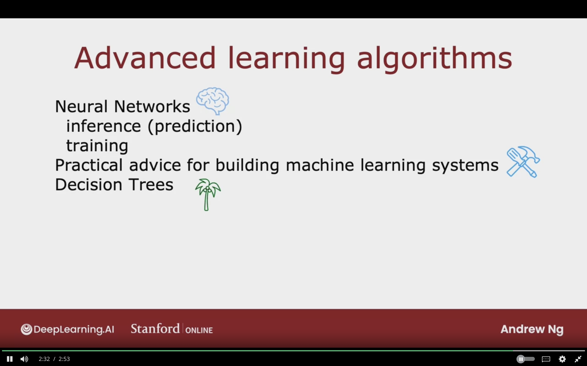

# Advanced Machine Learning

In this course we will cover

- Neural Networks (Deep Learning)
- Decision Trees
- Practical Advice on how to Implement Practical Machine Learning
- Systematic and Better Decisions in Building ML Models

## Week 1
Neural Networks and how to carry out inference(prediction)

## Week 2
Train your own neural networks

## Week 3
Practical Advice on better building ml systems

## Week 4
Decision Trees

The below image showcases the summary of the advanced learning algorithms summary

