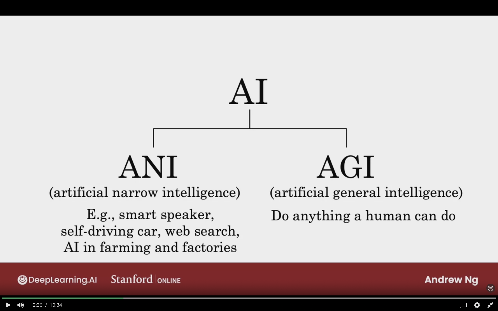
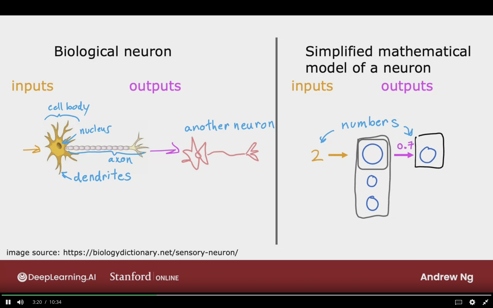
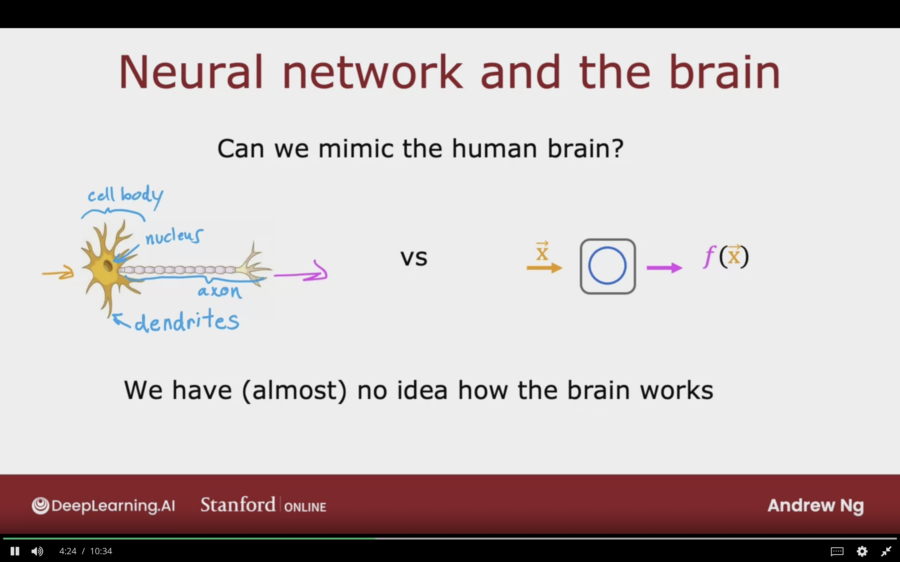
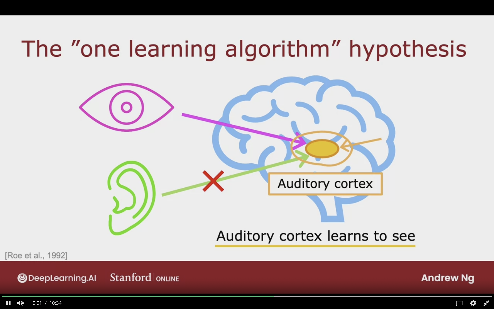
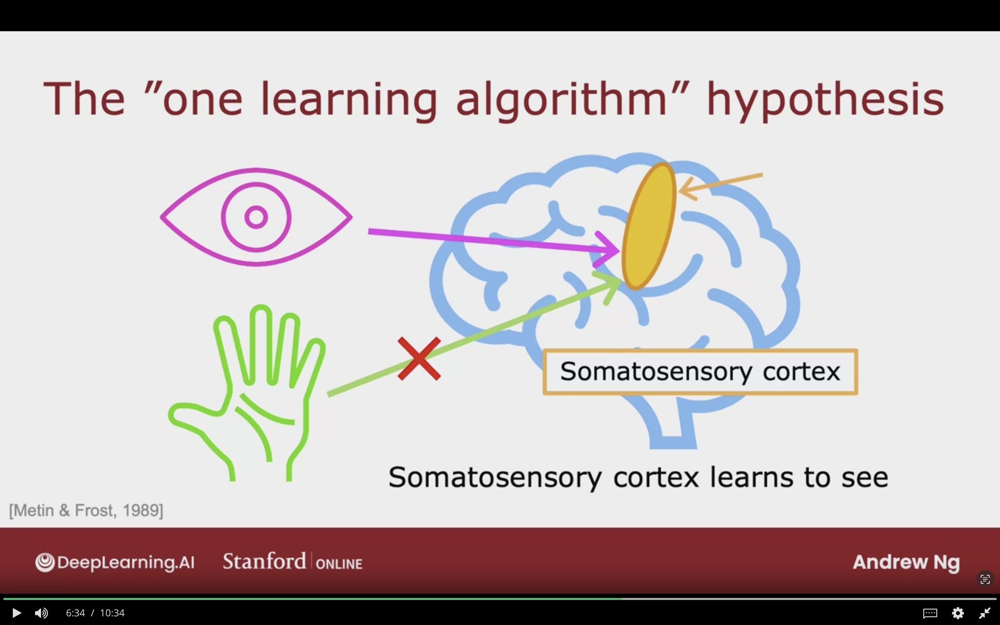
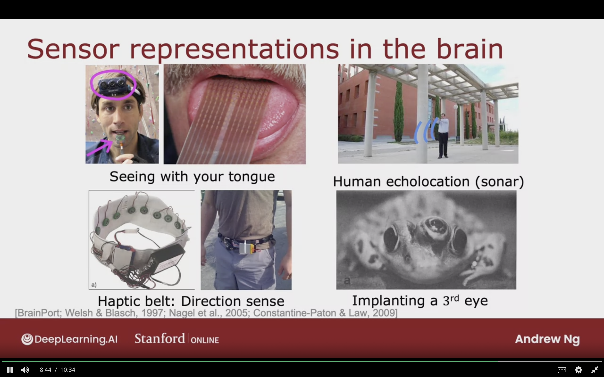

# Is there a path to AGI?

## AI Branches

- ANI (Artifical Narrow Intelligence)
  - Smart SPeaker, Self-Driving Car, Web Search
- AGI (Artifical General Inteligence)
  - Do anything human can do

From the picture below, it can be seen that human neurons are much more complicated than the artifical neuron networks

## Neural Network and the Brain

Can we mimic the human brain?

- For now we don't know how the brain really works.

## The "One Learning Algorithm" Hypothesis

### Auditory Cortex

It is part of the brain, has the ability of reading audio signal in the form of electrical impluses.

- If it was rewired between ear and Auditory Cortex
- Feed images to it, then Auditory Cortex learns to see
- So the if it's feed different data then it will learn to see

### Somatosensory Cortex

Part of the brain that handles touch processing.

- If it was rewired between hands and Somatosensory Cortex
- Feed images to it, then Somatosensory Cortex learns to see.
- So the if it's feed different data then it will learn to see

## Sensor Representations in the Brain

Below are examples of sensor representations in various tasks and experiments.

