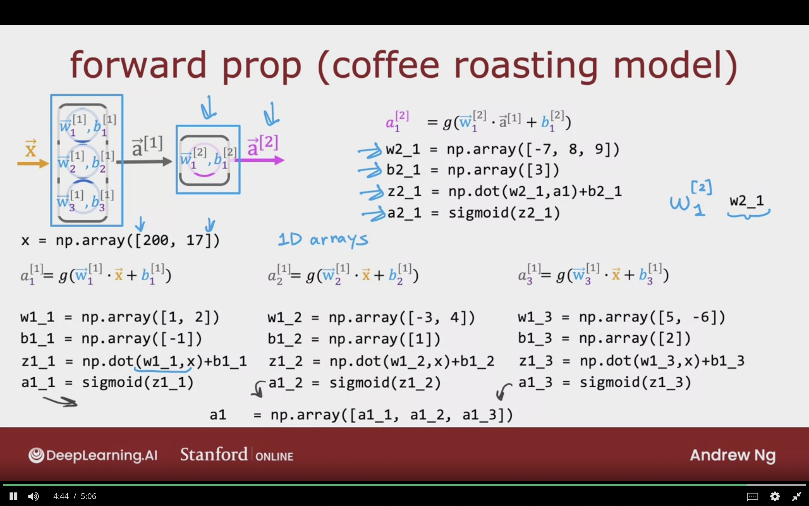
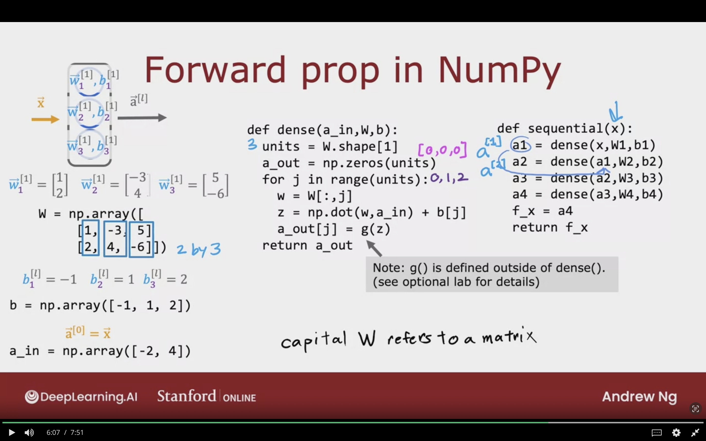

# Neural Network Implementation in Python

Getting into further details of the neural networks algorithms without the complete use of Tensorflow.


## Forward Prop in Single Layer (Coffe Roasting Model)

In the following section we will cover forward propagationn using numpy only.

The following expression $w_{1}^{[2]}$ will be represented as w2_1. So the first number is superscrit, and _1 is the subscript.


```python
# 1D np Vector and not [[]] like in tensorflow which is a matrix
x = np.array([200, 17])
```


**Notes for code variable w1_1,... a1_1:**
- First number indicates superscript => Layer
- Second number indicates subscript => neuron

### 1- For the first neuron in the first layer the following formula will be used:
$$
a^{[1]}_{1} = g(\vec{W}_{1} \cdot \vec{X} + b^{[1]}_{1})
$$


To compute $a^{[1]}_{1}$ we have the following parameters: 
```python
# the 2 parameters for the first neuron
w1_1 = np.array([1, 2])
b1_1 = np.array([-1])

# x is the one example which is from the previous code block
z1_1 = np.dot(w1_1, x) + b1_1

# applying the sigmoid to the z1_1 value
# sigmoid is g(z)
a1_1 = sigmoid(z1_1)
```


### 2- For the second neuron in the second layer the following formula will be used:
$$
a^{[1]}_{2} = g(\vec{W}_{2} \cdot \vec{X} + b^{[1]}_{2})
$$


To compute $a^{[1]}_{2}$ we have the following parameters: 
```python
# the 2 parameters for the first neuron
w1_2 = np.array([3, 4])
b1_2 = np.array([1])

# x is the one example which is from the previous code block
z1_2 = np.dot(w1_2, x) + b1_2

# applying the sigmoid to the z1_1 value
# sigmoid is g(z)
a1_2 = sigmoid(z1_2)
```


### 3- For the third neuron in the layer the following formula will be used:
$$
a^{[1]}_{3} = g(\vec{W}_{3} \cdot \vec{X} + b^{[1]}_{3})
$$


To compute $a^{[1]}_{3}$ we have the following parameters: 
```python
# the 2 parameters for the first neuron
w1_2 = np.array([5, -6])
b1_2 = np.array([2])

# x is the one example which is from the previous code block
z1_3 = np.dot(w1_3, x) + b1_3

# applying the sigmoid to the z1_1 value
# sigmoid is g(z)
a1_3 = sigmoid(z1_3)
```

### The last result of layer 1 neurons is the following

```python
# adding the result scalar of each neuron into a single vector
a1 = np.array([a1_1, a1_2, a1_3])

```

### For the second layer which has one single neuron

$$
a^{[1]}_{3} = g(\vec{W}_{3} \cdot \vec{a}^{[1]} + b^{[1]}_{3})
$$


```python
# defining the parameters for second/last layer
w2_1 = np.array([-7, 8, 9])
b2_1 = np.array([3])

# computing the predicion with previous layer result
z2_1 = np.dot(w2_1, a1) + b2_1

# taking the sigmoid of z value g(z)
a2_1 = sigmoid(z2_1)
```


The following image summarizes the entire process of forward propagation/inference/prediction using python and numpy only.



## General Implementation of Forward Propagation - Forward Prop in NumPy


### Example of Implementing Neural Network in Python & NumPy


#### For $W$

2 by 3 matrix => 2 Rows, and 3 columns

$$
\vec{W}^{[1]}_{1} = 
\left[
\begin{array}{l}
    1 \\
    2 \\
\end{array}
\right]
,

\vec{W}^{[1]}_{2} = 
\left[
\begin{array}{l}
    -3  \\
    4   \\
\end{array}
\right]
,

\vec{W}^{[1]}_{3} = 
\left[
\begin{array}{l}
    5   \\
    -6  \\
\end{array}
\right]
$$


**Parameter $W^{[1]}$ will be represented as the following in code:**
```python
W = np.array([
    [1, -3, 5]
    [2, 4, -6]
])
```


#### For Parameter $b$

$$
b^{[l]}_{1} = -1
,
b^{[l]}_{2} = -1
,
b^{[l]}_{3} = 2
$$


**Parameter $b^{[1]}$ will be represented as the followiing in code:**
```python
b = np.array([-1, 1, 2])
```


#### For Parameter/Output $\vec{a}^{[0]} = \vec{X}$
```python
a_in = np.array([-2, 4])
```


### Single Dense Layer Code

```python
def dense(a_in, W, b):
    
    # takes the number of neurons from W parameter columns no.
    units = W.shape[1]

    # initalizes 1D np array [0, 0, 0]
    a_out = np.zeros(units)

    # loop from 0,1,2
    for j in range(units):
        
        # pull jth column of W => w1_1, w1_2, w1_3
        # single neuron weights
        w = W[:,j]

        # inference W * X + b
        Z = np.dot(w, a_in) + b[j]

        # taking the sigmoid
        # and g is defined outside
        a_out[j] = g(z)

    return a_out
```


### For Stringing Togther Layers - Sequential Code

**Notes:**
- Captial $W$ refers to matrix
- Lowercase $b$ refers to vectors or scalars


```python
def sequential(x):

    # a[1], W1 & b1 both are refered to as the weights of first hidden layer
    a1 = dense(x, W1, b1)
    a2 = dense(a1, W2, b2)
    a3 = dense(a2, W3, b3)
    a4 = dense(a3, W4, b4)
    f_x = a4

    return f_x
```


The following image showcases the implementation of forward prop in NumPy with 2 functions dense layer & sequential.
