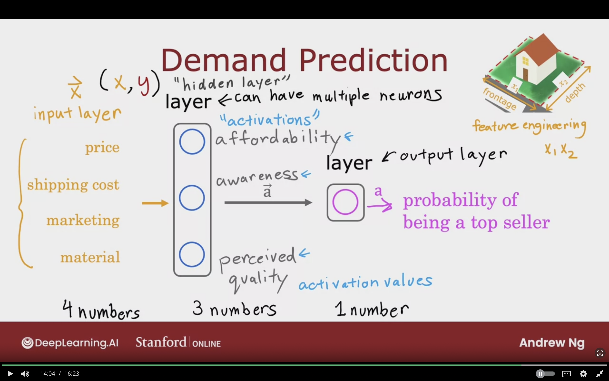

# Neural Networks Intitution

## Neurons and the Brain

Neural networks also called artifical neural networks

**Origins:**
- Algorithms that try to mimic the brain.
- Used in the 1980's and early 1990's.
- Fell out of favor in the late 1990's.
- Resurgence from around 2005.

Modern Deep learning helped in rebranding the neural networks.

**Modern Neural Networks/Deep Learning Applications are:**
- Speech Recognition imporved due to deep learning
- Computer Vision & Images due to imagenet
- Text (NLP Natural Language Processing) used in international translation.
- Other Appplication: Climate Change, product recommendation

The following diagram showcases how the neurons work:
- All human thoughts from neurons like these in brain and mind
- The neurons send electrical impluses/ or form othe connections with neurons
- Has number of inputs, which it recieves electrical impluses from other neurons.
- The neuron then carries computations, and send outputs to other neurons
- and the same happens to the recieving network

 

The below image shows a comparison between the biological neurons, and the simplified mathematical neurons. The two neurons take some input values, then carry out a computation then it sends the result to other neurons.

### Why Now?

Why has neural networks has taken off??

Amount of digital data has exploded

**The traditional machine learning algorithms logistic & linear regression faced some issue which are:**
- Even if they were feed more data, it was difficult to get the performance going up.
- They cannot utilize the large amount of data.
- They cannot scale with the large amount of data.

**Large Neural Networks** are better choice for very large amount of data!  
- To take advantage of the huge of amount of data for speech recognition.
So that's why Deep Learning took off
- Faster Computer Processors (GPUs) also helped in making Deep Learning trending.

The following image showcases why the neural networks are trending now, which is due to the huge amount of data, and faster CPUs.

## Demand Prediction

Example: Predict if the product is top seller

Used by retailers to plan better inventory level and marketinng campaigns

$$
x = price \rightarrow input
$$

$$
a = f(x) = {1 \over {1 + e^{-(wx + b)}}} \rightarrow output
$$

$a$ stands for activiation, and it's the probability of being top seller.  

In neuroscience, $a$ Stands for how much neuron is sending high output to other neurons downstream from it

Neuron is tiny computer, and its' main job is take input number, and outputs one or more number. The output is the probability of being topseller.

Building neural networks is just wiring different number of neurons together to build a robust mode.

The below image showcases an examply of find the bestseller product using logistic regression.

 

**Layer:** is grouping of neurons, and takes as input same or similar features and outputs a few numbers togther.
It can have multiple neuron, or single neuron.

**Output Layer:** The output of the layer is the probability predicted by neural network.

**Activation:** The features connect to a neuron
comes from bio neurons, degree that bio neurons sends high output value or electrical impluses to other downsream neurons from it.

**The Neural Network flow:**
1. Input Layer: inputs 4 numbers
2. First/Hidden layer: uses 4 number to compute 3 new numbers "activation values"
3. Output layer: uses the 3 numbers from activation then output the probability.

In practice, all the features are connected to each neuron in the first/hidden layer.

Input layer will be represneted as a vector $\vec{X}$, and it's feature vector. The output will be feed to the first layer.

The activation values represented as a vector $\vec{a}$ and will be feed to output layer.

**Why Is It called Hidden Layer?**
In training set I can observe $(x, y)$ values so I know correct values.

- However, for the values $(x, y)$ in the hidden layer affordability, awareness, preceived quality I don't know the actual values.

- Logistic Regression unit that takes as input affordability, awareness, preceived quality and using these 3 better features to estimate the probability of product being topseller.

- Logistic Regression, but it's a version that can learn its own features that makes it easier to make accurate prediction.

- Neural Network it can learn it's own features, and it makes it so powerful!!

- No need find the actual features in the hidden layer, which is the feature engineering part that we previously done.

 

The following image showcases how we construct a neural network, with each neuron being linked to a certain feature. 

 

### Multiple Hidden Layers "Multi Layer Perceptron"

The most common questions when building a neural network is the following:
**(Neural Network Architecture)**

1. How many Hidden Layers I want?
2. How many neurons I need in each hidden layer?

**Choosing the right numbers can have impact on the performance!**

The below image illustrates an example of multi hidden layers neural neural networks, and it's refered to as multi layer perceptron.

 

## Example: Recognizing Images

### Face Recognition

Neural Networks takes picture, and outputs identity of the person

- The image input is 1000 X 1000 Pixels Gird/ Matrix of Pixel Intensity Values.
- Where Each single pixel intenstiy value can range from 0 to 255.
- If the matrix of pixel are rolled into single vector
- The feature vector $\vec{X}$ it will be milion numbers

**When a Neural Network trains on a lot of images of faces, what features are the hidden layer will compute?**

1. First hidden layers will look for short line or edges

2. Next layer neurons will learn to group together lots of short lines or edges in order to find parts of faces. For example, search for eye presence and position, nose, etc.

3. Next hidden layer the neurons will try aggregating different parts of faces to detect presence or absence. Like, larger coarser face shapes. Then finally detecting how much the face corresponds to different face shape create rich set of feature. Which helps the output layer in finding the identity of the person.

It will learn all the features by itself from data only!

For each hidden layer, the size of the window is becoming larger.

The small neurons corresponds to differently sized regions in the image.

Activation are high level features

### Car Classification

For a problem of car classifcation the same princple can be applied as the face recognition. However, the features will vary in the next layers

1. First layer will detect line and edges.

2. Second layer will detect part of car.

3. Third layer will detect car shapes.

The following image illustrates how neural network can detect car based on the same princples as face recognition, but with different set of feature to be discovered in the next hidden layers.

