# Neural Networks Model

The Funedamental building block of modern Neural Network is layer of neurons, and putting them togther to form large neural network.

## Neural Network Layer

The following section will cover how a network layer works in details, with the hidden layers, logistic regression, and activation function.

**The layer numbering goes a follows:**  

- Layer 0: Input Layer and it's where the $\vec{X}$ reside.
- Layer 1: Hidden Layer, the input will be $\vec{X}^{[0]}$ and output will be $a^{[1]}$.
- Layer 2: Output Layer, the input will be $\vec{a}^{[1]}$, and output will be $a^{[2]}$ whic is a scalar.

**To distunguish the layer the following notation for layer numbering:**  
Use superscript [layer number]
- such as $sample^{[1]}$ to denote the output of layer 1/ hidden layer.
- $sample^{[2]}$ to denote the output of layer 2/ output layer.

### Example of a neural network with 1 hidden layer:

The input layer will consist of $\vec{X}$, and contains 4 feature which are $x_{1}, x_{2}, x_{3}, x_{4}$.

$\vec{X} = [197, 184, 136, 214]$

Each neuron in the hidden layer implements logistic regression.

***Logitsic regression will be used across all the neurons!***
$$g(Z) = {1 \over {1 + e^{-Z}}}$$

#### 1. For first neuron $a_{1}$ in the layer 1/hidden layer:

$neuron^{1}=> \vec{W}_{1}^{[1]} , \vec{b}_{1}^{[1]}$  
$$
a_{1}^{[1]} = g(\vec{W}_{1}^{[1]} \cdot \vec{X}_{1}^{[1]} + b_{1}^{[1]})
$$

$$
z_{1}^{[1]} = \vec{W}_{1}^{[1]} \cdot \vec{X}_{1}^{[1]} + b_{1}^{[1]}
$$

$$
a_{1}^{[1]} = 0.3
$$

#### 2. For second neuron $a_{2}$ in the layer 1/hidden layer:

$neuron^{2}=> \vec{W}_{2}^{[1]} , \vec{b}_{1}^{[2]}$

$$
a_{2}^{[1]} = g(\vec{W}_{2}^{[1]} \cdot \vec{X}_{2}^{[1]} + b_{2}^{[1]})
$$

$$
z_{2}^{[1]} = \vec{W}_{2}^{[1]} \cdot \vec{X}_{2}^{[1]} + b_{2}^{[1]}
$$

$$
a_{2}^{[1]} = 0.7
$$

#### 3. For third neuron $a_{2}$ in the layer 1/hidden layer:

$neuron^{3}=> \vec{W}_{3}^{[1]} , \vec{b}_{3}^{[1]}$

$$
a_{3}^{[1]}  = g(\vec{W}_{3}^{[1]} \cdot \vec{X}_{3}^{[1]} + b_{3}^{[1]})
$$

$$
z_{3}^{[1]} = \vec{W}_{3}^{[1]} \cdot \vec{X}_{3}^{[1]} + b_{3}^{[1]}
$$

$$
a_{3}^{[1]} = 0.2
$$

**These 3 value combine to create vector of activation values $\vec{a}$:**

Vector of activation values from layer 1
$
\vec{a}^{[1]} = [0.3, 0.7, 0.2]
$

Then the output of layer 1 or hidden layer $\vec{a}^{[1]}$ will be the input to layer 2!

The following image showcases the steps which were done in order to compute the activation of the each neurons in layer 1/ hidden layer, and the output will be a vector $\vec{a}^[1]$
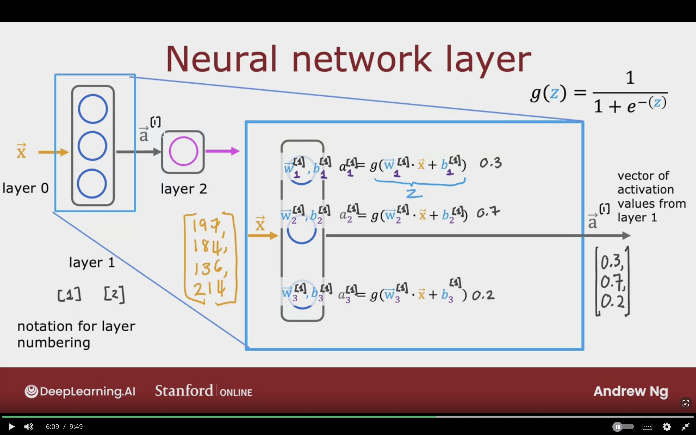

#### For the only neuron $a_{1}$ in the layer 2/output layer:

The input to layer 2 is the output of layer 1!

$\vec{a}^{[1]} = [0.3, 0.7, 0.2]$

$neuron^{1}=> \vec{W}_{1}^{[2]} , \vec{b}_{1}^{[2]}$

$$
a_{1}^{[2]}  = g(\vec{W}_{1}^{[2]} \cdot \vec{a}^{[1]} + b_{1}^{[2]})
$$

$$
z_{1}^{[2]} = \vec{W}_{1}^{[2]} \cdot \vec{a}^{[1]} + b_{1}^{[2]}
$$

The value is scalar value, and this will be final output of the neural network
$$
a^{[2]} = 0.84
$$

The following image showcases the steps which were done in order to compute the activation of single neuron in layer 2/ output layer, and the output will be a scalar $\vec{a}^[2]$
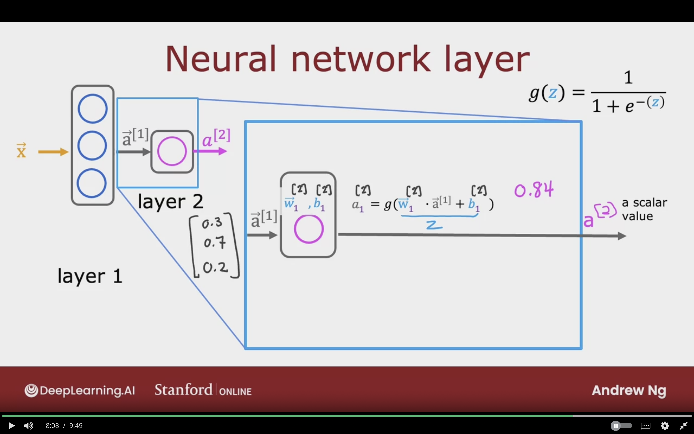

 

### Optional Step Predict category 1 or 0 (Yes/No)

Take the activation of the layer 2/ output layer $a^{[2]}$ and threshold the value.

is $a^{[2]} \ge 0.505$?

- yes: $\hat{y} = 1$
- no: $\hat{y} = 0$

The following image showcases how we can take the activation of the neural network $a^{[2]}$ from the output layer to evaluate it to a category. The same was done in the logistic regression!
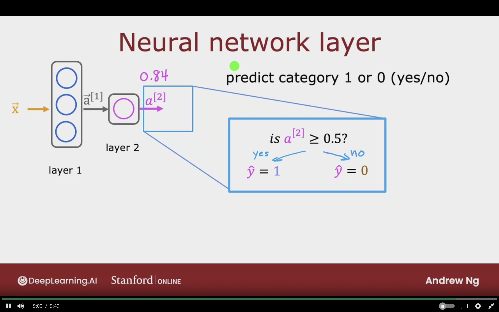

## More Complex Neural Networks

The following section will build the previous section to build a more complex neural network. 

### Example of Complex Neural Network with 3 hidden layers

Below is the architecture of the complex neural network in which it has 3 hidden layers.

The layer can be represented as the following:
- Layer [0]: Input/Features Layer
- Layer [1]: Hidden Layer 1
- Layer [2]: Hidden Layer 2
- Layer [3]: Hidden Layer 3
- Layer [4]: Output Layer

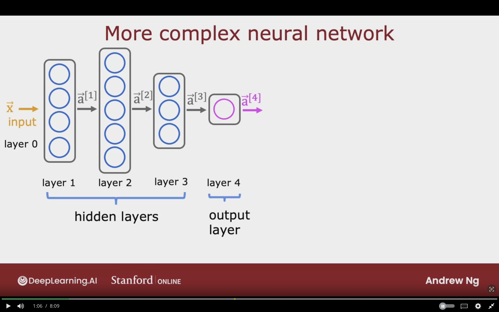

#### Hidden Layer [3] in details

- Represented as Layer[3]
- Has 3 neurons/ 3 hidden units
- Input: Takes vector $\vec{a}^{[2]}$  
- Output: vector $\vec{a}^{[3]}$

**The 3 neurons in the layer goes as the following:**  
(Note that the $\vec{a}$ term here is referncing the previous layer output $\vec{a}^{[2]}$)

Neuron 1 the parameters $\vec{W}_{1}, b_{1}$:
$$
a_{1}^{[3]} = g(\vec{W}_{1}^{[3]} \cdot \vec{a}^{[2]} + b_{1}^{[3]})
$$

Neuron 2 the parameters $\vec{W}_{2}, b_{2}$:
$$
a_{2}^{[3]} = g(\vec{W}_{2}^{[3]} \cdot \vec{a}^{[2]} + b_{2}^{[3]})
$$

Neuron 3 the parameters $\vec{W}_{3}, b_{3}$:
$$
a_{3}^{[3]} = g(\vec{W}_{3}^{[3]} \cdot \vec{a}^{[2]} + b_{3}^{[3]})
$$

The layer result activation vector will be:
$$
\vec{a}^{[3]} = [a_{1}^{[3]} \space a_{2}^{[3]} \space a_{3}^{[3]}]
$$

The following depicts the layer 3 of the complex neural network in details. As it shows that instead of having $\vec{X}$ it not takes th activation value from the previous layer $a^{[2]}$. The output activation value of the layer will be $a^{[3]}$
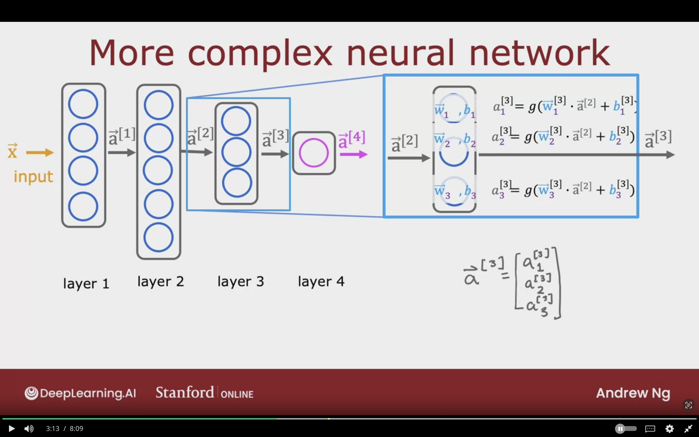

### Notation Quiz 
In the following pictures it's a quiz to check my understanding of notations for the activation value $a$.
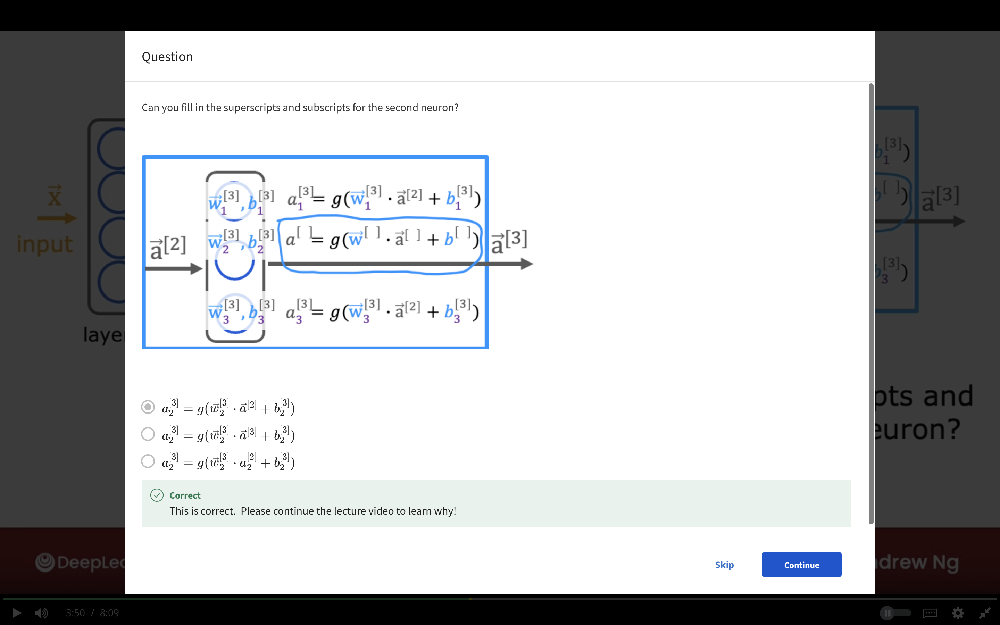

Explaintation of the correct activation $a$ notation
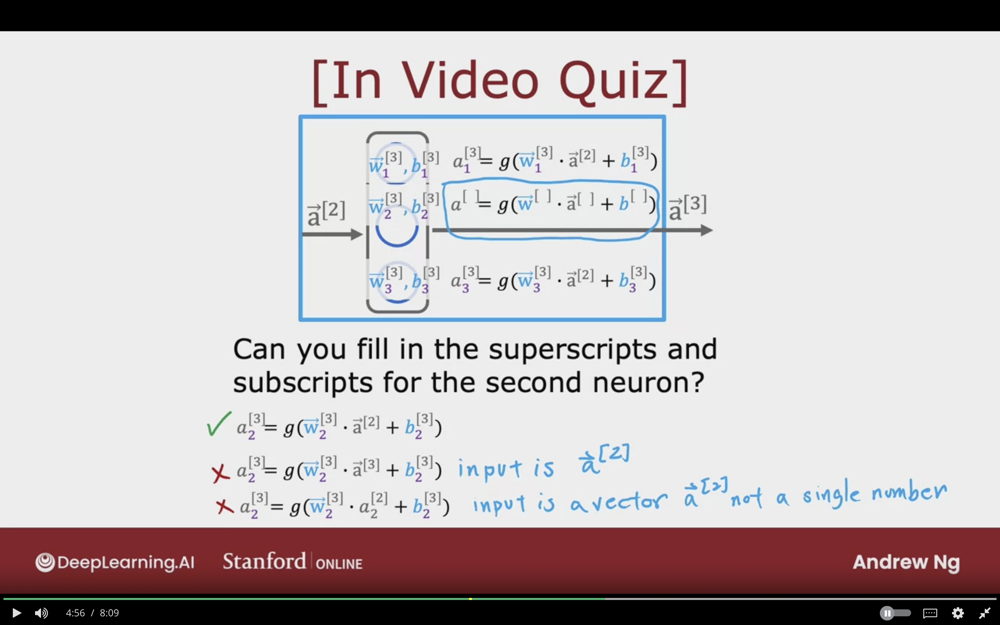

### Notation

The notation for any activation can be summarized as the following.

$$
a_{j}^{[l]}= g(\vec{W}_{j}^{[l]} \cdot a^{[l-1]} + b_{j}^{[l]})
$$

$a_{j}^{[l]}$:
Activation value of layer $l$, unit(neuron) $j$

$a^{[l-1]}$:
Output of layer $l-1$ (previous layer)

$\vec{W}_{j}^{[l]}, b_{j}^{[l]}$:
Parameters of $w, b$ of layer $l$, unit $j$

$g$:
Refers to the sigmoid function/ "activation function"

$\vec{X} = \vec{a}^{[0]}$:
Feature vector $\vec{X}$ will now be refered to as $\vec{a}^{[0]}$

The following image showcases the general notation for all layers.
- The features vector $\vec{X}$ in input layer/ layer 0 will now be changed into $\vec{a}^{[0]}$.
- $j$th neuron will be refered to as a unit in a layer.
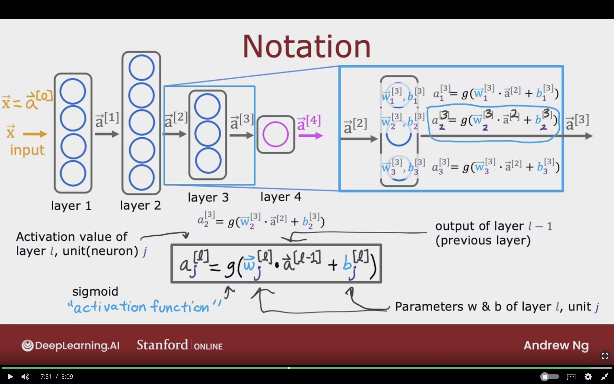

## Inference: Making Prediction (Forward Propagation)

The following section will discuss an algorithms that mamke the algorithms make a prediction.

### Example: Handwritten Digit Recognition

A machine learning model which recognizes if the letter is 0 or 1. Binary Classifciation problem

- Input: $l[0]$ It consists of features $\vec{X}$ or $a^{[0]}$ digit image size of 8 X 8 Pixels grid/matrix or 64 pixels intensity values.
  - 255 denotes bright white pixel, 0 denotes black pixel, other denotes different shades of grey.
- Hidden Layer 1: $l[1]$ Consists of 25 Units (Neurons).
- Hidden Layer 2: $l[2]$ Consists of 15 Units (Neurons).
- Output Layer: $l[3]$ Consists of 1 unit which gives the predictions of whether class 0 or 1.

**For Hidden layer 1**  
$j$ is the number of units/neurons which is 25  
$$
\vec{a}^{[1]} =
\left[
\begin{array}{l}
    g(\vec{W}^{[1]}_{1} \cdot \vec{X}^{[1]} + b^{[1]}_{1})  \\
    \dotso \\
    \dotso \\
    g(\vec{W}^{[1]}_{25} \cdot \vec{X}^{[1]} + b^{[1]}_{25})  \\
\end{array}
\right]
$$

The following furthers shows the hand written layer 1 in details which is conists of 25 units/ neurons so the activation "sigmoid" will be a vector of 25 values $a^{[1]}$
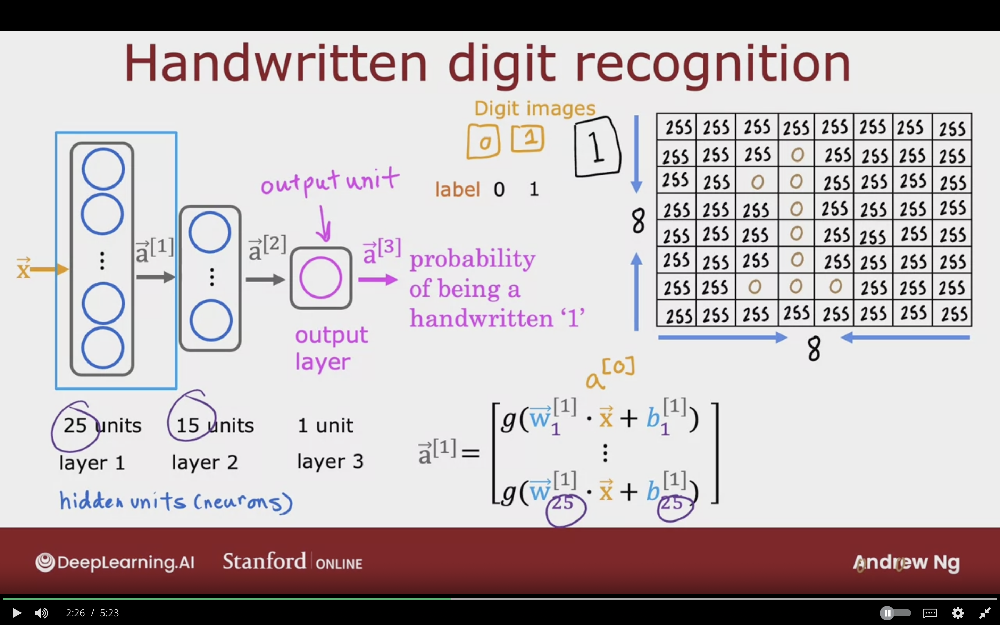

**For Hidden Layer 2**  
$j$ is the number of units/neurons which is 15
$$
\vec{a}^{[2]} =
\left[
\begin{array}{l}
    g(\vec{W}^{[2]}_{1} \cdot \vec{a}^{[1]} + b^{[2]}_{1})  \\
    \dotso \\
    \dotso \\
    g(\vec{W}^{[2]}_{15} \cdot \vec{a}^{[1]} + b^{[2]}_{15})  \\
\end{array}
\right]
$$

The following furthers shows the hand written layer 2 in details which is conists of 15 units/ neurons so the activation "sigmoid" will be a vector of 15 values $a^{[2]}$
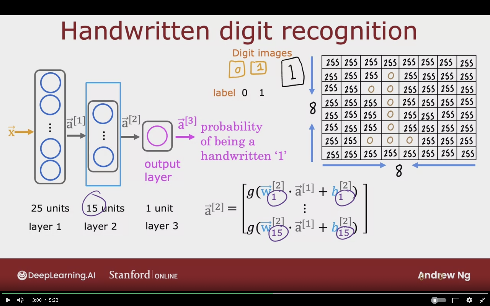

**For Output Layer 3**  
$j$ is the number of units/neurons which is 1
The output will be scalar/1 number

$$
\vec{a}^{[3]} =
\left[
    g(\vec{W}^{[2]}_{1} \cdot \vec{a}^{[2]} + b^{[2]}_{1})
\right]
$$

is $a^{[3]}_{1} \ge 0.5$

- yes: $\hat{y} = 1$, image is digit 1
- no: $\hat{y} = 0$, image is not digit 1

$f(x)$ output of the neural network which is the probability of being a handwritten "1"

**Forward Propagation:**  
- For Making predictions
- The algorithm goes forward $\rightarrow$.
- Propagating through the activation functions forward, from left to right.

**Back Propagation:**  
- Used for learning
- The algorithm goes backwards $\rightarrow$.
- Propagating through the activation functions backward, from  right to left.

The following image showcases the 3/output layer  of a handwritten digit recognition. Which outputs the image classification. It consists of 1 single unit/neuron.
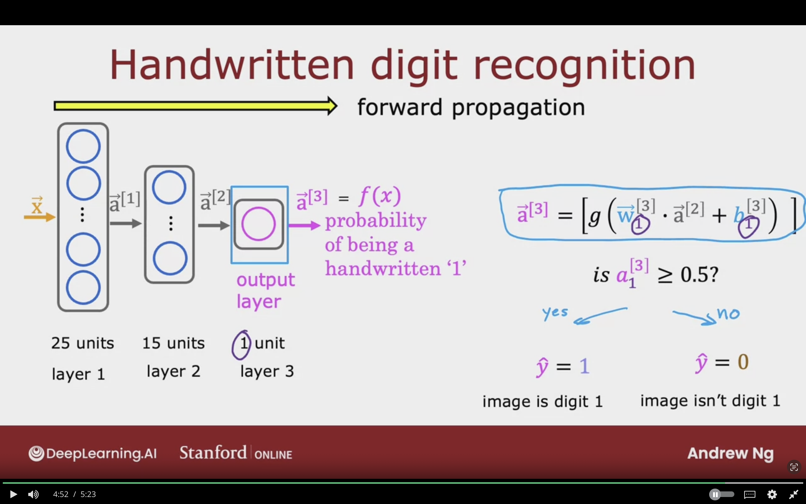

