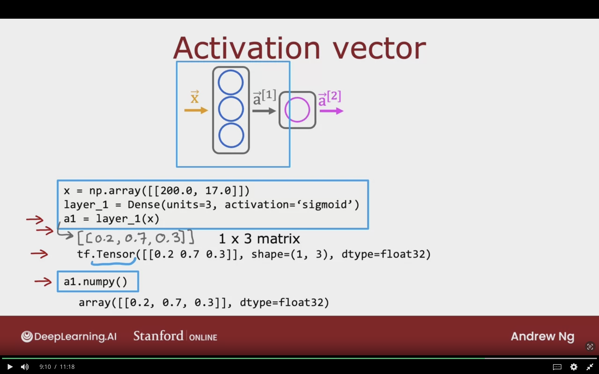
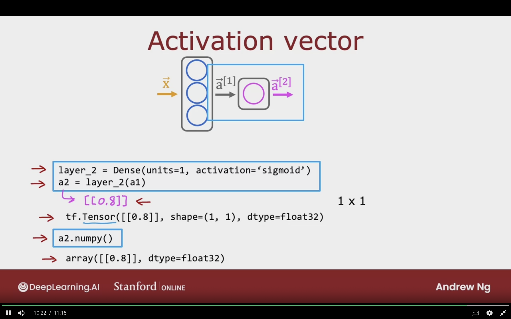

# Tensorflow Implementation

The following module will primarly focus converting neural networks into tensorflow code

## Inference in Code

The following secion will go into details how we can convert neural network architecture into a tensorflow code for 2 examples what are the Coffee Roasting, and Digit Classification

### Coffee Roasting Example

Will showcase an example of how machine learning model can be used to optimize the quality of roasted beans 

**2 Parameters which can be controlled:**
- Temperature (Celsius): Heating up the coffee beans
- Duration (Minutes): How long the coffee beans can be roasted


$y=1$, Good Coffee
$y=0$, Bad Coffee


**Possible Scenarios:**
- Very low temperature $\rightarrow$ will be not unroasted  
- Too short duration of time $\rightarrow$ will be unroasted  
- Very High temperature $\rightarrow$ will be overcooked
- Too Long duration of time  $\rightarrow$ will be overcooked


The below image illustrates how coffee roasting 2 parameters may affect the coffee quality.


### Build the Model using Tensorflow

The following section will implement the simple neural network/ logistic regression to the coffee roast problem.


```python
# create np 2D input vector of 2 features
# with shape (1,2) => 1 row, 2 columns => 1 example, 2 features
X = np.array([[200.0, 17.0]])

# unit is the number of neurons
# activation is activation function which is sigmoid like logistic regression
# Dense is another name for layers, and there are others
layer_1 = Dense(units=3, activation='sigmoid')

# layer_1 is a function
# passing the X input tensor to that function
# will be tensor of 3 number, because of the unit=3
# output= [0.2 0.7 0,3]
a1 = layer_1(X)


# will be the output layer
# single neuron in this layer with sigmoid activation
# output= [0.8]
layer_2 = Dense(unit=1, activation='sigmoid')


# threseholding/ converting output scalar to class
if a2 >=0.5:
    yhat = 1
else:
    yhat = 0

```


The following image shows how the model is converted into tensorflow code


### Model for Digit Classification

This section will discusses the previous digit classifcation problem 


```python
# input array of shape (64,)
# x is pixels intensity values
X = np.array([[0.0, ...,245, ..., 240, ...,0]])

### First Layer ###
# will have 25 units/neurons
# activation function = sigmoid
layer_1 = Dense(units=25, activation='sigmoid')

# carrying inference through layer 1
# output will be tensor/vector of 25 elements
a1 = layer_1(X)


### Second Layer ###
# will have 15 units/neurons
# activation function = sigmoid
layer_2 = Dense(units=15, activation='sigmoid')

# carrying inference through layer 1
# output will be tensor/vector of 25 elements
a2 = layer_2(a1)


### Third Layer / Output Layer ###
# will have 1 units/neurons
# activation function = sigmoid
layer_3 = Dense(units=1, activation='sigmoid')

# carrying inference through layer 1
# output will be tensor/vector of 25 elements
a3 = layer_2(a2)


# thresholding the values
# converting the probabilites into actual class
if a3 >= 0.5:
    yhat = 1
else:
    yhat = 0
```

The below image showcases how the digiti classification model in terms of code.


## Data in Tensorfllow

This section will discuss how data is represented in Tensorflow & Numpy


### Feature Vectors

For the coffee example, we have 2 features
1. Temprature (celsius) x1
2. Duration (Minutes)  x2

```python
X = np.array([[200.0, 17.0]])
```

### Note About Numpy Arrays

**Why are the brackets [[]] are used???**


**Example 1:**  
2D Array => 2 X 3 Matrix => 2 rows & 3 columns

$$
\left[
\begin{matrix}
    1 && 2 && 3 \\
    4 && 5 && 6 \\
\end{matrix}
\right]
$$


In code it looks like this, where each [] represents a row in the matrix.  
The shape of X will be (2,3)
```python
X = np.array([[1, 2, 4]
            ,[4, 5, 6]])
```


**Example 2:**  
2D Array => 4 X 2 Matrix => 4 rows & 2 columns

$$
\left[
\begin{matrix}
    0.1 && 0.2  \\
    -3  && -4   \\
    -.5 && -.6  \\
    7   && 8    \\ 
\end{matrix}
\right]
$$


In code it looks like this, where each [] represents a row in the matrix.  
The shape of X will be (4,2)
```python
X = np.array([[.1, .2],
            [-3, -4],
            [-.5, -.6],
            [7, 8]])
```

The following images illustartes how matrices are represented as numpy arrays.


### For Matrices with 1 Column or 1 Rows


1. 1 X 2 => 1 Row & 2 Columns => Row Vector
$$
\left[
\begin{matrix}
    200 && 17  \\
\end{matrix}
\right]
$$

In code the row vector looks like this
```python
X = np.array([[200, 17]])
```

2. Matrix of 1 X 2 => 2 Rows & 1 Column => Column Vector
$$
\left[
\begin{matrix}
    200 \\ 
    17  \\
\end{matrix}
\right]
$$

In code the column vector looks like this
```python
X = np.array([[200],
            [17]])
```

3. 1D "Vector" => 1D array with no rows & no columns, which is different than point 1. Just a list of number!
$$
\left[
\begin{array}{ll}
    200 && 17
\end{array}
\right]
$$

In code the column vector looks like this
```python
X = np.array([200, 17])
```

**In Tensorflow, the convention is to use Matrices to repsent data**  
- To Handle large dataset
- Computationallly Efficient internally


### Feature Vector for Coffee Roast Problem


The feature vector will be represented as 2D Vector/ Matrix  
1 Example, and 2 features.

Matrix of size 1 X 2:
$$
\left[
\begin{array}{ll}
    200.0 && 17.0
\end{array}
\right]
$$

```python
X = np.array([[200.0, 17.0]])
```

The following image displays how from now on we willl represnt the dataset in order for it to work with Tensorflow


### Activation Error


#### 1- Focusing on the First Layer



```python
X = np.array([[200.0, 17.0]])
layer_1 = Dense(units=3, activation='sigmoid')


# The result will be a 1 X 3 Matrix
# [[0.2, 0.7, 0.3]]
a1 = layer_1(X)


# a1 is tf.Tensor data type
#  was created to store and do computations on martices effciently
# it's just matrix, but more general
print(a1)

# a1 converted to numpy array
a1.numpy()
```


#### 2- Focusing on the Second Layer/ Output Layer




```python
layer_2 = Dense(units=1, activation='sigmoid')
a2 = layer_2(a1)

# a2 is 1 X 1 Matrix, 1 Row & 1 Column
# [[0.8]]
# of type Tensor with shape (1.1), and datatype =float32
print(a2)

# convert Tensorflow Tensot into numpy array
a2.numpy()
```


**So when you pass Numpy array into Tensorflowm it converts the numpy array into a Tensor!**


## Building a Neural Network

