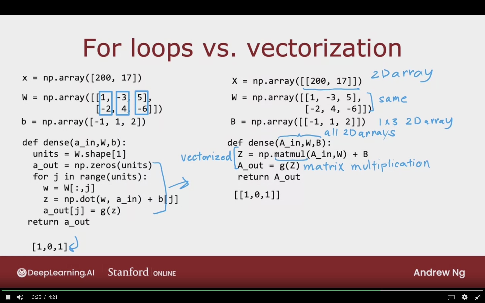
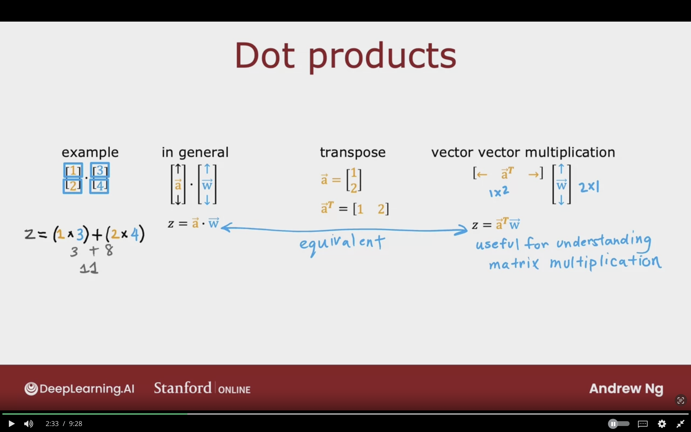
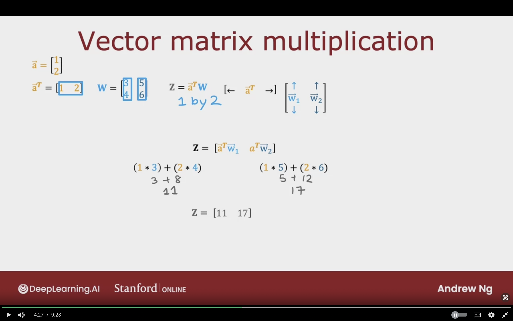
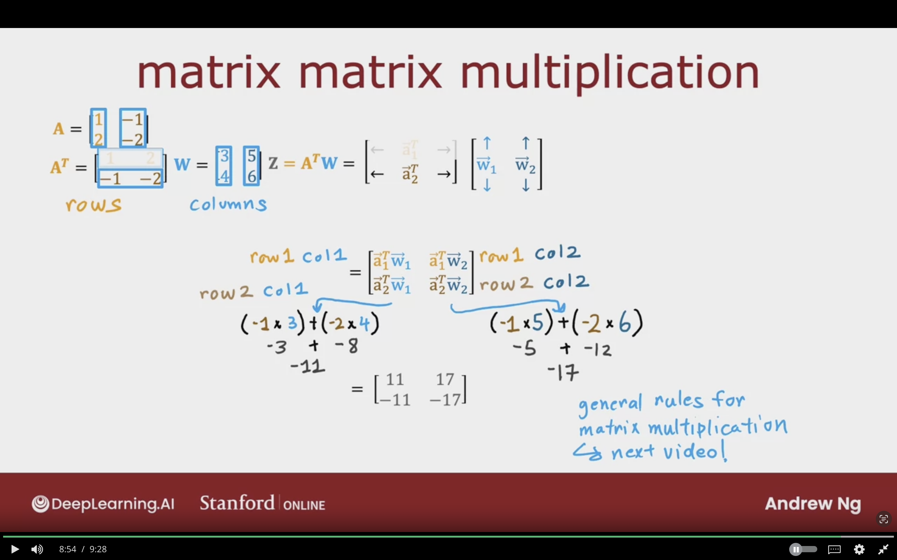

# Vectorization (Optional)

<!-- NOT COMPLETED -->

## How Neural Networks Are Implemented Efficiently

Parallel computing hardware (GPUs, Some CPU functions) are very good at doing very large martix multiplcation.


### For Loops vs. Vectorization


#### 1- Forward Propagation in for loop

```python
# input
x = np.array([200, 17])

# weights [col1_neuron_1, col2_neuron2, col3_neuron3]
W = np.array([[1, -3, 5],
            [-2, 4, -6]])

# bias [col1_neuron_1, col2_neuron2, col3_neuron3]
b = np.array([-1, 1, 2])


def dense(a_in, W, b):
    units = W.shape[1]

    a_out = np.zeros(units)

    for j in range(units):

        w = W[:,j]

        z = np.dot(w, a_in) + b

        a_out[j] = g(z)

    return a_out

[1, 0, 1]
```


#### 2- Forward Propagation with Vectorization

```python
# input in the shape of Matrix/2D array => 1 X 2 => 1 Row, 2 Cols
X = np.array([[200, 17]])


# weights [col1_neuron_1, col2_neuron2, col3_neuron3]
# same shape as before
W = np.array([[1, -3, 5],
            [-2, 4, -6]])


# bias [col1_neuron_1, col2_neuron2, col3_neuron3]
# in the shape of Matrix 2D array => 1 X 2 => 1 Row, 2 Cols
B = np.array([[-1, 1, 2]])


# all params are matrices now
def dense(A_in, W, B):
    units = W.shape[1]

    # vectorized
    # does matrix multiplication
    Z = np.matmul(A_in, W) + B

    # computes the sigmoid for each element in the matrix Z
    A_out = g(Z)

    return a_out

[1, 0, 1]
```

The following image show cases the key difference in code between normal for loop vs vectorized implementation of forward propagation



## Matrix Multiplication

The following section is concerned with focusing on Matrix Multiplication intitution. Also, Transpose of vector/Matrix.
//TODO: Complete the below

### Dot Products


#### Example of Dot Products between vectors:

$$
\left[
\begin{matrix}
    1 \\
    2 \\
\end{matrix}
\right]

\cdot

\left[
\begin{matrix}
    3 \\
    4 \\
\end{matrix}
\right]
$$

$$
Z = (1 \times 3) + (2 \times 4) \\
Z = 3 + 8 \\
Z = 11
$$


#### In general:

We multiply each element of $\vec{a}$ with the corresponding element of $\vec{b}$, then adding up all the products.

$$
\left[
\begin{matrix}
    \uparrow \\
    \vec{a} \\
    \downarrow \\
\end{matrix}
\right]

\cdot

\left[
\begin{matrix}
    \uparrow \\
    \vec{b} \\
    \downarrow \\
\end{matrix}
\right]
$$

$$
Z = \vec{a} \cdot \vec{w}
$$


#### Transpose:

Turning a column vector into a row vector.

$$
\vec{a} =
\left[
\begin{matrix}
    1 \\
    2 \\
\end{matrix}
\right]
\\

\vec{a}^{T} =
\left[
\begin{matrix}
    1 && 2
\end{matrix}
\right]
$$


#### Vector Vector Multiplication

Multiplying a row vector 1 X 2 matrix with column vector 2 X 1 matrix.


$$
\left[
\begin{matrix}
    \leftarrow && \vec{a}^{T} && \rightarrow
\end{matrix}
\right]

\left[
\begin{matrix}
    \uparrow \\
    \vec{W} \\
    \downarrow \\
\end{matrix}
\right]
$$


$$
Z = \vec{a}^{T} \vec{W}
$$

which is the equivalent to $Z = \vec{a} \cdot \vec{w}$ 

Useful for understanding matrix multiplication



### Vector Matrix Multiplication


$$
\vec{a} = 
\left[
\begin{matrix}
    1 \\
    2 \\
\end{matrix}
\right]
$$


$$
\vec{a}^{T} = 
\left[
\begin{matrix}
    1 && 2 
\end{matrix}
\right]

\quad

\bold{W} =  
\left[
\begin{matrix}
    3 && 5 \\
    4 && 6 
\end{matrix}
\right]

\quad

Z = \vec{a}^{T} W
\quad
(\text{Z will be 1 X 2 matrix})
$$

$$
\left[
\begin{matrix}
    \leftarrow && \vec{a}^{T} && \rightarrow
\end{matrix}
\right]

\left[
\begin{matrix}
    \uparrow && \uparrow \\
    \vec{W}_{1} && \vec{W}_{2} \\ 
    \downarrow && \downarrow \\
\end{matrix}
\right]
$$


$$
\bold{Z} = 
\left[
\begin{matrix}
    \vec{a}^{T} \vec{W}_{1} && \vec{a}^{T} \vec{W}_{2}
\end{matrix}
\right]
$$

$$
\vec{a}^{T} \vec{W}_{1} =
(1 * 3) + (2 * 4) \\
3 + 8 = 11 \\
$$

$$
\vec{a}^{T} \vec{W}_{2} =
(1 * 5) + (2 * 6) \\
5 + 12 = 17 \\
$$


$$
\bold{Z} = 
\left[
\begin{matrix}
    11 && 17
\end{matrix}
\right]
$$




### Matrix Matrix Multiplcation


$$
\bold{A} = 
\left[
\begin{matrix}
    1 && -1 \\
    2 && -2 \\
\end{matrix}
\right]
$$


$$
\bold{A}^{T} = 
\left[
\begin{matrix}
    1 && -1 \\
    2 && -2 \\
\end{matrix}
\right]

\bold{W} = 
\left[
\begin{matrix}
    3 && 4 \\
    5 && 6 \\
\end{matrix}
\right]
$$

We are taking the first column of $\bold{A}$ and lay it on the side of the first row, the same thing will occur to the second column of $\bold{A}$


**Trick to simplify the process:**

- For matrix transpose, I have to think of the rows
- For matrix, I have to think of the columns

$$
\bold{Z} = \bold{A}^{T} \bold{W}
\\
= \left[
\begin{matrix}
    \leftarrow && \vec{a}_{1}^{T} && \rightarrow \\
    \leftarrow && \vec{a}_{2}^{T} && \rightarrow \\
\end{matrix}
\right]


\left[
\begin{matrix}
    \uparrow && \uparrow \\
    \vec{W}_{1} && \vec{W}_{1} \\
    \downarrow && \downarrow \\
\end{matrix}
\right]
$$


$$
\left[
\begin{matrix}
    \vec{a}_{1}^{T} \vec{W}_{1} && \vec{a}_{1}^{T} \vec{W}_{2}\\
    \vec{a}_{2}^{T} \vec{W}_{1} && \vec{a}_{2}^{T} \vec{W}_{2} \\
\end{matrix}
\right]
\\
= 
\left[
\begin{matrix}
    \text{row 1 col 1} && \text{row 1 col 2} \\
    \text{row 2 col 1} && \text{row 2 col 2} \\
\end{matrix}
\right]
$$

$$
\vec{a}_{2}^{T} \vec{W}_{1} =
(-1 * 3) + (2 * -4) \\
3 + 8 = -11 \\
$$

$$
\vec{a}_{2}^{T} \vec{W}_{2} =
(-1 * 5) + (-2 * 6) \\
5 + 12 = -17 \\
$$


$$
= \left[
\begin{matrix}
    11 && 17 \\
   -11 && -17 \\
\end{matrix}
\right]
$$




## Matrix Multiplcation Rules


## Matrix Multiplication Code


## Complete Lab Quiz Vectorization Part

