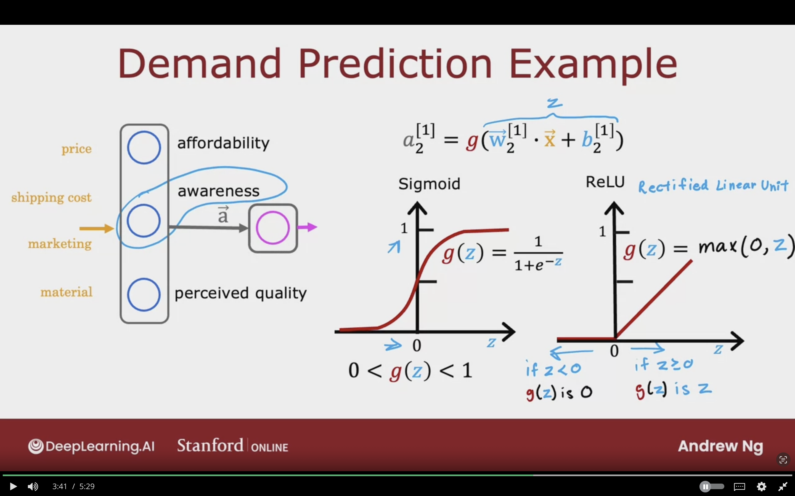
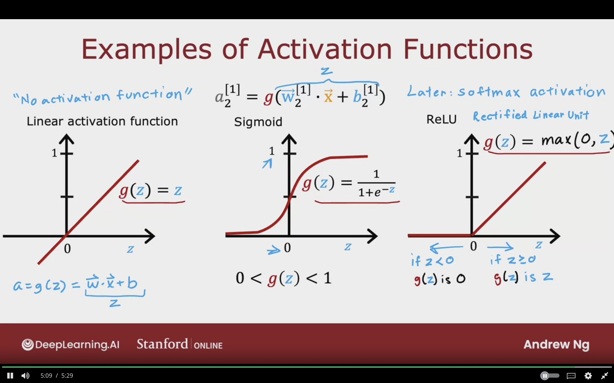
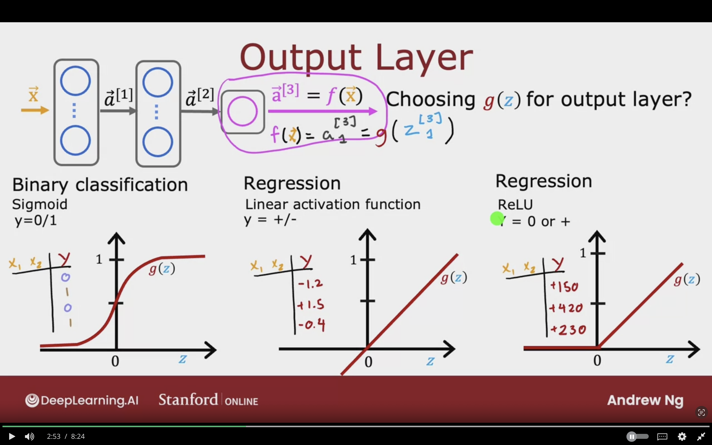
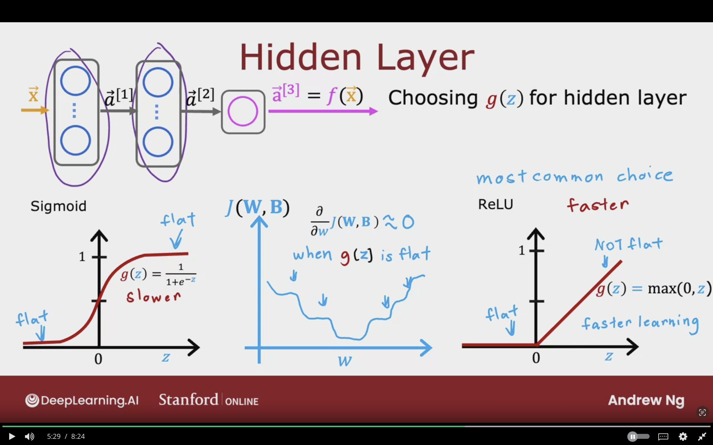
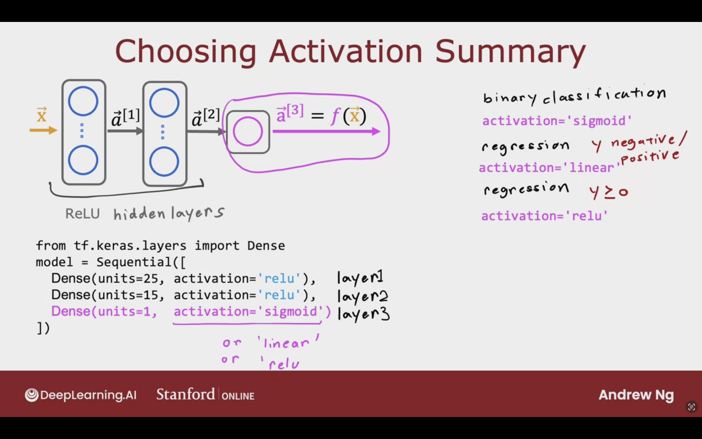
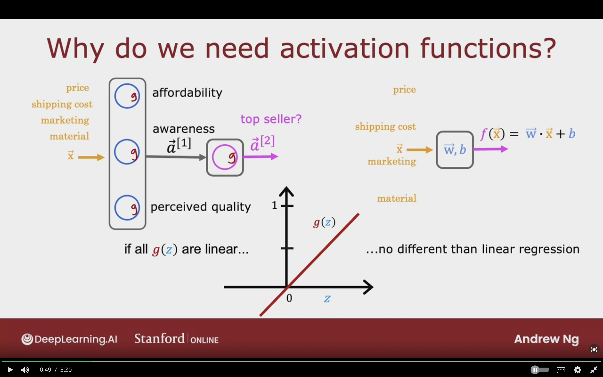
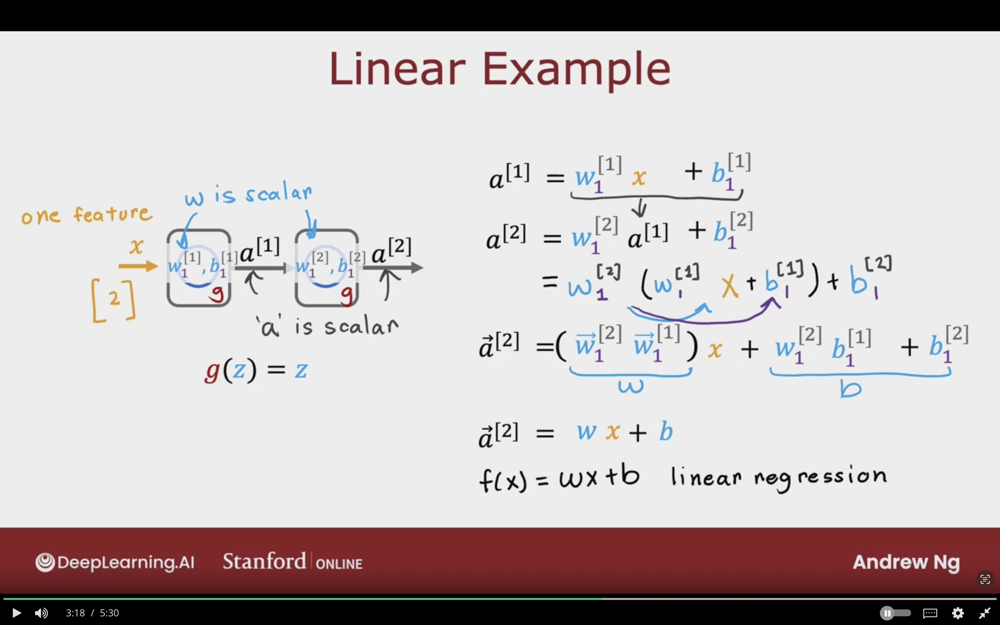
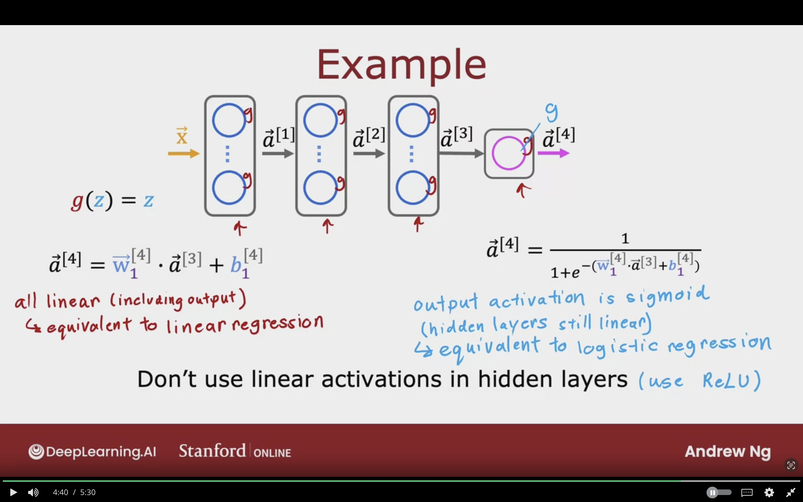

# Activation Functions


## Alternatives to the Sigmoid Functions


### Demand Prediction Example

Modeling awareness as no negative number

$$
Z = \vec{W^{[1]}_{2}} \cdot \vec{W} + b^{[1]}_{2}
$$

$$
a^{[1]}_{2} = g(z)
$$

$$
a^{[1]}_{2} = g(\vec{W^{[1]}_{2}} \cdot \vec{W} + b^{[1]}_{2})
$$


**Sigmoid Function:**
$$
g(z) = {1 \over {1 + e^{-z}}}
$$

$$
0 < g(z) < 1
$$


To allow value to be greater than 1, ReLU function can be used

**ReLU (Rectified Linear Unit):**
$$
g(z) = max(0,z)
$$

if $z < 0 \longrightarrow g(z)$ is 0  
if $z \ge 0 \longrightarrow g(z)$ is $z$


The below image showcases the example of demand prediction, which instead of using the sigmoid activation, we can use ReLU in order to consider values greater than 1.



### Examples of Activation Functions


#### 1- Linear Activation Function

"No Activation Function"
Without using any activation, as if there is no $g(z)$

$$
g(z) = z
$$

$$
a = g(z) = z = \vec{W} \cdot \vec{X} + b
$$


#### 2- Sigmoid

$$
a^{[1]}_{2} = g(\vec{W^{[1]}_{2}} \cdot \vec{W} + b^{[1]}_{2})
$$

$$
0 < g(z) <1
$$


#### 3- ReLU (Recified Linear Unit)

$$
g(z) = max(0, z)
$$

if $z < 0 \longrightarrow g(z)$ is 0  
if $z \ge 0 \longrightarrow g(z)$ is $z$


The below image summarized the most common activation functions for neural networks.



## Choosing Activation Functions


### Output Layer

Depending on the target/ ground truth for target $y$.

Choosing $g(z)$ for output layer

$$
a^{[3]} = f(\vec{X})
$$

$$
f(\vec{X}) = a^{[3]}_{1} = g(Z^{[3]}_{1})
$$

**Binary Classification Problem - sigmoid**  
- There are 2 possible answers in the target label
- y = 0/1

**Regression Problem - Linear Activation Function**   
- There are more than 2 possible answers in the target label (positve/negative values)
- y = +/-

**Regression - ReLU**  
- Takes only on non negative values
- y = 0 or +


All the output layer activation functions depend on the $y$ value which is predicting



### Hidden Layer

Choosing $g(z)$ for hidden layer

$$
a^{[1]}
$$

$$
a^{[2]}
$$


**ReLU**  
- Most common choice for for the hidden layers  
- $g(z) = max(0,z)$
- A bit faster as it's simple expression
- Goes flat in one part, and other part is not flat
- Gradient descent is faster, so faster learning


**Sigmoid**  
- It was used before, but now it's very rare
- $g(z) = {1 \over {1 + e^{-z}}}$
- Less efficient
- Flat on both sides
- Gradient descent will be slower, so slower learning


The image below showcases that the most common choice for activation function is ReLU as it's faster in gradient descent. Due to having one side of the value being not flat.



### Choosing Activation Summary

The below is the general guide to follow when choosing activation function in a layer.

**For Output Layer:**
1. Binary Classification, $y = 0/1 $
   - activation = 'sigmoid'
2. Regression, $y$ negative/positive
   - activation = 'linear'
3. Regession, $y \ge 0$
   - activation = 'relu'


**For Hidden Layer:**  
ReLU as the default activation function
   - activation = 'relu'

Sample Code
```python
from tf.keras.layer import Dense

model = Sequential([
    # layer 1
    Dense(units=25, activation='relu'),
    
    # layer 2
    Dense(units=15, activation='relu'),
    
    # layer 3/output layer
    # or linear/ or relu
    Dense(units=1, activation='sigmoid'),
])
```

**Other Activation Function:**  
- Tanh
- LeakyReLU
- Swish


The below image summarizes the activation choice to be used in each layer of the neural network.



## Why Do We Need Activation Functions

If we don't use activation functions in every neuron in the neural network, it will not work.


if all $g(z)$ are linear, then all the neural network will be just a linear regression.

$$
f(\vec{X}) = \vec{W} \cdot \vec{X} + b
$$





### Linear Example

- One feature $x = [2]$
- $w^{[1]}_{1}$ is scalar, since it's one input feature
- $b^{[1]}_{1}$ is scalar
- $a^{[1]}$ is scalar since there is only one unit in the layer
- $g(z) = z$


**For the first layer:**
$$
a^{[1]} = w^{[1]}_{1} x + b^{[1]}_{1}
$$

**For the second layer:**
$$
a^{[2]} = w^{[1]}_{1} a^{[1]} + b^{[1]}_{1}
$$

Substituting $a^{[1]}$
$$
= w^{[2]}_{1} (w^{[1]}_{1} x + b^{[1]}_{1}) + b^{[2]}_{1}
$$


$$
a^{[2]} = (w^{[2]}_{1} w^{[1]}_{1}) x + w^{[2]}_{1} b^{[1]}_{1} + b^{[2]}_{1}
$$


Then we consider the below inner terms as
$$
w = (w^{[2]}_{1} w^{[1]}_{1}) x 
$$

$$
b = w^{[2]}_{1} b^{[1]}_{1} + b^{[2]}_{1}
$$

We get the following:
$$
a^{[2]} = w x + b
$$

Linear Regression
$$
f(x) = wx + b
$$

Because the fact in linear algebra is that:
- a linear regression of a linear regression
  - is **linear regreesion**!


**As a result having multiple neural network with linear regression does not allow the nn to compute complex features.**


The below image showcases that having multiple layer in neural network having linear activation function does not allow the model to compute complex features. As it's known that linear function of a of a linear function results in a linear function.




### Genral Case Example


**Case 1:**  
$g(z) =z$
$$
a^{[4]} = \vec{W}^{[4]}_{1} a^{[3]} + b^{[4]}_{1}
$$

All linear (including output)
- Equivalent to Linear Regression


**Case 2:**
$$
a^{[4]} = {1
\over 
1 + e^{-(\vec{W}^{[4]}_{1} a^{[3]} + b^{[4]}_{1})}
}
$$

Output activation is sigmoid (Hidden layers still linear)
- Equivalent to logistic regression


**Don't use linear activations in hidden layers, use ***ReLU***!!**


The below image shows how the activation affects the resultant output.
- In case of all linear regression across all layers, it results in a linear regression
- In case of linear in only hidden layer, but sigmoid in ouput, the result will be logistic.
- So it's better to use ReLU in the hidden layers.



## Topics to study

- More Activation functions which are used