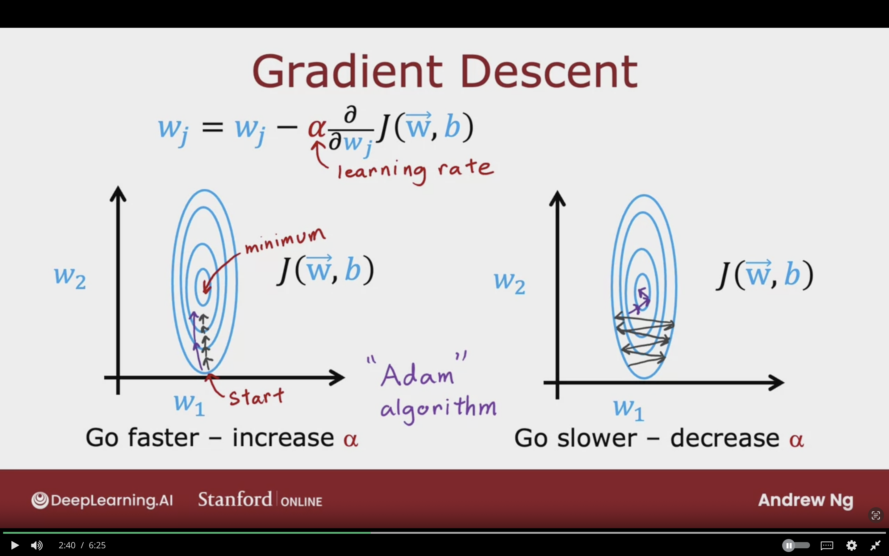
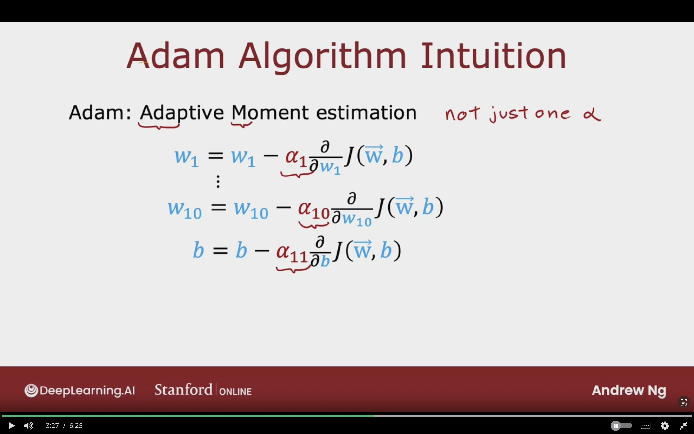
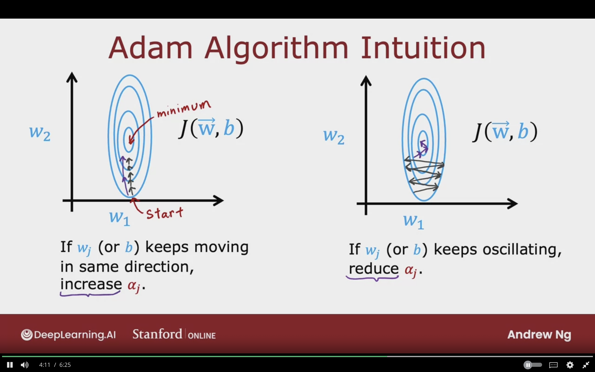
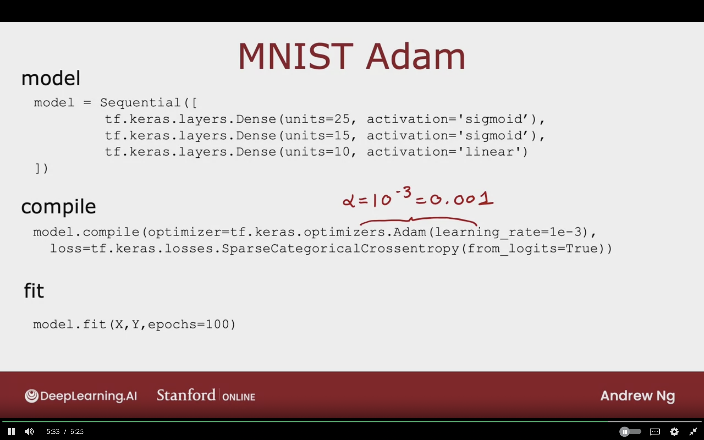
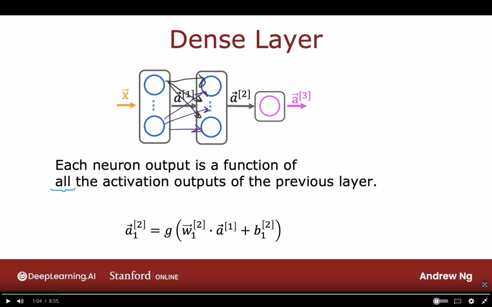
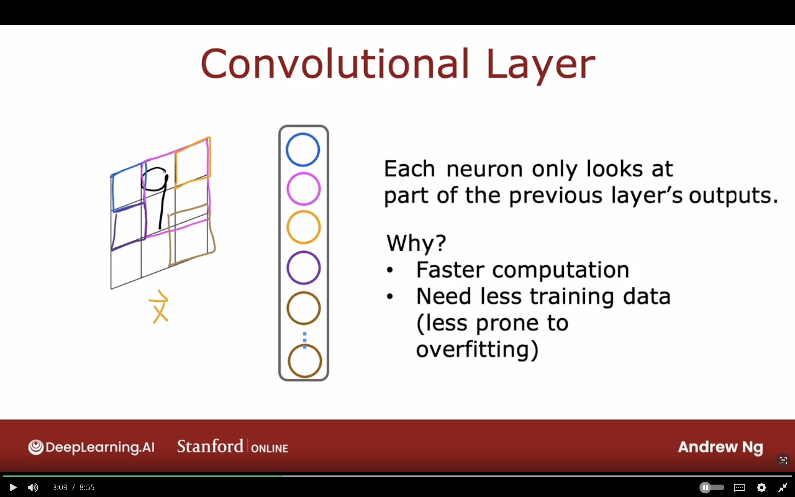
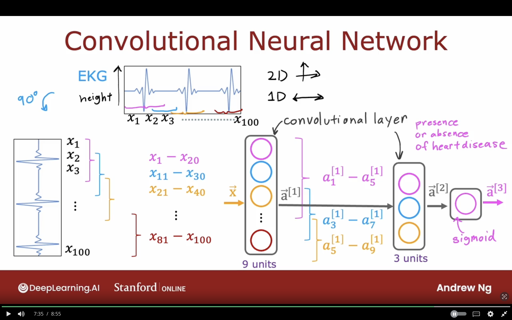

# Additionl Neural Networks Concepts


## Advanced Optimization

Gradient Descent is the foundation of many learning algorithms such as linear regression, logistic regression, and early neural networks.

There are many optimzation algorithms that are better than Gradient Descent.


### Gradient Descent

$$
w_{j} = w_{j} - \alpha {\partial \over {\partial w_{j}}} J(\vec{W}, b)
$$


**Adam Algorithm:**  
it sees that the learning rate is small, and it makes the learning rate bigger in order to take bigger steps.

- Go Faster - Increase $\alpha$
- Go Slower - Decrease $\alpha$


The below image showcases what Gradient Descent currently do for optimization. 


### Adam Algorithm Intitution

**Adam:**  
Adaptive Moment Intitution

Not just on $\alpha$ but uses different $\alpha$ for every single parameter in the model.

$$
w_{1} = w_{1} - \alpha_{1} {\partial \over {\partial w_{1}}} J(\vec{W}, b) \\
\dotso \\
w_{10} = w_{10} - \alpha_{10} {\partial \over {\partial w_{10}}} J(\vec{W}, b) \\

b = b - \alpha_{11} {\partial \over {\partial b}} J(\vec{W}, b) \\
$$




#### Adam Algorithm in 2 steps

1- If $w_{j}$ (or $b$) keeps moving in same direction, Increase $\alpha_{j}$

2- If $w_{j}$ (or $b$) keeps oscillating, Reduce $\alpha_{j}$




### MNIST Adam

**Model**
```python
model = Sequential([
    tf.keras.layer.Dense(units=25, activation='sigmoid'),
    tf.keras.layer.Dense(units=15, activation='sigmoid'),
    tf.keras.layer.Dense(units=10, activation='linear')
])
```


**Compile**
```python
# 1e-3 = 0.001
# should try different values
model.compile(optimizer=tf.keras.optimizers.Adam(learning_rate=1e-3),
loss=tf.keras.losses.SparseCategoricalCrossentropy(from_logits=True))
```

**Fit**

```python
model.fit(X, Y, epochs=100)
```

Adam Algorithm for loss function is an excellent choice as it's more adaptive than gradient descent.




## Additional Layer Types

Different type of layers than Dense layers


### Dense Layer

Each neuron output is a function of all the activation outputs of the previous layer.


$$
\vec{a}^{[2]}_{1} = g(\vec{w}^{[2]}_{1} \cdot \vec{a}^{[1]} + b^{[2]}_{1})
$$




### Convolutional Layer

Each neuron looks at part of the previous layer's outputs.

Why?
- Faster Computation
- Need less training data (less prone to overfitting)

Each neuron looks at a region of the image is called the convolutional layer.




### Convolutional Neural Network

A combination of Convolutinal Layers is called convolutional neural network.

Convolutional Layer each unit looks at limited window of the input.

**With Convolutional Layer there are these architecture choices:**

- How big the window of inputs should a neuron look at
- How many neuron should each neuron have


The below image showcases an example of EKG signals for hearts. the signal have been rotated to be vertical, and will be labeled from $x_{1}$ to $x_{100}$.

In the first convolutinal layer, each unit will look at a range of input features, for example:
- Unit 1: $x_{1}$ - $x_{20}$
- Unit 1: $x_{11}$ - $x_{30}$

The second convolutional layer will have 3 units, each unit will look at a number of units, for example:
- Unit 1: $a^{[1]}_{1}$ - $a^{[1]}_{5}$
- Unit 1: $a^{[1]}_{3}$ - $a^{[1]}_{7}$
- Unit 1: $a^{[1]}_{5}$ - $a^{[1]}_{9}$

The last layer will Dense with sigmoid activation function and will output $\vec{a}^{[3]}$




## Topics to Learn

- Adam Algorithm
- Convolutional Neural Networks
