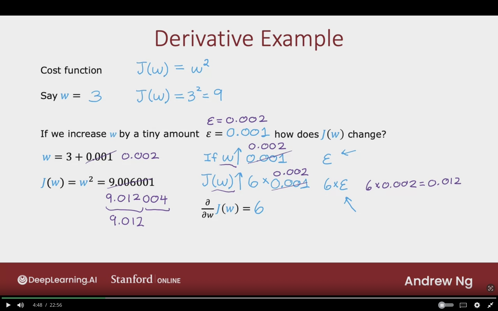

# Back Propagation

The following module is optional and will cover the back propagation, and it's how each neuron in neural networks decrease the loss.

## What is a derivative?

Tensorflow will use back propagation to compute derivative and use gradient descent to train parameters of neural networks.

**Back progation:**  
Compute derivatives of cost function with respect to the parameters.

### Derivative Example

**Cost Function:**  $J(W) = W^{2}$  
**Say $w$ = 3**  $J(W) = 3^{2} = 9$  

If we increase $w$ by a tiny amount $\epsilon = 0.001$. How does $J(W)$ change?

**Example 1:**  
$\epsilon = 0.001$  
$w = 3 + 0.001$  
$J(W) = W^{2} = 9.006001$

If $w \uparrow 0.001$  
$J(W) \uparrow 6 \times 0.001 = 0.006\;\;\;\;$  $\rightarrow 6 \times \epsilon$  
${\partial \over {\partial w}} J(W) = 6$

**Example 2:**  
$\epsilon = 0.002$  
$w = 3 + 0.002$  
$J(W) = W^{2} = 9.012004$

If $w \uparrow 0.002$  
$J(W) \uparrow 6 \times 0.002 = 0.012\;\;\;\;$  $\rightarrow 6 \times \epsilon$  
${\partial \over {\partial w}} J(W) = 6$

The smalller $\epsilon$ the more accurate it is.

### Informal Defination of Derivative

## Computation Graph

## Larger Neural Network Example

## Topics to learn

- 