# Multiclass Classification

Classification problems where there is more than 2 possible classes.

## Multiclass


**Multiclass Classification Problem:**  
target $y$ can take on more than ***two*** possible values.


### Minist Example

**Examples:**
- Classifying number (0,1,2,3,4,5,6,7,8,9)
- Diagnosing problem (Many diseases)
- Visual Defect Inspection of Manufactury parts, discoloration, chipped

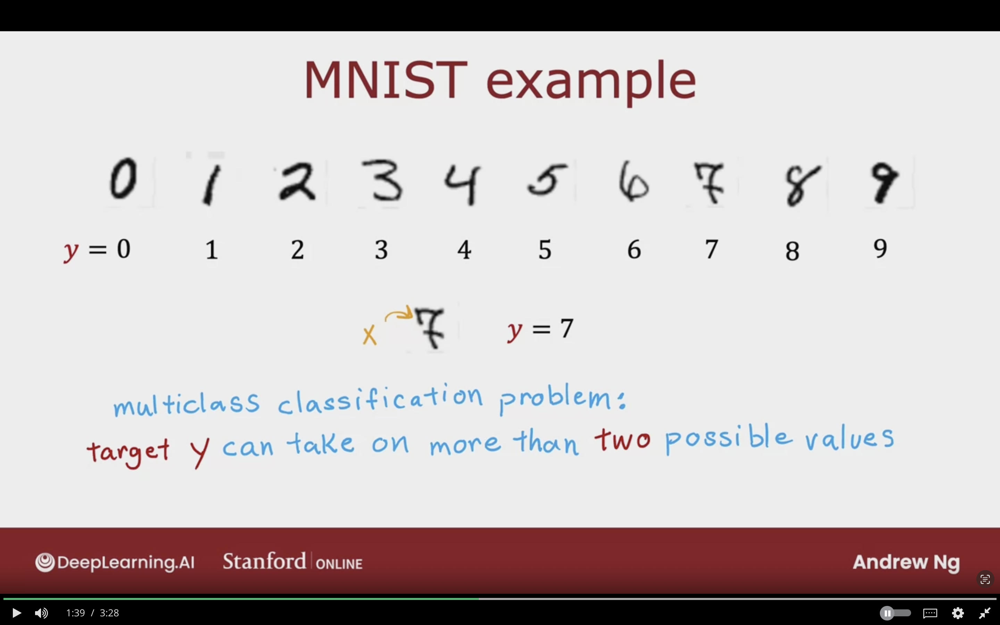


### Multiclass Classification Problem

Previously we had a dataset with 2 possible classes:
- $P(y = 1 | \vec{X})$
- not 1


Now with Multiclass:
- Class= 1, $P(y = 1 | \vec{X})$
- Class= 2, $P(y = 2 | \vec{X})$
- Class= 3, $P(y = 3 | \vec{X})$
- Class= 4, $P(y = 4 | \vec{X})$


The below image illustruates how the multiclass classification will work. It will have many decision boundaries to seperate each class of the dataset instead of one single line like before with logistic regression.
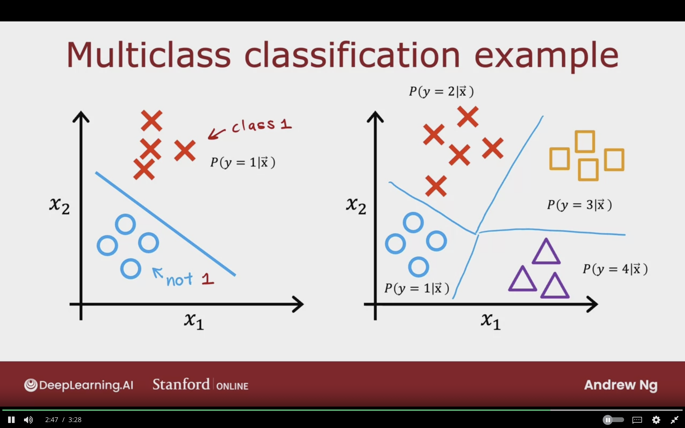


## Softmax

Generalization of logistic regression (binary classification) to the multiclass context

### Logistic Regresion (2 Possible output values):

$$
z = \vec{W} \cdot \vec{X} + b
$$ 

**Probability of y=1:**
$$
a_{1} = g(z) = {1 \over {1 + e^{-z}}} = P(y=1 |\vec{X})
$$

**Probability of y=0:**
$$
a_{2} = 1 - a_{2} = P(y=0 |\vec{X})
$$

Logistic estimate of the probability that $y = 1$ given those input features $\vec{X}$

- $P(y=1 |\vec{X}) = 0.71$  
- $P(y=0 |\vec{X}) = 0.29$

The have to add up to 1!


### Softmax Regression (4 possible outputs)

$y=1,2,3,4$


**Class 1:**  
$$
z_{1} = \vec{W}_{1} \cdot \vec{X} + b_{1}
$$


$$
a_{1} = {
    {e^{z_{1}}}
    \over
    {e^{z_{1}} + e^{z_{2}} + e^{z_{3}} + e^{z_{4}}}
}
$$

$$
= P(y=1 | \vec{X}) = 0.30
$$


**Class 2:**  
$$
z_{1} = \vec{W}_{1} \cdot \vec{X} + b_{2}
$$


$$
a_{2} = {
    {e^{z_{2}}}
    \over
    {e^{z_{1}} + e^{z_{2}} + e^{z_{3}} + e^{z_{4}}}
}
$$

$$
= P(y=3 | \vec{X}) = 0.20
$$


**Class 3:**  
$$
z_{3} = \vec{W}_{3} \cdot \vec{X} + b_{3}
$$

$$
a_{3} = {
    {e^{z_{3}}}
    \over
    {e^{z_{1}} + e^{z_{2}} + e^{z_{3}} + e^{z_{4}}}
}
$$

$$
= P(y=3 | \vec{X}) = 0.15
$$


**Class 4:**  
$$
z_{4} = \vec{W}_{4} \cdot \vec{X} + b_{4}
$$

$$
a_{4} = {
    {e^{z_{4}}}
    \over
    {e^{z_{1}} + e^{z_{2}} + e^{z_{3}} + e^{z_{4}}}
}
$$

$$
= P(y=4 | \vec{X}) = 1 - (a_{1}+ a_{2} + a_{3})
$$

$$
= 1 -(0.30+0.20+0.15) = 1 - 0.65 =  0.35
$$


### Softmax Regression (No Possible Outputs)

$(y =1,2,3,4,N)$


**Where $j = 1,2,3,4..,N:**
$$
Z_{j} = \vec{W}_{j} \cdot \vec{X} + b_{j}
$$

Parameters:
- $w_{1}, w_{2},\dotso, w_{N}$
- $b_{1}, b_{2},\dotso, b_{N}$


$$
a_{j} = {
    {e^{Z_{j}}}
    \over
    {\sum_{k=1}^{N} {e^{Z_{k}}}}
}
= P(y=j | \vec{X})
$$


- $k$ to index to summation
- $a_{j}$ is the model estimate that y =j given the input feature $\vec{X}$


**Note:**  
$a_{1} + a_{2} + a_{3} + \dotso + a_{N} = 1$


The above formula can also work with 2 classes!  
it ends up being like logistic regression

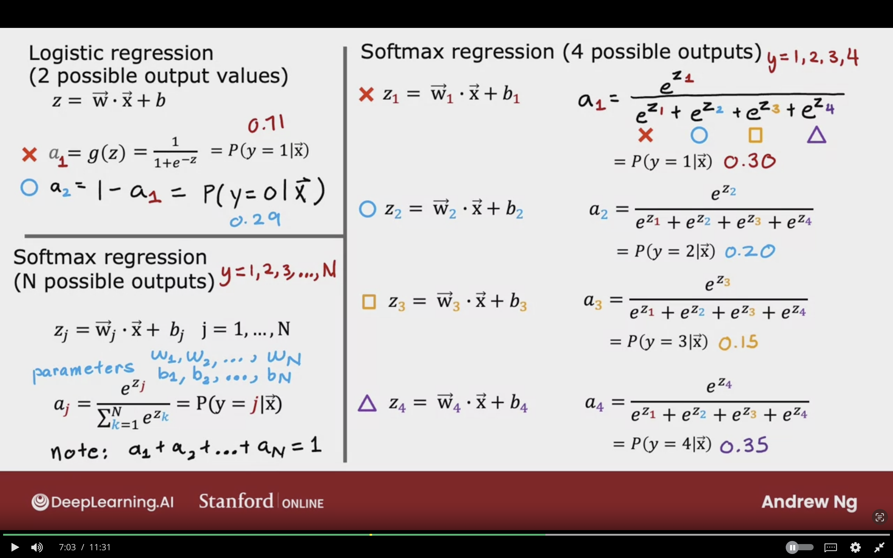


### Cost

#### Logistic Regression

$$
z = \vec{W} \cdot \vec{X} + b
$$

$$
a_{1} = g(z) = {1 over {1 + e^{-z}}} = P(y=1 | \vec{X})
$$

$$
a_{2} = 1 - a_{1} = P(y=1 | \vec{X})
$$


$$
loss = -y log(a_{1}) - (1 - y) log(1 - a_{1})
$$

By substituting $a_{2}$
$$
loss = -y log(a_{1}) - (1 - y) log(a_{2})
$$

if $y=1$ then:
- $-y log(a_{1})$

if $y=0$ then:
- $- (1 - y) log(a_{2})$


$J(\vec{W}, b)$ = average loss of the entire training set


#### Softmax Regression


$$
a_{1} = {
    {e^{z_{1}}}
    \over
    {e^{z_{1}} + e^{z_{2}} + e^{z_{3}} + e^{z_{4}}}
}
= P(y=1 | \vec{X})
$$
$$\dotso$$

$$
a_{N} = {
    {e^{z_{N}}}
    \over
    {e^{z_{1}} + e^{z_{2}} + e^{z_{3}} + e^{z_{N}}}
}
= P(y=N | \vec{X})
$$


The loss is taking the -log of the probability it thought y was N:
$$
loss (a_{1}, \dotso, a_{N}) = 
    \begin{cases}
    - \log\left(a_{1} \right) & \text{if $y=1$}\\
    - \log\left(a_{2} \right) & \text{if $y=2$}\\
    \dotso \\
    - \log\left(a_{N} \right) & \text{if $y=N$}\\
  \end{cases}
$$


**if $y =j$:**
- $loss = -log(a_{j})$


**If $a_{j}$ is low, then Loss is high!!**

**For computing the loss, we are computing for single $y$ prediction and not all!**


Teh following image summarizes the differences between Logistic Rgression Cost, and Sofmax Regression Cost.
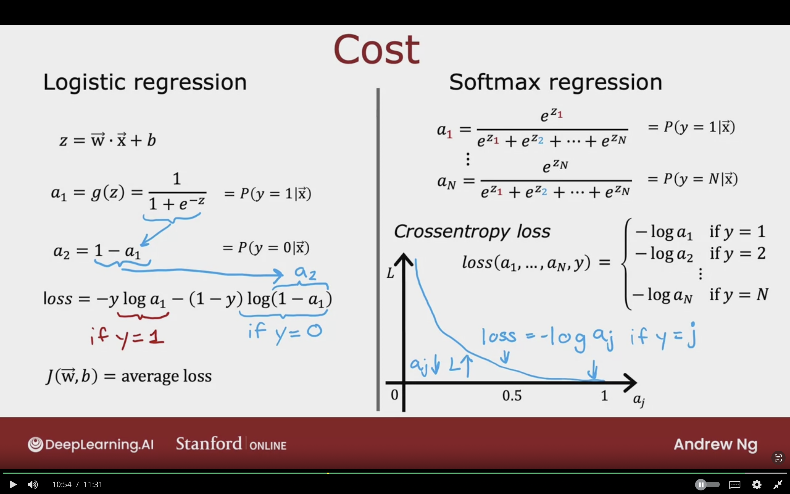


## Neural Network with Softmax Output

Take softmax model and will be placed in the output layer of neural netowrk.


**The changes will be the following:**

- Output layer with single unit will be replaced with softmax output layer.
- The output layer will have 10 units/neurons for 10 classes.
- Compute $z_{1}, \dotso, z_{10}$.


**For the output softmax layer:**
$$
Z^{[3]}_{1} = \vec{W}^{[3]}_{1} \cdot \vec{a}^{[2]} + b^{[3]}_{1}
\;\;\;\;\;\;\;\;
a^{[3]}_{1} = {
    {e^{z^{[3]}_{1}}}
    \over
    {e^{z^{[3]}_{1}}} + \dotso + {e^{z^{[3]}_{10}}}
    } 
= P(y = 1|\vec{X})
$$

$$
\dotsb
$$

$$
Z^{[3]}_{10} = \vec{W}^{[3]}_{10} \cdot \vec{a}^{[2]} + b^{[3]}_{10}
\;\;\;\;\;\;\;\;
a^{[3]}_{10} = {
    {e^{z^{[3]}_{10}}}
    \over
    {e^{z^{[3]}_{1}}} + \dotso + {e^{z^{[3]}_{10}}}
    } 
= P(y = 10|\vec{X})
$$


Softmax depends on all the values of $Z$ across all units, unlike sigmoid function!

**Logistic Regression:**  
$a^{[3]}_{1} = g(z^{[3]}_{1}) \;\;\;\; a^{[3]}_{2} = g(z^{[3]}_{2})$


**Softmax:**  
$\vec{a}^{[3]} = (a^{[3]}_{1},\dotso, a^{[3]}_{2}) = g(a^{[3]}_{1},\dotso, a^{[3]}_{2})$


The below image showcases a neural network with 10 softmax output layer, and the layer consists of 10 units/neurons. These units represent a class.
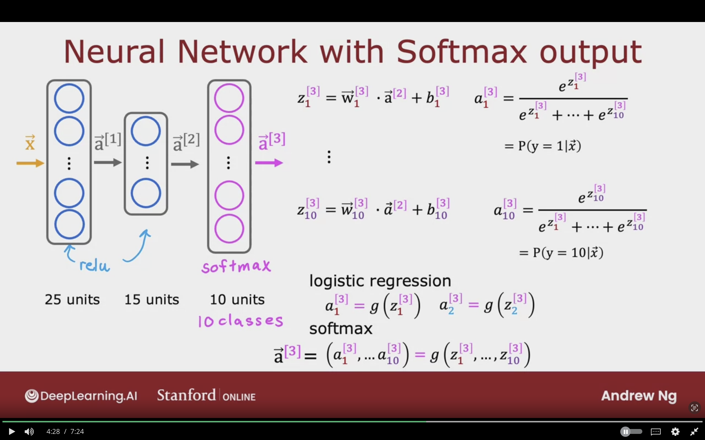


### MNIST with softmax

This section gives an example of defining a neural network for MNIST digit classifcation problem.

#### Step 1: Specify the model $f_{\vec{W},b} (\vec{X})$  = ?


```python
import tensorflow as tf
from tensorflow.keras import Sequential
from tensorflow.keras.layers import Dense


model = Sequential([
    Dense(units=25, activation='relu'),
    Dense(units=15, activation='relu'),

    # since the output will be multiclass
    Dense(units=10, activation='softmax'),
])
```


#### Step 2: Specify the loss and cost $L(f_{\vec{W},b}, y)$ 


SparseCategorical refers to the following:

1. **Catageorical:** Classify y into categories
2. **Sparse:** $y$ can only take one of these values, and not multiple category

```python
from tensorflow.keras.losses import SparseCategoricalCrossentropy

model.compile(loss= SparseCategoricalCrossentropy())
```


#### Step 3: Train the model to minimze $J(\vec{W},b)$ 


```python
model.fit(X,Y, epochs=100)
```

**Note:**  
- Better (Recommeneded) version later
- Don't use the version shown here


The below image showcases a sample code of training neural network for MNIST dataset which is a multiclassifcation problem.
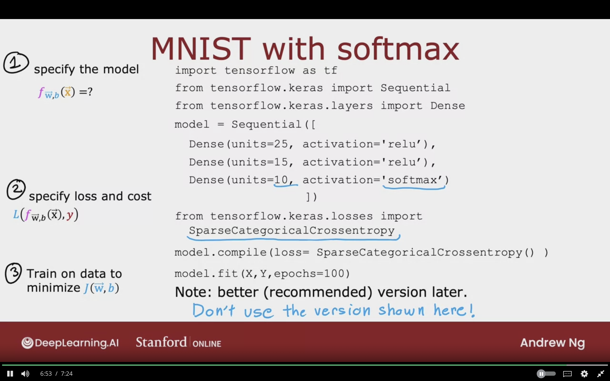


## Improved Implementation of Softmax


### Numerical Roundoff Errors

More numerically accurate implementation of logistic loss:


2 Different ways of computing the same quantity in computer:

**Option 1**  

$x = {2 \over 10,000}$

**Option 2**  
$x = (1 + {1 \over 10,000}) - (1 - {1 \over 10,000})$  
$= {2 \over 10,000}$

**In computer a round off error occurs!**

This can have an impact in computing softmax activation, which can help in reducing the numerical roundd off errors.

This can lead to more accurate results.


#### Logistic Regression:
$$
a = g(z) = {1 \over {1 + e^{-z}}}
$$


Original Loss:  
$$
loss = -y log(a) - (1-y) log(1-a)
$$

```python
model = Sequential([
    Dense(units=25, activation='relu'),
    Dense(units=15, activation='relu'),
    Dense(units=1, activation='sigmoid'),
])

model.compile(loss=BinaryCrossentropy())
```

The numeric round off is fine for logistc regression.


More accurate loss (in code):  
- Not using $a$ directly.
- Tell Tensorflow that this is the loss, which contain an expanded $a$ term.
- Tensorflow can arrange it to more numeric accurate way to compute loss function.
$$
loss = -y log({1 \over {1 + e^{-z}}}) - (1 - y) log(1 - {1 \over {1 + e^{-z}}})
$$


The below is the more accurate version 
```python
model = Sequential([
    Dense(units=25, activation='relu'),
    Dense(units=15, activation='relu'),

    # will now be set ouput layer to linear activation
    # Dense(units=1, activation='linear'),
    Dense(units=1, activation='sigmoid'),
])

# model.compile(loss=BinaryCrossentropy())


# (from_logits=True)
# logit:z tensorflow will rearange it to compute intermediate value that can be rearrange terms
# result --> more accurate
# helps in avoid numerical round off errors in tensorflow
model.compile(loss=BinaryCrossentropy(from_logits=True))
```

The below image of numerical round off error in logistic regression
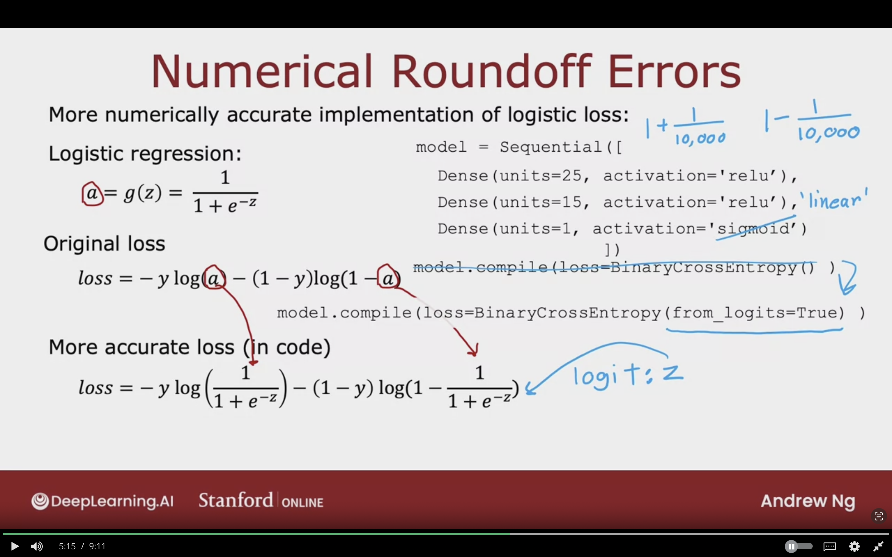


**Numeric round off can be far worse in softmax activation**

#### Softmax regression

$$
(a_{1}, \dotso, a_{1}) = g(z_{1}, \dotso, z_{10})
$$


$$
loss = L(\vec{a}, y) = 
    \begin{cases}
    - \log\left(a_{1} \right) & \text{if $y=1$}\\
    \dotso \\
    - \log\left(a_{10} \right) & \text{if $y=10$}\\
  \end{cases}
$$


```python
model = Sequential([
    Dense(units=25, activation='relu'),
    Dense(units=15, activation='relu'),


    Dense(units=10, activation='linear') 
    # Dense(units=10, activation='softmax') 
])

# have slight more round off error
# model.compile(SparseCategoricalCrossentropy())

# this version more numerical accurate 
# due to not doing th  numerical round off
model.compile(SparseCategoricalCrossentropy(from_logits=True))


```


The below image of numerical round off error in softmax activation. by making the last layer linear, and adding the from_logits the result is now more accurate.
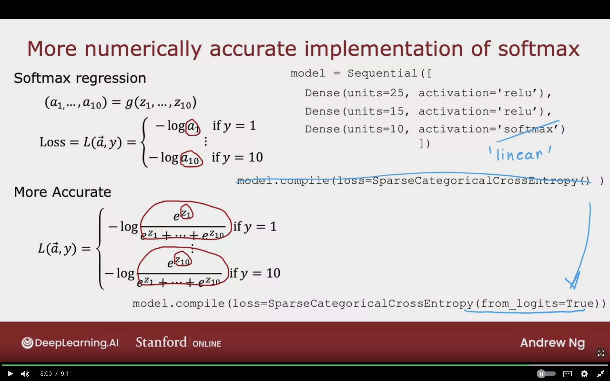


### MNIST (More Numerically Accurate)


#### Model

```python
import tensorflow as tf
from tensorflow.keras import Sequential
from tensorflow.keras.layer import Dense


model = Sequential([
    Dense(units= 25, activation= 'relu'),
    Dense(units= 15, activation= 'relu'),
    Dense(units= 10, activation= 'linear'),
])
```

#### Loss


```python
from tensorflow.keras.losses import SparseCategoricalCrossEntropy

model.compile(..., loss = SparseCategoricalCrossEntropy(from_logits=True))
```

#### Fit

Now instead of outputing the probabilites $a_{1}, ...,a_{10}$

It is now outputing $z_{1}, ..., z_{10}$

We have to define the softmax ourselves now!

```python
model.fit(X,Y, epochs=100)
```

#### Predict

```python
logits = model(X)

f_x = tf.nn.softmax(logits)
```

The below image showcases a sample code with softmax activation that results in better accuracy.

The key differences are the following:

- output layer having linear activation
- The additional ```from_logits=True``` parameter in BinaryCrossentropy
- Teh additional ```logits = model(X)``` & ```f_x = tf.nn.softmax(logits)``` functions when predicting using the model.

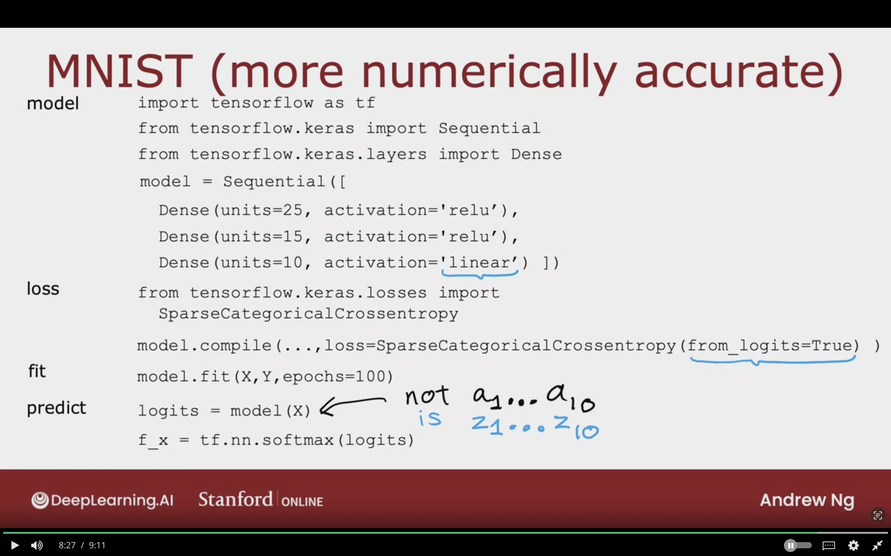


The below image showcases a logistic regression model with more accuracy.

The key differences are the following:

- output layer having linear activation
- The additional ```from_logits=True``` parameter in BinaryCrossentropy
- Teh additional ```logit = model(X)``` & ```f_x = tf.nn.sigmoid(logit)``` function when predicting using the model.
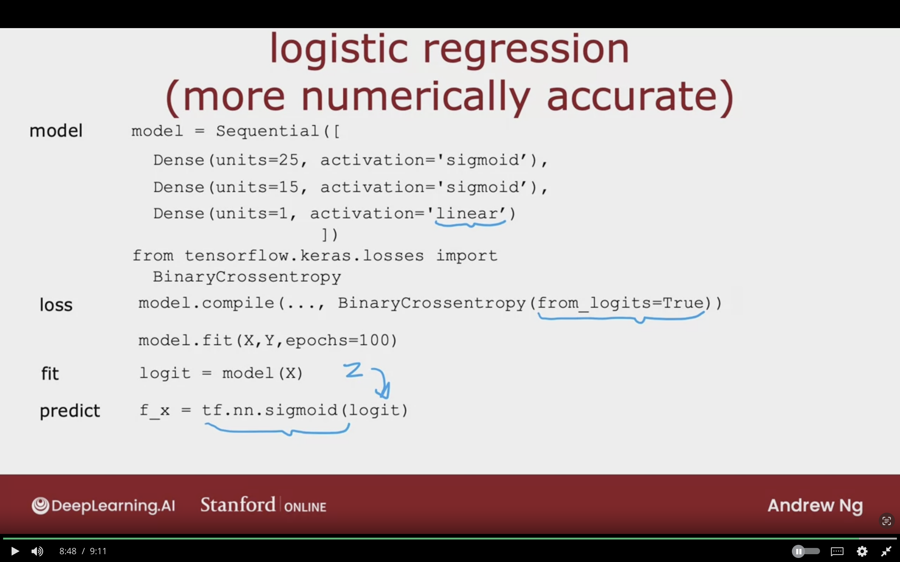


## Classification with Multiple Outputs

Different type of classfication, where each image can have multiple classes.

The output will be something like the following:


Is there a car? yes  
Is there a bus? no  
Is there a pedestrian? yes  

The target label $y$ is a vector of 3 values.
$$
y = \left[
\begin{matrix}
    1 \\
    0 \\
    1 \\
\end{matrix}
\right]
$$


### How can a neural network be trained to detect multiple class?

#### Approach 1: Build 3 neural networks with each can detect single a class/label


#### Approach 2: Build a Single neural networks with 3 outputs

Since we're solving 3 binary classifcation problem in the output layer:

- Sigmoid functions can be used in each neuron/unit of the output label.


$
\vec{a}^{[3]} = \left[
\begin{matrix}
    a^{[3]}_{1} \\
    a^{[3]}_{2} \\
    a^{[3]}_{3} \\
\end{matrix}
\right]
\begin{matrix}
car   \\
bus   \\
pedestrain \\
\end{matrix}
$  

**IMPORTANT:  Multi-Label Classification is not the same as multi-class classifcation!!**


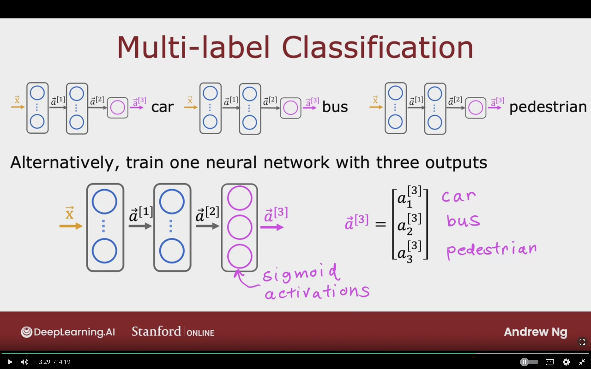

## Topics to study
- 

