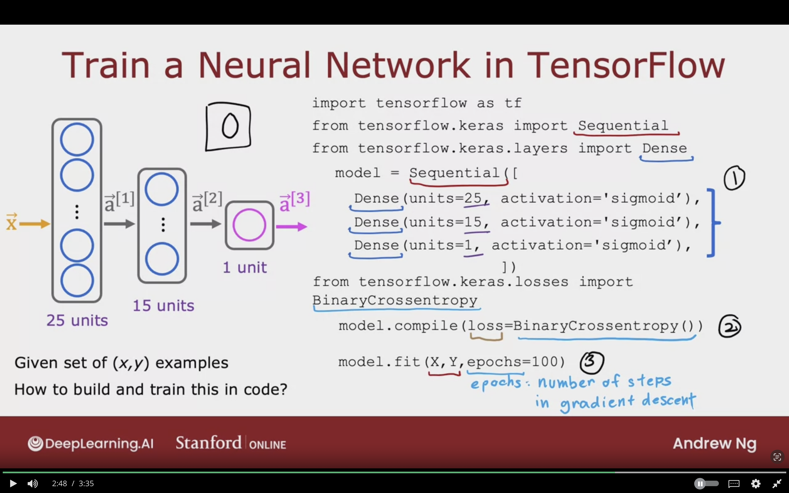
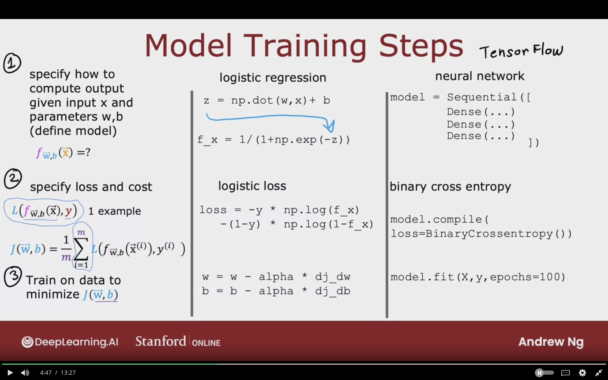
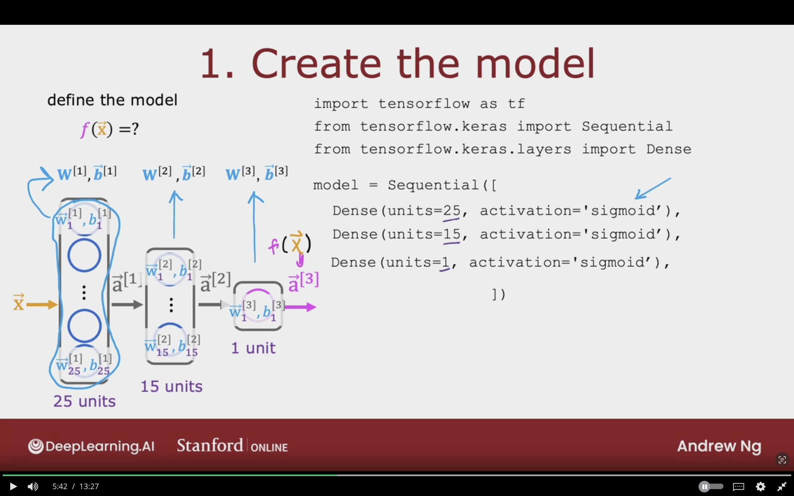

# Neural Network Training

## Tensorflow Implementation


### Train a Neural Network in Tensorflow

We will be using the same example from week-1

Given set of (X, y) examples
How to build and train this code.


```python
import tensorflow as tf
from tf.keras import Sequential
from tf.keras.layers import Dense

# 1 creating model
model = Sequential([
    Dense(units=25, activation='sigmoid'),
    Dense(units=15, activation='sigmoid'),
    Dense(units=1, activation='sigmoid'),
])


# 2 defining which loss function to use
from tf.keras.losses import BinaryCrossentropy

model.compile(loss= BinaryCrossentropy())


# 3 fit the model using the loss which was specified in 2
# epochs: number of steps in gradient descent or other loss function
model.fit(X, Y, epochs=100)
```


The below image showcases how we trained a neural network model in tensorflow by following the 3 mentioned steps.



## Training Details

Looking at the details of Tensorflow of training a model

### Model Training Steps

#### Step 1- Specifiy How to compute output given input x, and parameters w, b (define model)

$$
f_{\vec{W},b} (\vec{X}) = ?
$$

Which was the sigmoid function applied to $W \cdot X + b$


**Logistic Regression**

```python
# W * X + b
z = np.dot(w,x) + b

# sigmoid function
f_x = 1/(1 + np.exp(-z))
```

#### Step 2- Specify loss and cost

Comparing the prediction $f_{\vec{W},b}$ with the actual value  

**Loss Function:**
Function of the output learning algorithm and ground truth label for single example
$$
L(f_{\vec{W}, b} (\vec{X}), y)
$$

**Logistic Loss**
```python
# loss on single training example X,y
# loss function (-y) * log(f(x)) - (1 - y) * log(1-f(X))
loss = -y * np.log(f_x) - (1-y) * np.log(1-f_x)
```


**Cost Function:**
Average of all m training examples of the loss function computed on m training example x1, y1 -> xm, ym

$$
J(\vec{W}, b) = {1 \over m} \sum_{i=1}^{m} {L(f_{vec{W},b} (\vec{X}^{(i)}), y^{(i)})}
$$


#### Step 3- Training data to minimze $J(\vec{W},b)$ 

Use gradient descent to minmize the function $J(\vec{W},b)$ 


```python
w = w - alpha * dj_dw
b = b - alpha * dj_db
```

minimze the cost as function of the paramaters of the neural network

```python
mode.fit(X, y, epochs=100)
```


### Neural Network in Tensorflow

How the steps are mapped in Tensorflow

#### Step 1

Specifying the neural network, and it's enough for inference
```python
model = Sequential([
    Dense(...),
    Dense(...),
    Dense(...),

])
```

#### Step 2

Code to specify the cost function which is Binary Crossentropy

```python
mode.compile(loss= BinaryCrossentropy())
```


#### Step 3

minimze the cost as function of the paramaters of the neural network

```python
mode.fit(X, y, epochs=100)
```

The below image show cases the required steps in training the model. In terms of mathematics, python, Tensorflow.



### The 3 Steps of Training neural networks in details:

#### 1. Create the model 

The below code specifies the entire architecure of the neural network.
- The number of layers
- The number of units/neurons in each layer, which will be the number of parameters $W^{[1]}, b^{[1]}$
- The activation function in layers

```python
import tensorflow as tf
from tensorflow.keras import Sequential
from tensorflow.keras.layers import Dense

model = Sequential([
    Dense(units=25, activation='sigmoid'),
    Dense(units=15, activation='sigmoid'),
    Dense(units=1, activation='sigmoid')
])
```

The below image showcases the first step in training the model which is defining the model architecture, which consists of number of layers, units, activation function.



#### 2. Loss and Cost Function

What is the loss function which also defines the cost function as it's the average of the all loss for training examples.


Handwritten Digit Classification Problem --> Binary Classification (2 classes => 1/0, yes/no)

Compare prediction vs target value

**Logistic Loss, also known as Binary CrossEntropy**

$$
L(f(\vec{X},y)) = -y log(f(\vec{X})) - (1 - y)(1 - f(\vec{X}))
$$

```python
form tensorflow.keras.losses import BinaryCrossEntropy

model.compile(loss= BinaryCrossEntropy())
```

The cost is taking the average of all m training examples on the loss of all training examples.

Optimizing this cost function will result fitting neural network to binary classification data.


**Regression (Predicting numbers and not categories)**

```python
from tensorflow.keras.losses import MeanSquaredError

model.compile(loss= MeanSquaredError())
```

