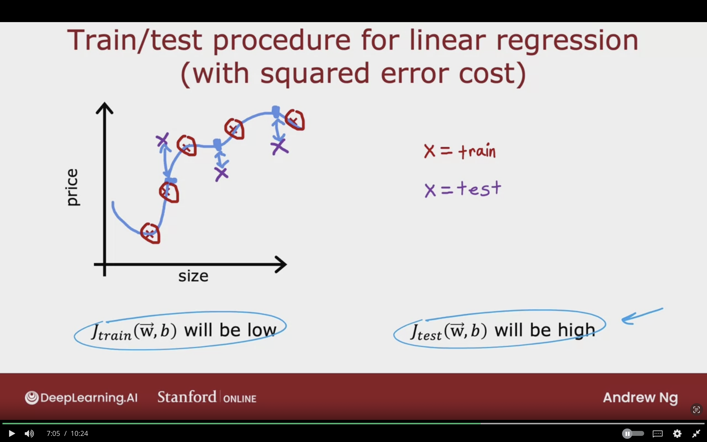
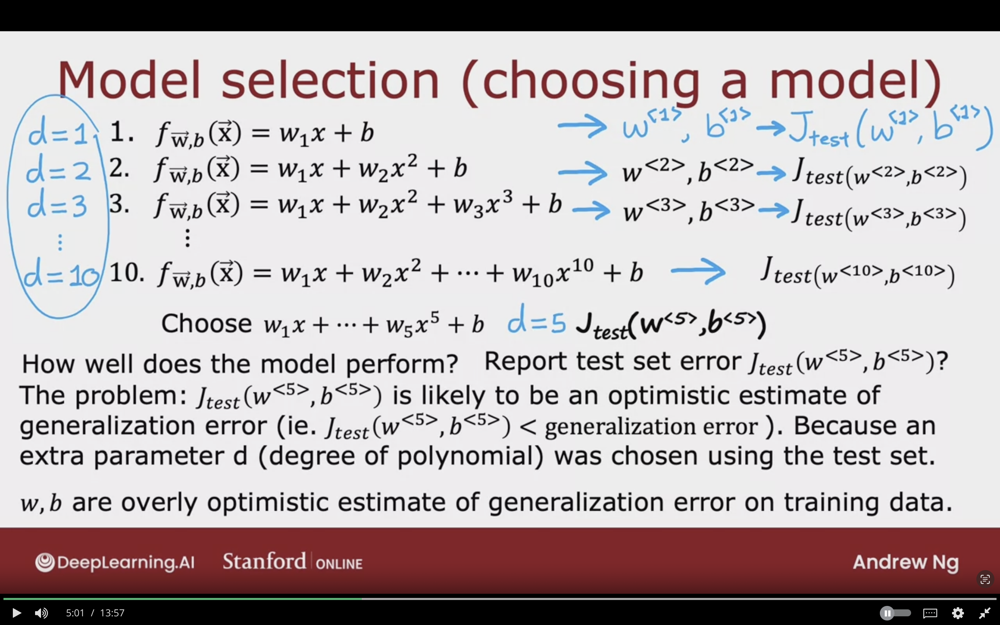
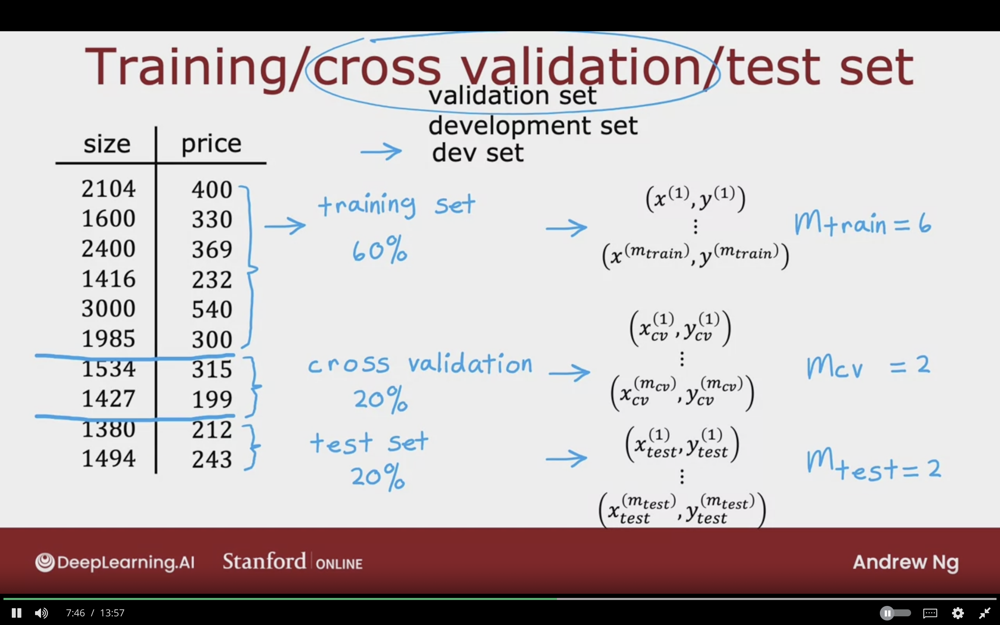
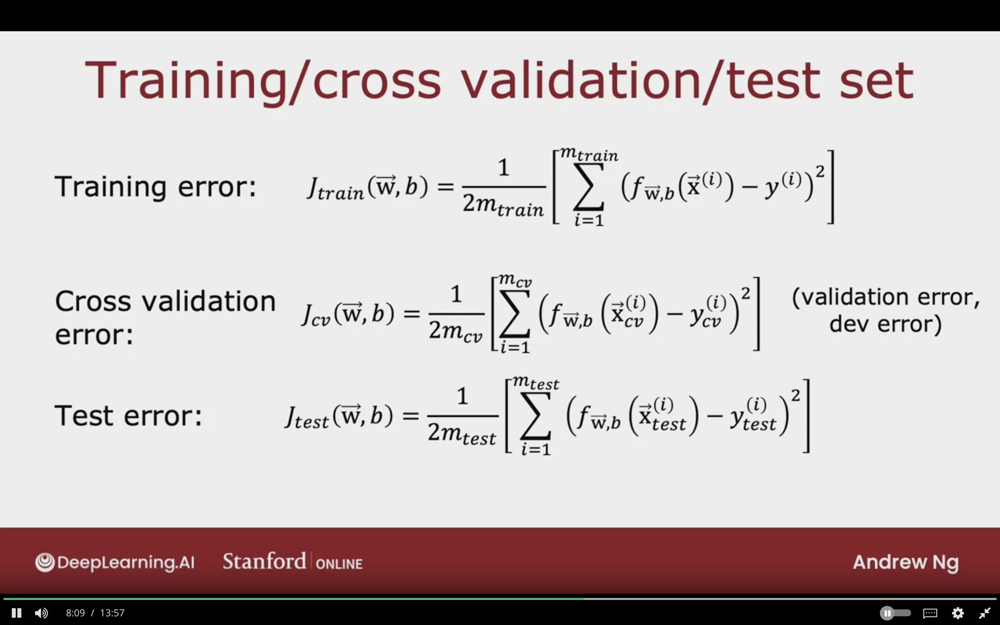
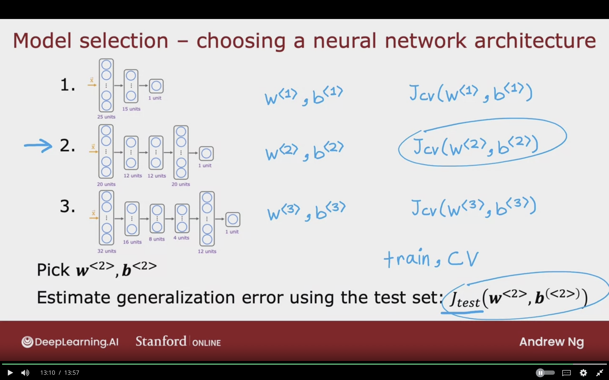

# Advice for Applying Machine Learning

## Deciding What to Try next

### Debugging a learning algorithm

You've implemented regularized linear regression on housing prices.

$$
J(\vec{W},b) = {1 \over 2m} \sum_{i=1}^{m} (f_{\vec{W},b}(\vec{X}^{(i)})- y^{(i)})^{2} + {\lambda \over 2m} \sum_{j=1}^{n} W_{j}^{2}
$$

But it makes unpredicatable large errors in the predictions.  
What should be done?

1. Get mor Training Example
2. Try smaller sets of features
3. Try getting additional set of features
4. Try adding polynomial features $(x_{1}^{2}, x_{2}^{2}, x_{1} x_{3}, etc)$
5. Try decreasing $\lambda$
6. Try increasing $\lambda$

### Machine Learning Diagnostic

**Diagonstic:**  
A test that you can run to gain insight into what is/isn't working with a learning algorithm, to gain guidance into improving its performance.

It will if it is worth weeks or months in collecting data, which will lead to improving performance sometimes.

Diagnostics can take time to implement
but doing so can be very good use of your time.

## Evaluating a model

Having systematic way to evaluate performace to have clear path on improving performace.

### Evaluting your model

**Overfitting:**  
Model fits training data well but will fail to generalize to new examples not in the training set.

$x_{1}$ = size in feet$^{2}$  
$x_{2}$ = no. of bedrooms  
$x_{3}$ = no. of floors  
$x_{4}$ = age of home in years  

$$
x = x_{1} \\

f_{\vec{w},b} (\vec{X}) = w_{1} x + w_{2} x^{2} + \dotso + w_{n} x^{n} + b \\

w_{n} x^{n} \rightarrow w_{4} x^{4}
$$

The curve is very curly, and it has many features, so it will very difficult to plot $f(\vec{X})$.

We need a better systematic way to evaluate how well the model is doing.

As the image below shows model which fits the data very well, but fails to generalizes to new examples.

### Technique 1

The model parameetrs will be trained on the training set, and will performance will be tested on the test set.

The total number of examples is 10

**Training set**  
70% of the dataset

$m_{train}$ = no. of training examples  
= 7

$$
(x^{(1)}, y^{(1)}) \\
(x^{(2)}, y^{(2)}) \\

(x^{(m_{train})}, y^{(m_{train})}) \\
$$

**Test set**  
30% of the dataset

$m_{train}$ = no. of test examples  
= 3

$$
(x_{test}^{(1)}, y_{test}^{(1)}) \\
(x_{test}^{(2)}, y_{test}^{(2)}) \\

(x_{test}^{(m_{test})}, y_{test}^{(m_{test})}) \\
$$

The below image showcases a sample dataset with 10 examples. 70% of the dataset will be used for the training, and 30% will be used for testing the performance of the model.

### Train/Test Procedure for Linear Regression (with Squared Error Cost)

Fit parameters by minimizing cost function $J(\vec{W},b)$

$$
J(\vec{W}, b) =
\left[
{1 \over 2m_{train}}
\sum_{i=1}^{m_{train}}
(f_{\vec{W},b} (\vec{X}^{(i)}) - y^{(i)})^{2}
+ {\lambda \over 2m_{train}}
\sum_{j=1}^{n} W_{j}
\right]
$$

**Compute Test Error:**  
$$
J_{test}(\vec{W}, b) =
{1 \over 2m_{test}}
\left[
\sum_{i=1}^{m_{test}}
(f_{\vec{W},b} (\vec{X}_{test}^{(i)}) - y_{test}^{(i)})^{2}
\right]
$$

**Compute Training Error:**  
$$
J_{train}(\vec{W}, b) =
{1 \over 2m_{train}}
\left[
\sum_{i=1}^{m_{train}}
(f_{\vec{W},b} (\vec{X}_{train}^{(i)}) - y_{train}^{(i)})^{2}
\right]
$$

**The error for training and test doesn't include regularization term!**

The following image showcases how the train test procedure can implemented to linear regression wit squared error cost. The previous formula which we used is minimzation term + regularization term.  
Now in the procedure we are evaluating the error for test and training sepearately. The two does not contain the regularization term.

On the training cost $J_{train} (\vec{W}, b)$ will be low

On the test cost $J_{test} (\vec{W}, b)$ will be high
Not good at generalizing to new example/data points that are not in the training set.

Large gap between the predicted housing prices with test set.

The below image showcases that the new examples from the test set are very from from the actual target values.

### Train/Test Set Procedure for Classifcation Problem (0/1)

Fit parameters by minimizng $J(\vec{W},b)$ to find $\vec{W},b$

$$
J(\vec{W},b) =
- {1 \over m_{train}}
\sum_{i=1}^{m_{train}}
\left[
y^{(i)}
log \left(
    f_{\vec{W},b} (\vec{X}^{(i)})
    \right)
+ (1 - y^{(i)})
log \left(
    1 - f_{\vec{W},b} (\vec{X}^{(i)})
    \right)
\right]

+ {\lambda \over 2m_{train}}
\sum_{j=1}^{n} W_{j}^{2}
$$

 

**Compute Test Error:**  
$$
J_{test}(\vec{W},b) =
- {1 \over m_{test}}
\sum_{i=1}^{m_{test}}
\left[
y_{test}^{(i)}
log \left(
    f_{\vec{W},b} (\vec{X}_{test}^{(i)})
    \right)
+ (1 - y_{test}^{(i)})
log \left(
    1 - f_{\vec{W},b} (\vec{X}_{test}^{(i)})
    \right)
\right]
$$

 

**Compute Train Error:**  
$$
J_{train}(\vec{W},b) =
- {1 \over m_{train}}
\sum_{i=1}^{m_{train}}
\left[
y_{train}^{(i)}
log \left(
    f_{\vec{W},b} (\vec{X}_{train}^{(i)})
    \right)
+ (1 - y_{train}^{(i)})
log \left(
    1 - f_{\vec{W},b} (\vec{X}_{train}^{(i)})
    \right)
\right]
$$

### Train/ Test Procedure for Classifcation Problem

Instead of using logistic loss to compute test error and test error. We can do the following:

Fraction of the test set and the fraction of the train set that the algorithm has misclassified.

$$
\hat{y} = 
 \begin{cases}
    1 \; \text{if } f_{\vec{W},b} (\vec{X}) \ge 0.5 \\
    0 \; \text{if } f_{\vec{W},b} (\vec{X}) < 0.5 \\
    \end{cases}
$$

Count $\hat{y} \ne y$

$J_{test} (\vec{W},b)$ is the fraction of the test set that has been misclassified.

$J_{train} (\vec{W},b)$ is the fraction of the train set that has been misclassified.

## Model Selection and Training/ Cross Validation/ Test Sets

Use Technique to choose a good model for machine learning algorithm.

### Model Selection (Choosing a model)

Once parameters $\vec{W}, b$ are fit to the training set, the training error $J_{train} (\vec{W,b})$ is likely lower than the actual generalization error (average error on new new examples not in training set).

**$J_{test} (\vec{W},b)$ is better estimate**  
of well the model will generalize to new data compared to $J_{train} (\vec{W},b)$

$
x = x_{1} \\
f_{\vec{W},b} (\vec{X}) = w_{1} x + w_{2} x^{2} + w_{3} x^{3} + w_{4} x^{4} + b
$

### Example of Choosing a model

**Degree polynomial:**  
$d=1$

1\. $d=1 \;\;\;\; f_{\vec{W},b} (\vec{X}) = w_{1} x + b$
  - $\Rightarrow W^{<1>}, b^{<1>} \Rightarrow J_{test} (W^{<1>}, b^{<1>})$

2\. $d=2 \;\;\;\; f_{\vec{W},b} (\vec{X}) = w_{1} x + w_{2} x + b$
  - $\Rightarrow W^{<2>}, b^{<2>} \Rightarrow J_{test} (W^{<2>}, b^{<2>})$

3\. $d=3 \;\;\;\; f_{\vec{W},b} (\vec{X}) = w_{1} x + w_{2} x + w_{3} x + b$
  - $\Rightarrow W^{<3>}, b^{<3>} \Rightarrow J_{test} (W^{<1>}, b^{<1>})$

...

10\.  $d=10 \;\;\;\; f_{\vec{W},b} (\vec{X}) = w_{1} x + w_{2} x + \dotso + w_{10} x + b$
  - $\Rightarrow W^{<10>}, b^{<10>} \Rightarrow J_{test} (W^{<10>}, b^{<10>})$

Check all the degree and pick the model with lowest values.  

**For example $J_{test}(W^{<5>}, b^{<5>})$ does best.**  
Choose $w_{1} x + \dotso + w_{5} x^{5} + b \;\;\;\;\; d=5$

**How well does the model perform?**

Report Test set error $J_{test} (W^{<5>}, b^{<5>})$

It is a Flawed procedure.

**The Problem:**  
$J_{test} (W^{<5>}, b^{<5>})$ is likely an optimistic estimate of generalization error.
- $J_{test} (W^{<5>}, b^{<5>})$ < generalization error

Because an extra parameter d (degree of polynomial) was chose using the train set.

$w,b$ are overly optimistic estimate of generalization error on training data.

The following image showcases flawed procedure in which we choose the polynomial degree based on having the lost $J_{test}$ value. However, the degree is most likely to be an overly optimistic estimate of generalization error. Also, the parameter d is only found in train set.

### Training/Cross Validation/Test Set

**Training Set: 60%**  
$m_{train} = 6$

$$
(x^{(1)}, y^{(1)}) \\
\dotso \\

(x^{(m_{train})}, y^{(m_{train})}) \\
$$

**Cross Validation: 20%**  
$m_{cv} = 2$

$$
(x^{(1)}, y^{(1)}) \\
\dotso \\

(x^{(m_{cv})}, y^{(m_{cv})}) \\
$$

**Test Set: 60%**  
$m_{test} = 2$

$$
(x^{(1)}, y^{(1)}) \\
\dotso \\

(x^{(m_{test})}, y^{(m_{test})}) \\
$$

**Cross Validation:**  
refers to that it's extra dataset to cross check the validaity or accuracy of different models.

**Cross Validation also refered to as:**  
- Validation Set
- Development Set
- Dev Set

The below image showcases an example of spliting the dataset into 3 subsets which are training, cross validation and test set. The cross validation is used to cross check the accuracy of different models.

### The 3 Different Formulas For Each Set

**Training Error:**
$$
J_{train} (\vec{W},b) =
{1 \over {2m_{train}}}
\left[
    \sum_{i=1}^{m_{train}} (f_{\vec{W},b} (\vec{X^{(i)}})
    - y^{(i)})^{2}
\right]
$$

**Cross Validation Error (Validation Error, Dev Error):**
$$
J_{cv} (\vec{W},b) =
{1 \over {2m_{cv}}}
\left[
    \sum_{i=1}^{m_{cv}} (f_{\vec{W},b} (\vec{X_{cv}^{(i)}})
    - y_{cv}^{(i)})^{2}
\right]
$$

**Test Error:**
$$
J_{test} (\vec{W},b) =
{1 \over {2m_{test}}}
\left[
    \sum_{i=1}^{m_{cv}} (f_{\vec{W},b} (\vec{X_{test}^{(i)}})
    - y_{test}^{(i)})^{2}
\right]
$$

### Model Selection

It will be the same as before, but instead of evaluating on the test set. The parameters will be evalauted on cross validation set.

1\. $d=1 \;\;\;\; f_{\vec{W},b} (\vec{X}) = w_{1} x + b$
  - $\Rightarrow W^{<1>}, b^{<1>} \Rightarrow J_{cv} (W^{<1>}, b^{<1>})$

2\. $d=2 \;\;\;\; f_{\vec{W},b} (\vec{X}) = w_{1} x + w_{2} x + b$
  - $\Rightarrow W^{<2>}, b^{<2>} \Rightarrow J_{cv} (W^{<2>}, b^{<2>})$

3\. $d=3 \;\;\;\; f_{\vec{W},b} (\vec{X}) = w_{1} x + w_{2} x + w_{3} x + b$
  - $\Rightarrow W^{<3>}, b^{<3>} \Rightarrow J_{cv} (W^{<1>}, b^{<1>})$

...

10\.  $d=10 \;\;\;\; f_{\vec{W},b} (\vec{X}) = w_{1} x + w_{2} x + \dotso + w_{10} x + b$
  - $\Rightarrow W^{<10>}, b^{<10>} \Rightarrow J_{cv} (W^{<10>}, b^{<10>})$

 

Pick $w_{1} x + \dotso + w_{4} x^{4} + b \;\;\;\;\;\;\; J_{cv} (W^{<4>}, b^{<4>})$

Which is the 4th degree polynomial

**Estimate generalization error of how well the model will do on new data, by using test set:**  
$J_{test} (W^{<4>}, b^{<4>})$

1. Train Set: will be used to fit the parameters.

2. Cross Validation Set: Will choose the parameter d or degree of ploynomial for the model.

3. Test Set: will be used for generalization error estimate of the model that is parameter $(W^{<4>}, b^{<4>})$

### Model Selection - Choosing a Neural Network Architecture

- To help to decide nn architecture

- consider 3 models to decide how many layer, or units in each layers

- Each model will have $W^{<1>}, b^{<1>}$, and will be evaluated using $J_{cv} (W^{<1>}, b^{<1>})$
- Pick the model with the least cross validation error, and use parameters trained using the datset

- To report the estimate of the generalization error, use the test set to estimate how well the neural network that was chosen will do.

- Use Train Set and CV Set only in the training process.

- When the final model was chosenm then evaluate using the test set.

- this will ensure the test set will be fair. and not overly optimitic on how well model will generalize to new data.

The below image illustartes the process for model selection on neural network architecture.

## Topics to Learn

- Cross Validation Error
- Other types of Linear Regression in Sci-Kit Learn [link](https://scikit-learn.org/stable/modules/classes.html#classical-linear-regressors)