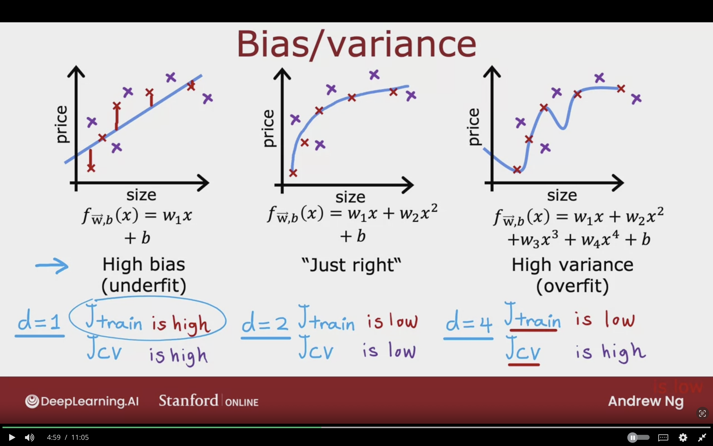
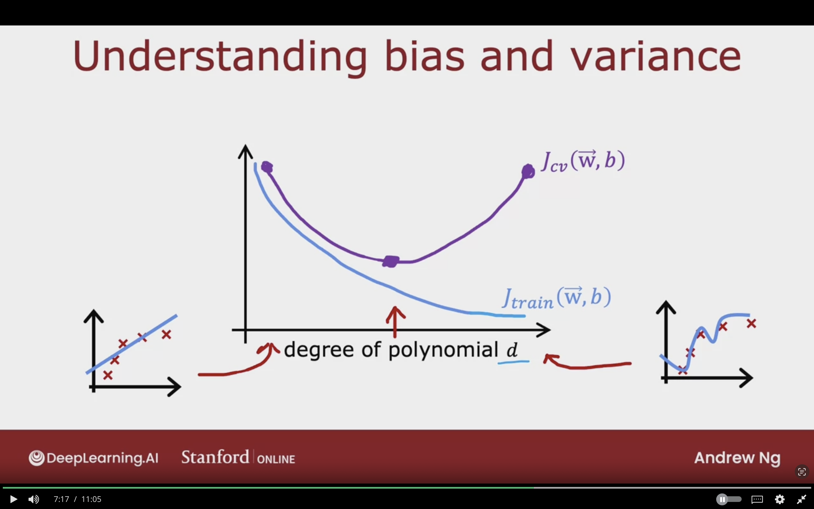
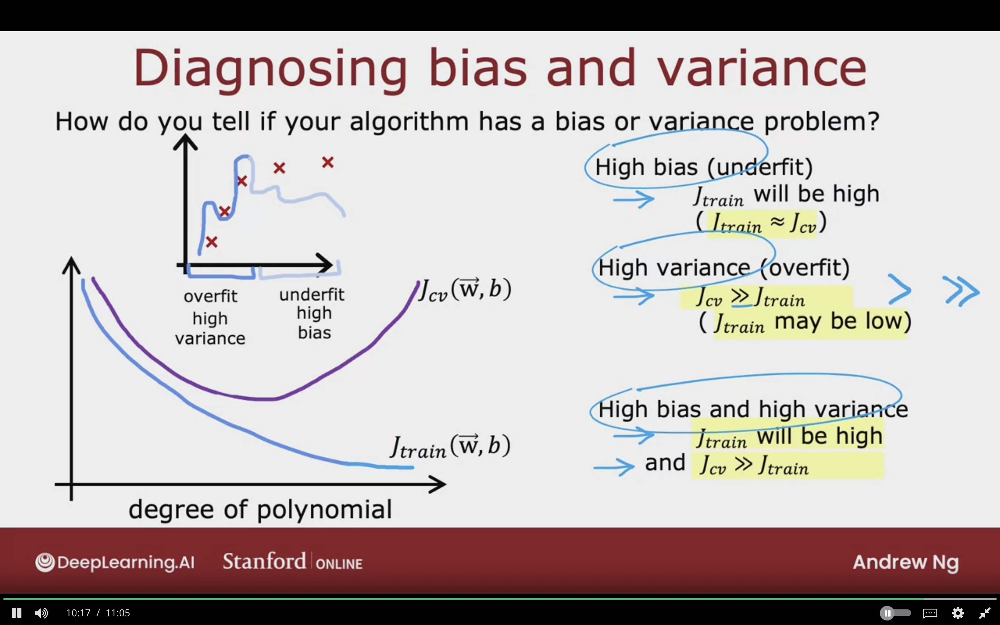
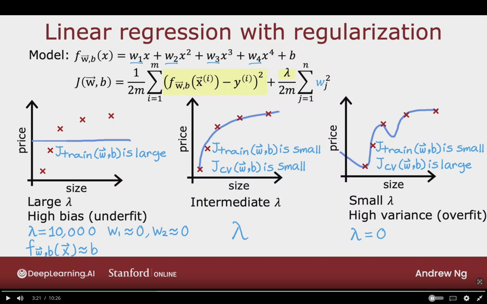
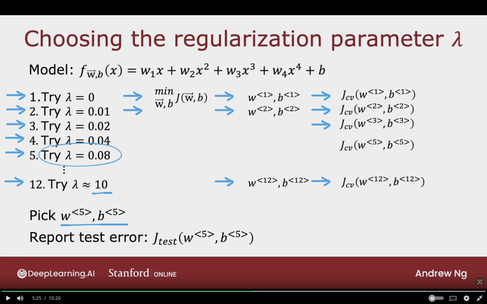
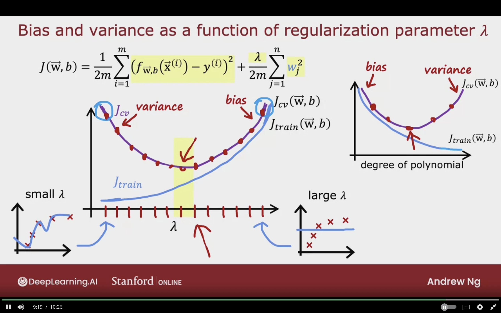
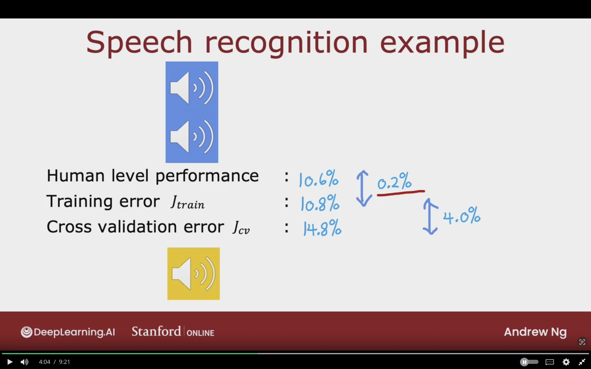
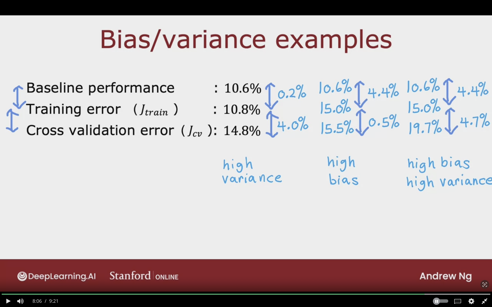

# Bias And Variance

## Diaganosing Bias and Variance

### Bias/Variance

Looking athe Bias and Variance of learning algorithms gives a good guidance on what to do next.

For simple feature it's easy to diagnoise to find the algorithm performance.

Systematic way to find the algorithm performance is by looking at the training set and cross validation set.

#### High Bias (Underfit)

$f_{\vec{W},b} = w_{1} x + b$  
$d=1$  
$J_{train}$ is high  
$J_{cv}$ is high

#### Just Right

$f_{\vec{W},b} = w_{1} x + w_{2} x^{2} + b$  
$d=2$  
$J_{train}$ is low  
$J_{cv}$ is low

#### High Variance (Overfit)

$f_{\vec{W},b} = w_{1} x + w_{2} x^{2} + w_{3} x^{3} + w_{4} x^{4} + b$  
$d=4$  
$J_{train}$ is low  
$J_{cv}$ is high

The below image showcases a different apporach to determine if the learning algorithm is overfitting or underfitting from the $J_{train}$ and $J_{cv}$

### Understanding Bias and Variance

On the x-axis the left side means a low degree polynomial d=1, and right is d=4

As the degree of polynomial increases, the $J_{train}$ decreases drastically.

For $J_{cv}$ if the degree is very low or too high, the $J_{cv}$ increases drastically, but in the middle it is the lowest. Right side is underfit, and right side is overfit.

### Diagonsing Bias and Varinace Summary

How do you tell if your algorithm has a bias or variance problem.

**High Bias(Underfit)**  
$J_{train}$ is high  
($J_{train} \approx J_{cv}$)

**High Variance(Overfit)**  
$J_{train} >> J_{train}$ [much greater]  
($J_{train}$ may be low)

**High Bias and High Variance**  
$J_{train}$ will be high  
and $J_{cv} >> J_{train}$

Don't happen that much in linear model applied in d=1.  

Overfits (High Bias) part of the input, and underfit (High Variance) part of the input. So it does bad in both dataset.

The below image summarizes the diagnosing bias and variance section.

## Regularization and Bias/Variance

### Linear Regression with Regularization

**Model:**  
$$
f_{\vec{W},b} (\vec{X}) = w_{1} x + w_{2} x^{2} + w_{3} x^{3} + + w_{4} x^{4} + b
$$

$$
J(\vec{W},b) =
{1 \over 2m}
\sum_{i=1}^{m}
\left(
    f_{\vec{W},b} (\vec{X}^{(i)}) - y^{(i)}
\right)^{2}
+ {\lambda \over 2m}
\sum_{j=1}^{n} w_{j}^{2}
$$

**$\lambda$ (Regularization parameter):**  
How much you trade-off the parameters w small versus versus fitting the training data well.

**Large lambda**  
**High Bias (Underfit)**  

- $J_{train} (\vec{W},b)$ is large
- $\lambda= 10,000 \;\;\; w_{1}\approx 0, w_{2}\approx 0$  
- Large lambda, the algorithm is motivated to keep parameters $w$ very small.  
- $f_{\vec{W},b} (\vec{}X) \approx b$

**Small lambda**  
**High Varaince (Overfit)**  

- $J_{train} (\vec{W},b)$ is small
- $J_{cv} (\vec{W},b)$ is large
- $\lambda= 0 \;\;\; w_{1}\approx 0, w_{2}\approx 0$  

**Intermediate $\lambda$**  

- $J_{train} (\vec{W},b)$ is small
- $J_{cv} (\vec{W},b)$ is small

### Choosing the Regularization Parameter $\lambda$

**Model:**  
$$
f_{\vec{W},b} = w_{1} x + w_{2} x^{2} + w_{3} x^{3} + w_{4} x^{4} + b
$$

1. Try $\lambda = 0 \rightarrow min_{\vec{W},b} J(\vec{W},b) \rightarrow w^{<1>}, b^{<1>} \rightarrow J_{cv} (W^{<1>}, b^{<1>})$

2. Try $\lambda = 0.01 \rightarrow min_{\vec{W},b} J(\vec{W},b) \rightarrow w^{<2>}, b^{<2>} \rightarrow J_{cv} (W^{<2>}, b^{<2>})$

3. Try $\lambda = 0.02 \rightarrow min_{\vec{W},b} J(\vec{W},b) \rightarrow w^{<3>}, b^{<3>} \rightarrow J_{cv} (W^{<3>}, b^{<3>})$

4. Try $\lambda = 0.04 \rightarrow J_{cv} (W^{<4>}, b^{<4>})$

5. Try $\lambda = 0.08 \rightarrow J_{cv} (W^{<5>}, b^{<5>})$

Pick $W^{<5>}, b^{<5>}$

Report test error: $J_{test} (W^{<5>}, b^{<5>})$

The same procedure which was used with polynomial degrees can be applied with regularization term in order to pick the best value.

### Bias and Variance as a Fucntion of Regularization Parameter $\lambda$

$$
J(\vec{W},b) =
{1 \over 2m}
\sum_{i=1}^{m}
\left(
    f_{\vec{W},b} (\vec{X}^{(i)}) - y^{(i)}
\right)^{2}
+ {\lambda \over 2m}
\sum_{j=1}^{n} w_{j}^{2}
$$

As the $\lambda$ increases the $J_{train} (\vec{W},b)$ will increases. Also, $J_{cv}$ will increases, so it will result underfitting the data (high bias)

Meanwhile, as $\lambda$ decreases, $J_{train}$ will decreases. Also, $J_{cv}$ will decreases. So it will result in overfitting the data (high variance)

The graph is like a mirror of the degree of polynomial graph.

Cross Validation evaluating different values can help to choose good value for $d$ or $\lambda$

## Establishing a Baseline Level of Performance

Concenrete numbres on $J_{train}$ & $J_{cv}$ to see if learning algorithm has high bias or high variance

### Speech Recognition Example

**Human Performance:** 10.6%  
Measure how well fluent speakers can transcript audiocips.
Can be bad due to bad audio

**Training Error $J_{train}$:** 10.8%   
What is the percentage of audioclips in data that algorithm doesn't transcript correctly.

- It does slightly worse (0.2%) than human peformance, which is very good.

**Cross Validation Error $J_{cv}$:** 14.8%

- It does worse with cv, and it has high variance problem, as it has 4.0% more error than training error.

So we conclude that that the learning algorithm has a high variance problem, and not high bias problem. (Overfitting)

### Establishing Baseline level of Performance

What is the level of error you can reasonably hope to get?

- Human Level Performance
  - Good level when using unstructured data like audio, images or text.
- Competing algorithms performance
- Guess based on experience

### Bias/Varianace Examples

**To determine Bias:**  
Gap between Baseline performance and Training error $J_{train}$

**To determine Variance:**  
Gap between training error $J_{train}$ and cross validation error $J_{cv}$

We can have a learning algorithm with both high bias and high variance but it's a rare occurence.

The below image showcases an examples bias and variance problem by comparign with baseline performance. It concludes that the gap between each measure will determine the bias and variance of the learning algorithm.

## Learning Curves

## Deciding What to Try Next

## Bias/Variance and Neural Networks

## Topics to Learn

- 