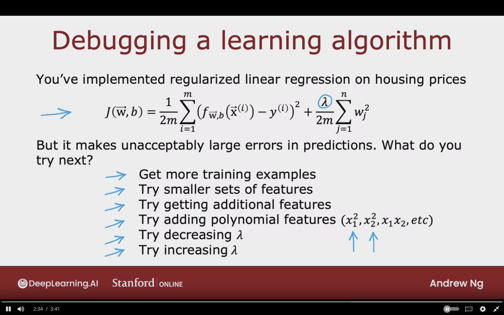
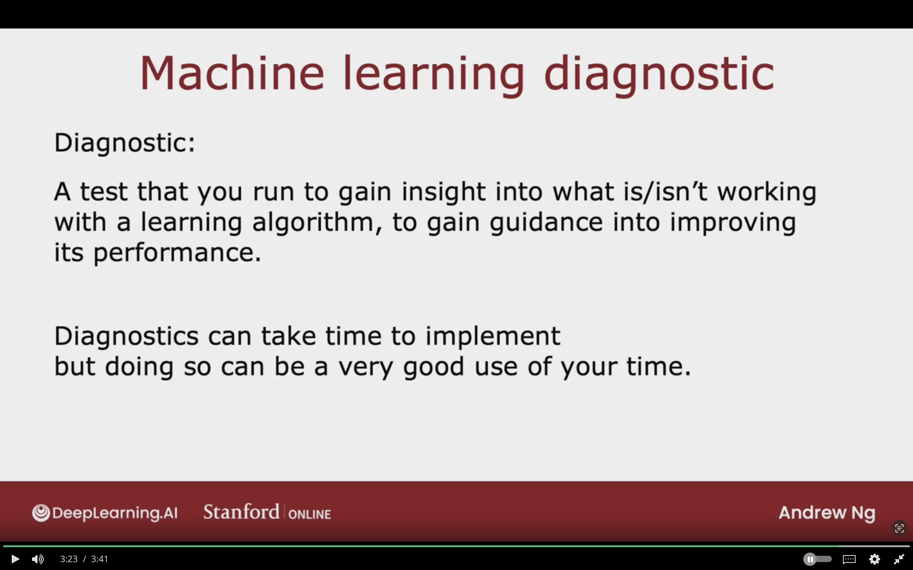
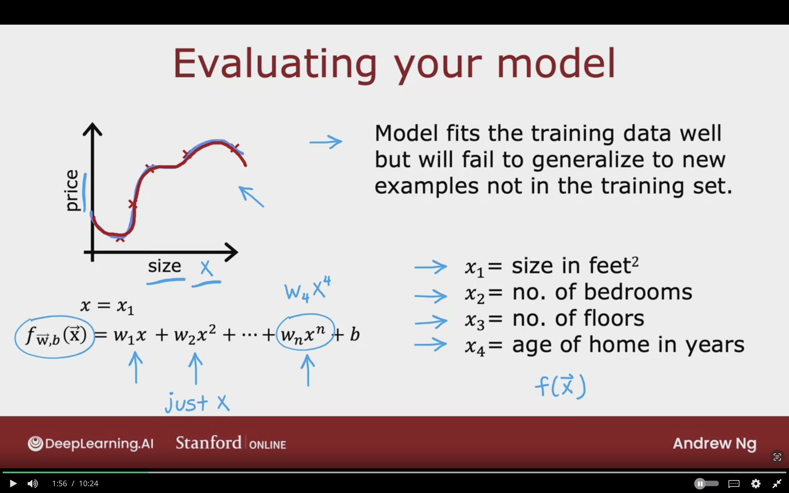
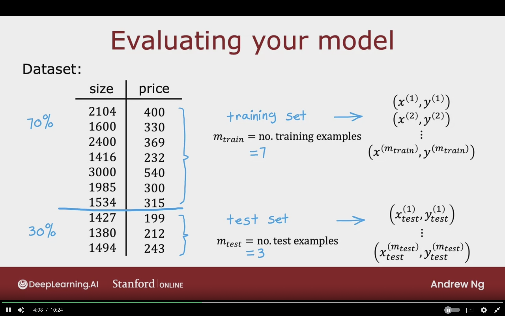
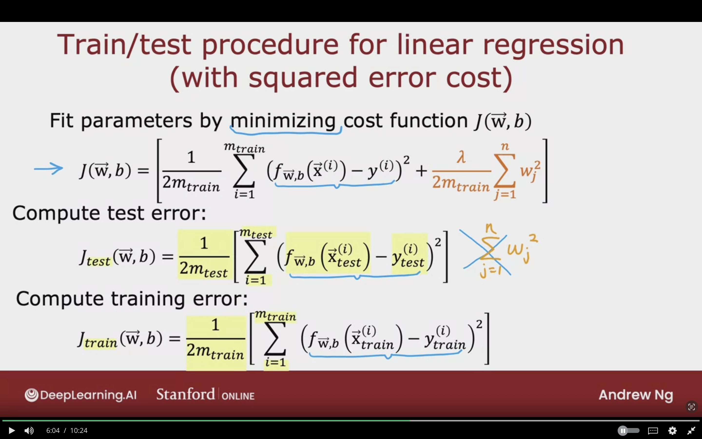
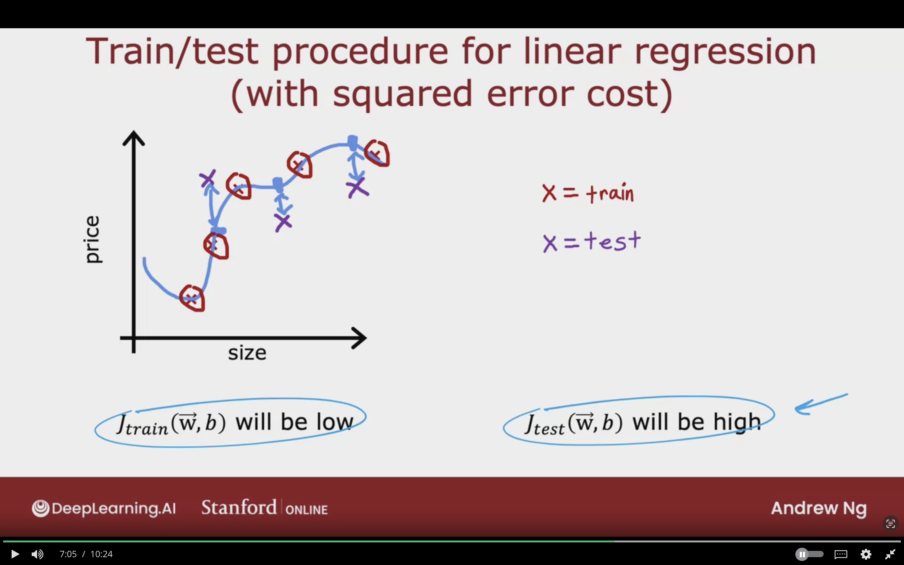
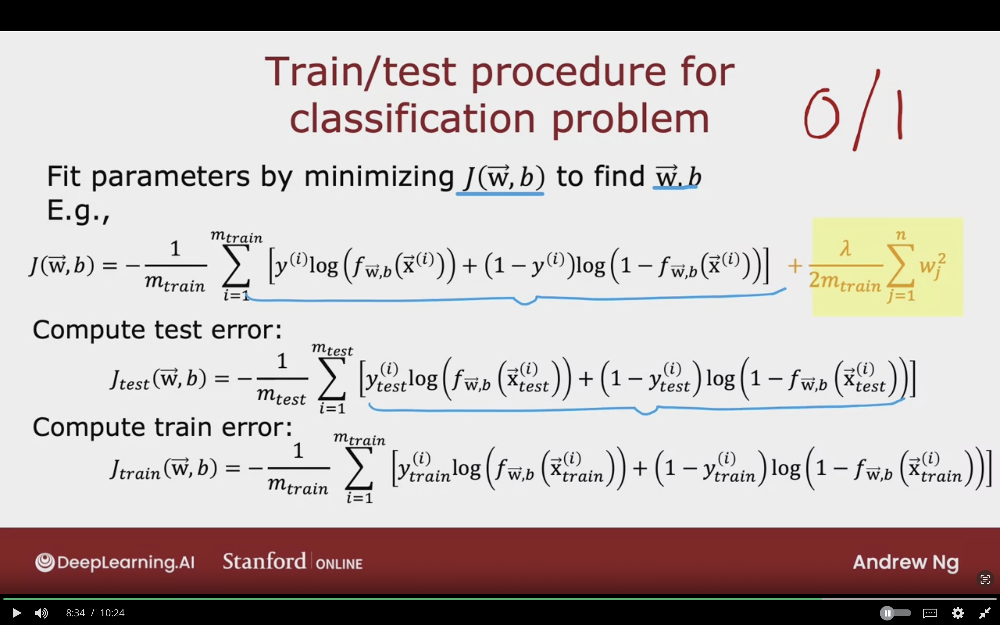
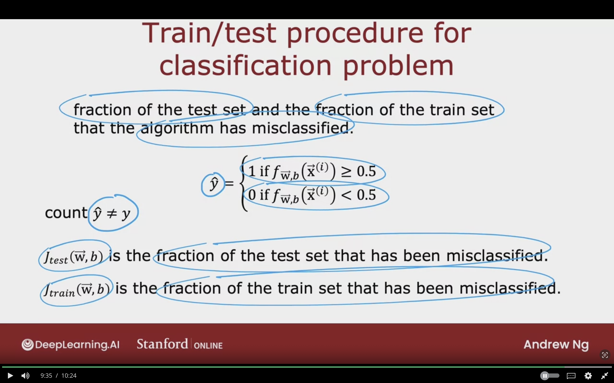

# Advice for Applying Machine Learning

## Deciding What to Try next

### Debugging a learning algorithm

You've implemented regularized linear regression on housing prices.

$$
J(\vec{W},b) = {1 \over 2m} \sum_{i=1}^{m} (f_{\vec{W},b}(\vec{X}^{(i)})- y^{(i)})^{2} + {\lambda \over 2m} \sum_{j=1}^{n} W_{j}^{2}
$$

But it makes unpredicatable large errors in the predictions.  
What should be done?

1. Get mor Training Example
2. Try smaller sets of features
3. Try getting additional set of features
4. Try adding polynomial features $(x_{1}^{2}, x_{2}^{2}, x_{1} x_{3}, etc)$
5. Try decreasing $\lambda$
6. Try increasing $\lambda$

### Machine Learning Diagnostic

**Diagonstic:**  
A test that you can run to gain insight into what is/isn't working with a learning algorithm, to gain guidance into improving its performance.

It will if it is worth weeks or months in collecting data, which will lead to improving performance sometimes.

Diagnostics can take time to implement
but doing so can be very good use of your time.

## Evaluating a model

Having systematic way to evaluate performace to have clear path on improving performace.

### Evaluting your model

**Overfitting:**  
Model fits training data well but will fail to generalize to new examples not in the training set.

$x_{1}$ = size in feet$^{2}$  
$x_{2}$ = no. of bedrooms  
$x_{3}$ = no. of floors  
$x_{4}$ = age of home in years  

$$
x = x_{1} \\

f_{\vec{w},b} (\vec{X}) = w_{1} x + w_{2} x^{2} + \dotso + w_{n} x^{n} + b \\

w_{n} x^{n} \rightarrow w_{4} x^{4}
$$

The curve is very curly, and it has many features, so it will very difficult to plot $f(\vec{X})$.

We need a better systematic way to evaluate how well the model is doing.

As the image below shows model which fits the data very well, but fails to generalizes to new examples.

### Technique 1

The model parameetrs will be trained on the training set, and will performance will be tested on the test set.

The total number of examples is 10

**Training set**  
70% of the dataset

$m_{train}$ = no. of training examples  
= 7

$$
(x^{(1)}, y^{(1)}) \\
(x^{(2)}, y^{(2)}) \\

(x^{(m_{train})}, y^{(m_{train})}) \\
$$

**Test set**  
30% of the dataset

$m_{train}$ = no. of test examples  
= 3

$$
(x_{test}^{(1)}, y_{test}^{(1)}) \\
(x_{test}^{(2)}, y_{test}^{(2)}) \\

(x_{test}^{(m_{test})}, y_{test}^{(m_{test})}) \\
$$

The below image showcases a sample dataset with 10 examples. 70% of the dataset will be used for the training, and 30% will be used for testing the performance of the model.

### Train/Test Procedure for Linear Regression (with Squared Error Cost)

Fit parameters by minimizing cost function $J(\vec{W},b)$

$$
J(\vec{W}, b) =
\left[
{1 \over 2m_{train}}
\sum_{i=1}^{m_{train}}
(f_{\vec{W},b} (\vec{X}^{(i)}) - y^{(i)})^{2}
+ {\lambda \over 2m_{train}}
\sum_{j=1}^{n} W_{j}
\right]
$$

**Compute Test Error:**  
$$
J_{test}(\vec{W}, b) =
{1 \over 2m_{test}}
\left[
\sum_{i=1}^{m_{test}}
(f_{\vec{W},b} (\vec{X}_{test}^{(i)}) - y_{test}^{(i)})^{2}
\right]
$$

**Compute Training Error:**  
$$
J_{train}(\vec{W}, b) =
{1 \over 2m_{train}}
\left[
\sum_{i=1}^{m_{train}}
(f_{\vec{W},b} (\vec{X}_{train}^{(i)}) - y_{train}^{(i)})^{2}
\right]
$$

**The error for training and test doesn't include regularization term!**

The following image showcases how the train test procedure can implemented to linear regression wit squared error cost. The previous formula which we used is minimzation term + regularization term.  
Now in the procedure we are evaluating the error for test and training sepearately. The two does not contain the regularization term.

On the training cost $J_{train} (\vec{W}, b)$ will be low

On the test cost $J_{test} (\vec{W}, b)$ will be high
Not good at generalizing to new example/data points that are not in the training set.

Large gap between the predicted housing prices with test set.

The below image showcases that the new examples from the test set are very from from the actual target values.

### Train/Test Set Procedure for Classifcation Problem (0/1)

Fit parameters by minimizng $J(\vec{W},b)$ to find $\vec{W},b$

$$
J(\vec{W},b) =
- {1 \over m_{train}}
\sum_{i=1}^{m_{train}}
\left[
y^{(i)}
log \left(
    f_{\vec{W},b} (\vec{X}^{(i)})
    \right)
+ (1 - y^{(i)})
log \left(
    1 - f_{\vec{W},b} (\vec{X}^{(i)})
    \right)
\right]

+ {\lambda \over 2m_{train}}
\sum_{j=1}^{n} W_{j}^{2}
$$

 

**Compute Test Error:**  
$$
J_{test}(\vec{W},b) =
- {1 \over m_{test}}
\sum_{i=1}^{m_{test}}
\left[
y_{test}^{(i)}
log \left(
    f_{\vec{W},b} (\vec{X}_{test}^{(i)})
    \right)
+ (1 - y_{test}^{(i)})
log \left(
    1 - f_{\vec{W},b} (\vec{X}_{test}^{(i)})
    \right)
\right]
$$

 

**Compute Train Error:**  
$$
J_{train}(\vec{W},b) =
- {1 \over m_{train}}
\sum_{i=1}^{m_{train}}
\left[
y_{train}^{(i)}
log \left(
    f_{\vec{W},b} (\vec{X}_{train}^{(i)})
    \right)
+ (1 - y_{train}^{(i)})
log \left(
    1 - f_{\vec{W},b} (\vec{X}_{train}^{(i)})
    \right)
\right]
$$

### Train/ Test Procedure for Classifcation Problem

Instead of using logistic loss to compute test error and test error. We can do the following:

Fraction of the test set and the fraction of the train set that the algorithm has misclassified.

$$
\hat{y} = 
 \begin{cases}
    1 \; \text{if } f_{\vec{W},b} (\vec{X}) \ge 0.5 \\
    0 \; \text{if } f_{\vec{W},b} (\vec{X}) < 0.5 \\
    \end{cases}
$$

Count $\hat{y} \ne y$

$J_{test} (\vec{W},b)$ is the fraction of the test set that has been misclassified.

$J_{train} (\vec{W},b)$ is the fraction of the train set that has been misclassified.

## Model Selection and Training/ Cross Validation/ Test Sets

## Topics to Learn

- 