# Machine Learning Development Process

## Iterative Loop of ML Development

1. Choose Architecture (Model, Data, etc)

2. Train Model

3. Diagnostics (Bias, Variance, Error Analysis)
   - Make neural netowrk bigger, change $\lambda$ regularization parameter, add more data, add more features or remove features.

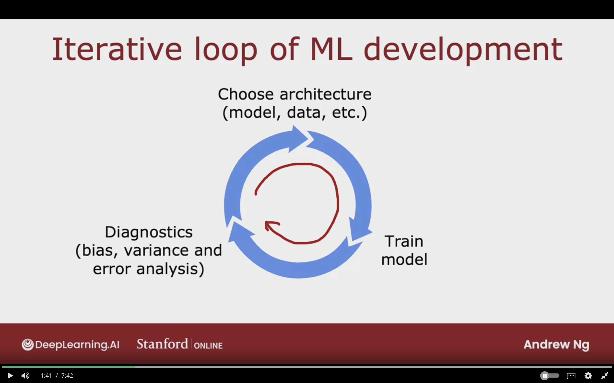

### Spam Classification Problem

Some spam email mispell words intentionally in order to trick spam classifier system.

### Building a Spam Classifier

**Supervised Learning:**  

$\vec{X}$ = features of email  
$y$ = spam (1) or not spam (0)

**Features:**  
list of top 10,000 words to compute $x_{1}, x_{2}, \dotso ,x_{10,000}$

If the word appears then mark it as 1, else 0
$$
\vec{X} = \left[
\begin{matrix}
    0 \\
    1 \\
    1 \\
    1 \\
    0 \\
    \vdots \\
\end{matrix}
\right]

\begin{matrix}
    \text{a} \\
    \text{andrew} \\
    \text{buy} \\
    \text{deal} \\
    \text{discount} \\
    \vdots \\
\end{matrix}
$$

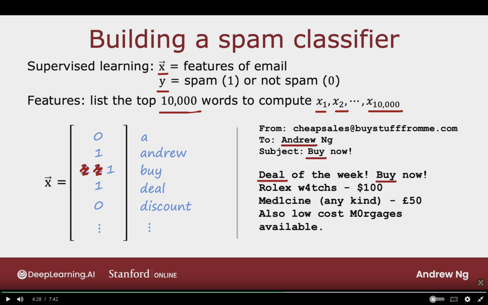

**How to try to reduce your spam classifier's error?**

- Collect more data (Honeypot Project)

- Develop sophisticated features based on email routing (from header)

- Define sophisticated features from email body. (should "discounting" and "discount" be labeled as 1 word)

- Design algorithms to detect misspellings (w4tches, med1cine)

## Error Analysis 

Manually looking through 500 examples and gain insight on where the algorithm does wrong.

$m_{cv}$ = 500 examples in cross validation set.

Algorithm misclassifies 100 of them.

Manually examine 100 examples and categorize them based on common traits.  

Pharma: 21  
Deliberate Misspellings (W4tches, med1cine): 3  
Unsual email routing: 7  
Steal passwords (Phising): 18  
Spam messages in embedded image: 5

**These categorizes can be overlapping (steall passwords + pharma)**

If the $m_{cv}$ is very large like 5000, then I can randomly just select a subset of 100 examples. This will help to determine what's the most common type of errors.

- Can collect more data for Pharma spam as it missclassifies it a lot.

- Come up with new features related to specific names of pharma products, so that the algorithm can be better to classfies this type better.

- Write special code to come up with extra features to see if the linking url is suspicious URL.

**By manually examining a set of examples that the algorithm missclassifies, it will give inspiration to what do next, or if the error is rare not worth the effort**

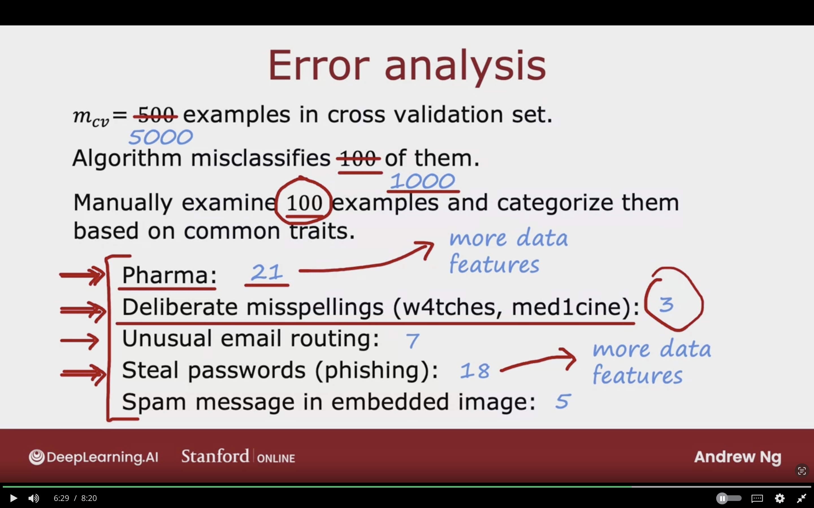

## Adding Data

Add more data to everything "Honeypot" Project.

Add more data of the types where error analysis has indicated it might help.
  - Go to unlabeled data and find more example of Pharma related spams. I can get more data of all examples, but it's more efficient to focus on Pharma spams.

Beyond getting brand new training examples (X, y), another technique: **Data Augmentation**

### Data Augmentation

**Augumentation:**
Modifying an existing training example to create new training example.

**Such as:**
Rotating image, enlarge image, shrink image, add contrast to image

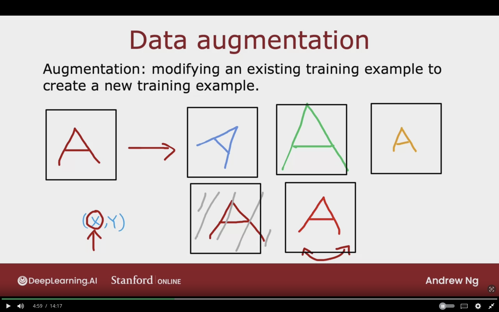

### Data Augmentation By Introducing Distorations

Will make the learning algorithm more robust what is the letter "A".

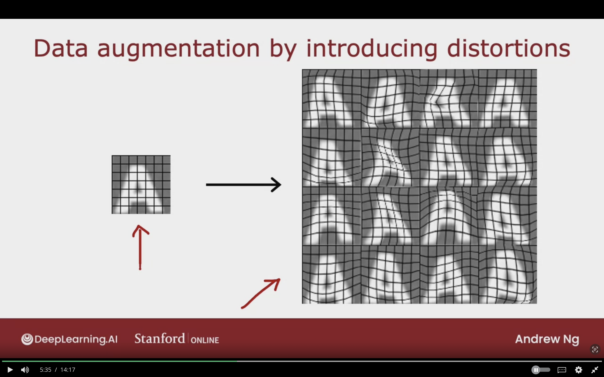

### Data Augmentation for Speech

Adding noisy background to audioclips, is data augmentation for speech recognition.

This will create new training examples, and make the model more accurate and robust.

The distorations or changes made to data should be representative of the type of noise in test dataset

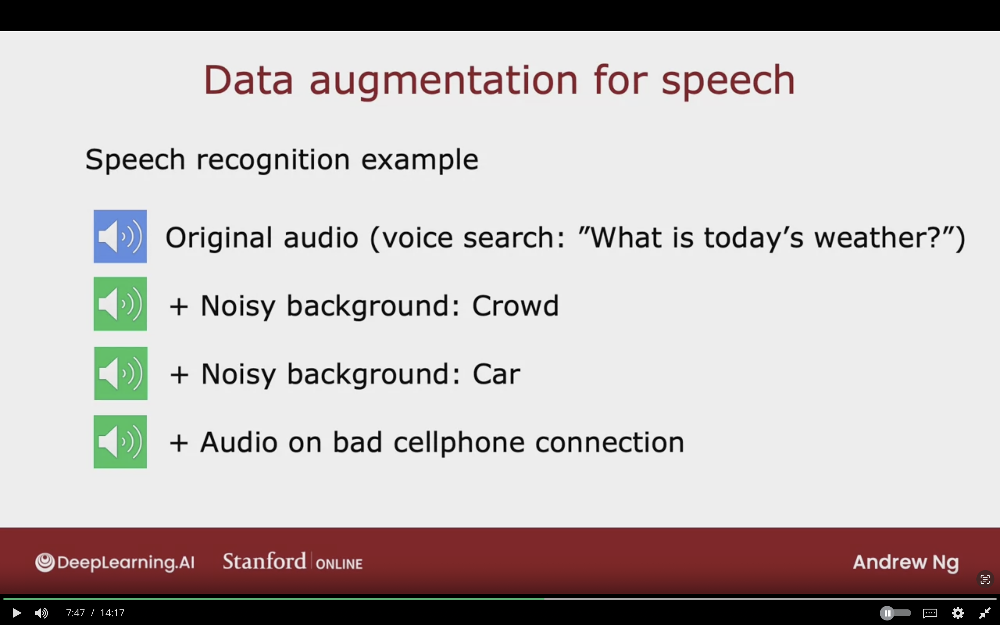

### Data Augmentation by Introducing Distortions (Continued)

Distoration should be representation of the type of noise/distortions in the test set.

Usually does not help to add purely random/meaningless noise to your data.

$x_{i}$ = intensity (brightness) of pixel $i$  
$x_{i} \leftarrow x_{i} + \text{random noise}$

### Data Synthesis

**Synthesis:**
Using artifical data inputs to create a new training example.

For example: creating random texts in text editor with various fonts an taking screenshots. It will help Photo OCR to detect text from images.

It is common in Computer Vision Tasks, and less of other tasks.

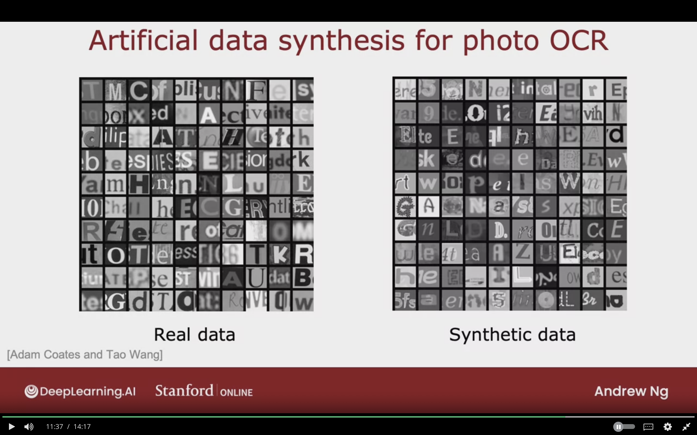

### Engineering the Data Used by your System

**Conventional model-centric Approach:**
$$
\text{AI = Code (Algorithm/Model)+ Data}
$$
**Work on Code**
The algorithms today are now widely available because of that.

**Data-Centric Approach:**
$$
\text{AI = Code (Algorithm/Model)+ Data}
$$
**Work on Data**
Collect more data, collect more data on specific class based on error analysis, data augmentation, data synthesis.

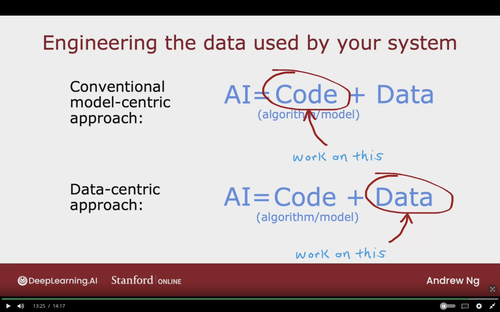

## Transfer Learning: Using Data from Different Task

### Transfer Learning

Want to develop digit recognition from 0 to 9, but don't have enough dataset.

I will use an existing neural network that was trained on 1,000,000 images for 1,000 classes recognition (cats, dogs, people).

Use parameters from all the layers, except output layer then run optimization layer with parameters initalized as the original model.

**Option 1:**  
Only train the output layers parameters
then use stochastic gradient or adam optimization gradient to update the last layer from small training datset of the digit recognition dataset

- Better for smaller dataset
- Called "Supervised pretraining"

**Option 2:**  
Train the parameters in the neural network including the first layer, but the 4 layers are initalized like in top.

- Better for larger dataset.
- Called "Fine tuning"

The following image of transfer learning example where we used an existing neural network which was trained on 1,000 classes recognition and use the existing parameters to build our own digit recognition.

### Why Does Transfer Learning Work?

- First layer neurons will learn to detect certain simple features such as detect edges.
- Then second layer will detect corners.
- then third layer will detect further complex features such as curves/basic shapes.

Use the same input type which is an image of the desired dimensions.

Use neural network that was train on the same type of task, such as if the ouput is speech recognition, then use neural network that was trained on audio.

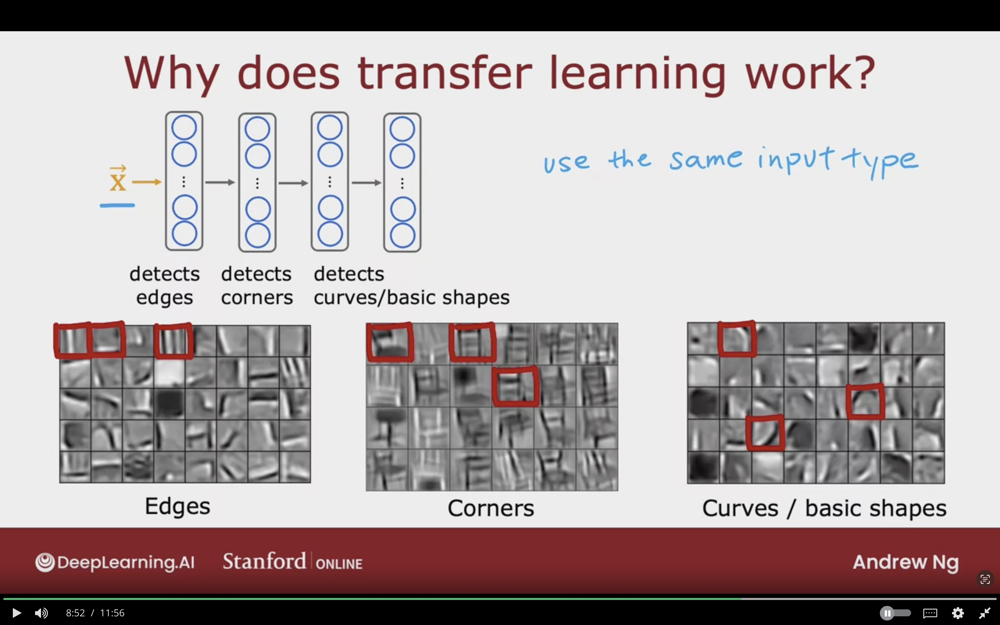

### Transfer Learning Summary

1. Download neural network parameters pretrained on a large dataset with same input type (images, audio, text) as your application (Or train your own).

2. Further train (Fine tune) the network on your own data (1,000 or 50 images)

Transfer learning is one of the ways that ML researcher to share their paramaters and assist other research to build on top of each other work.

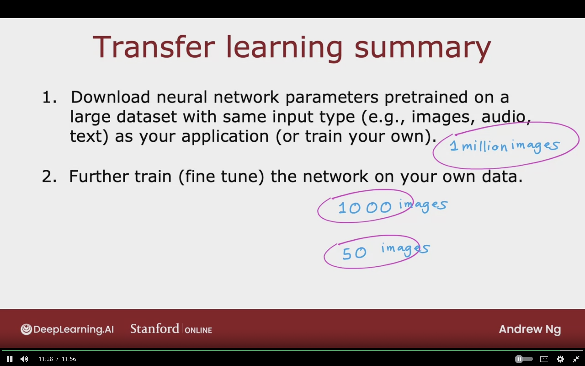

## Full Cycle of Machine Learning Project

1. Scope Project (Define Project)

2. Collect Data (Define and Collect Data)

3. Train Model (Training, Error Analyis & Iterative Improvement)
   - Can Go back to collect more data based on error analysis.

4. Deploy in Production (Deploy, Monitor and maintain system)
   - Can go back to train the model if the performance is not goe
   - Can fo back to collect more data from production ti improve performance.

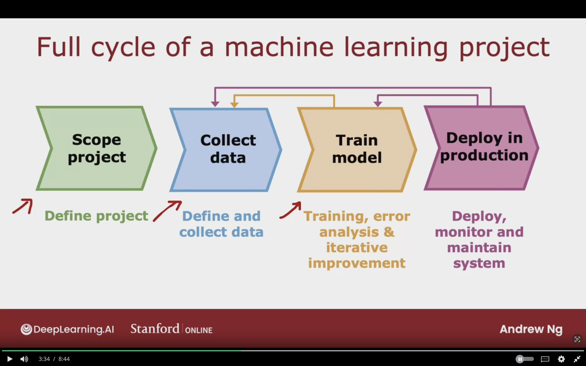

### Deployment

Take ML Model and place it in Inference Server and will call the ML Model

**Example:**  

- Mobile app will make an API call ($\vec{X}$) with Audio Clip as the example
- Will get Inference $\hat{y}$ as (Text Transcript)

**Software Engineering may be needed for:**

- Ensure reliable and effcient predictions
- scaling
- Logging, the data you're getting $x$ and $\hat{y}$
- System monitoring, figure out when data is shifting to improve the performance and accuracy
- Model updates

**MLOps:**
Machine Learning Operations

The practice on how to systematically to build, deploy, and maintain system to ensure that machine learning model scales well, has logs, and reliable.

They ensure that it's highly optimized implementation, so the compute cost is not very expensive.

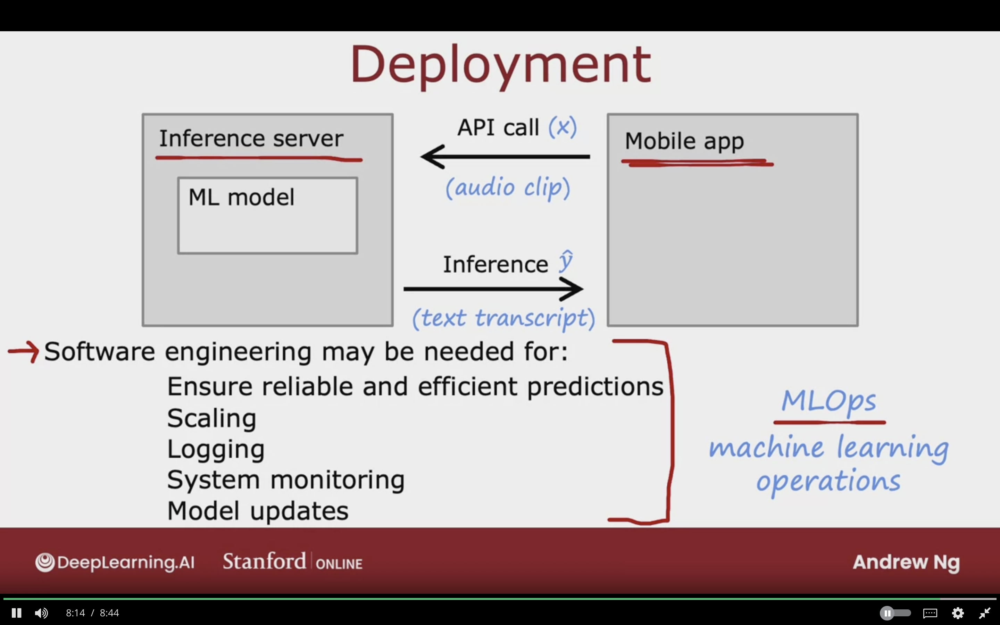

## Fairness, Bias, and Ethics

### Bias

Hiring tool that discriminates against women.

Facial recognition system matching dark skinned individuals to criminal mugshots.

Biased bank loan approvals.

Toxic effect of enforcing negative stereotypes.

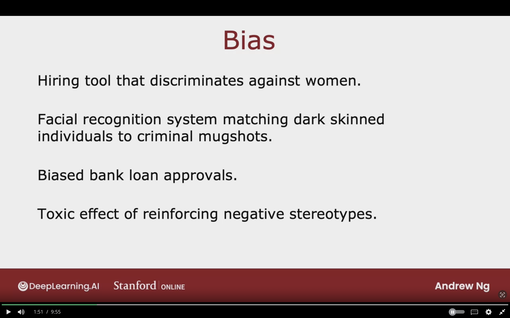

### Adverse Use Cases

Deepfakes

Spreading toxic/incendiary speech through optimizing for engagement

Generating fake content for commercial or political purposes.

Using ML to build harmful products, commit fraud, etc

Spam vs anti-spam: Fraud vs anti-fraud

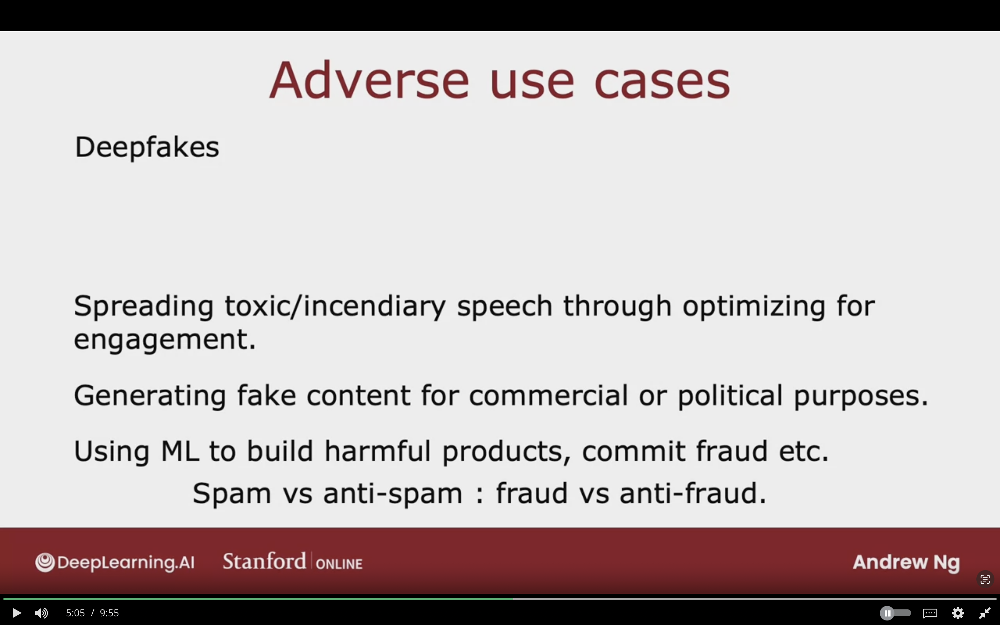

### Guidelines

Get a diverse team to brainstorm things that might go wrong, with emphasis on possible harm to vulnrable groups.

Carry out literature search on standards/ guidelines for your industry.
  - In finanical, they establish standards to be reasonably be fair and free from bias inn giving loans. 

Audit system against possible harm prior to deployment.

Develop mititgation plan (if applicable), and after deployment, monitor for possible harm
  - self-driving cars plan in case a car is an accident.

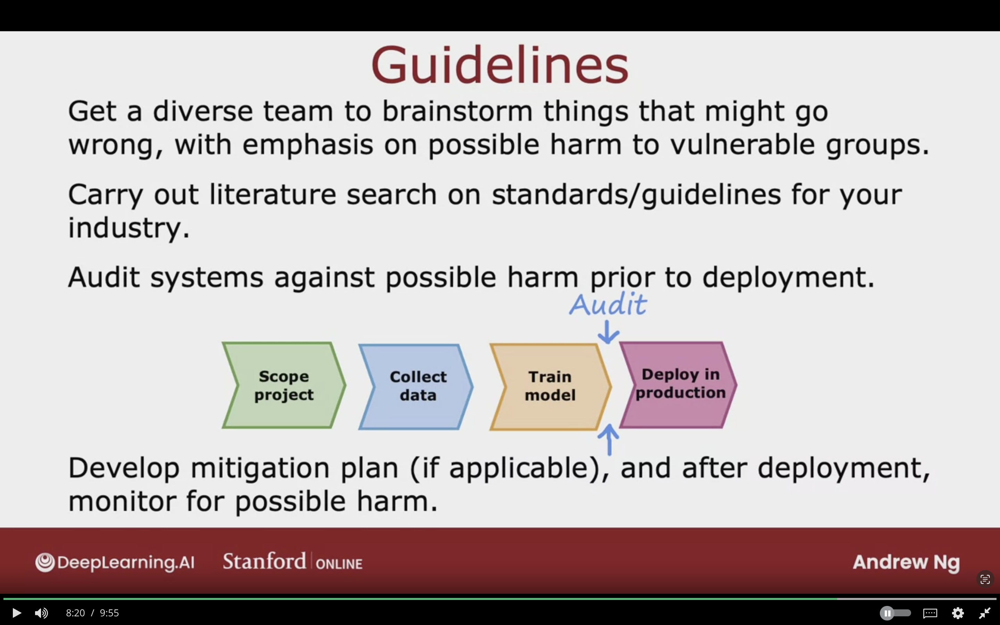

The other implications varies depending on the use cases of the ML System such as banks loan, and coffee roasting.

## Topic to Study

-

