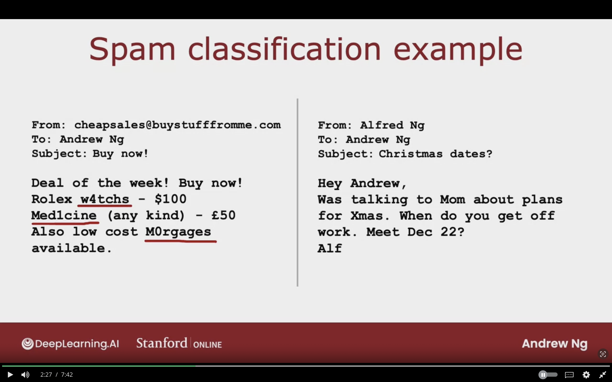

# Machine Learning Development Process

## Iterative Loop of ML Development

1. Choose Architecture (Model, Data, etc)

2. Train Model

3. Diagnostics (Bias, Variance, Error Analysis)
   - Make neural netowrk bigger, change $\lambda$ regularization parameter, add more data, add more features or remove features.

### Spam Classification Problem

Some spam email mispell words intentionally in order to trick spam classifier system.

### Building a Spam Classifier

**Supervised Learning:**  

$\vec{X}$ = features of email  
$y$ = spam (1) or not spam (0)

**Features:**  
list of top 10,000 words to compute $x_{1}, x_{2}, \dotso ,x_{10,000}$

If the word appears then mark it as 1, else 0
$$
\vec{X} = \left[
\begin{matrix}
    0 \\
    1 \\
    1 \\
    1 \\
    0 \\
    \vdots \\
\end{matrix}
\right]

\begin{matrix}
    \text{a} \\
    \text{andrew} \\
    \text{buy} \\
    \text{deal} \\
    \text{discount} \\
    \vdots \\
\end{matrix}
$$

**How to try to reduce your spam classifier's error?**

- Collect more data (Honeypot Project)

- Develop sophisticated features based on email routing (from header)

- Define sophisticated features from email body. (should "discounting" and "discount" be labeled as 1 word)

- Design algorithms to detect misspellings (w4tches, med1cine)

## Error Analysis 

Manually looking through 500 examples and gain insight on where the algorithm does wrong.

$m_{cv}$ = 500 examples in cross validation set.

Algorithm misclassifies 100 of them.

Manually examine 100 examples and categorize them based on common traits.  

Pharma: 21  
Deliberate Misspellings (W4tches, med1cine): 3  
Unsual email routing: 7  
Steal passwords (Phising): 18  
Spam messages in embedded image: 5

**These categorizes can be overlapping (steall passwords + pharma)**

If the $m_{cv}$ is very large like 5000, then I can randomly just select a subset of 100 examples. This will help to determine what's the most common type of errors.

- Can collect more data for Pharma spam as it missclassifies it a lot.

- Come up with new features related to specific names of pharma products, so that the algorithm can be better to classfies this type better.

- Write special code to come up with extra features to see if the linking url is suspicious URL.

**By manually examining a set of examples that the algorithm missclassifies, it will give inspiration to what do next, or if the error is rare not worth the effort**

## Adding Data

## Transfer Learning: Using Data from Different Task

## Full Cycle of Machine Learning Project

## Fairness, Bias, and Ethics

## Topic to Study

-

