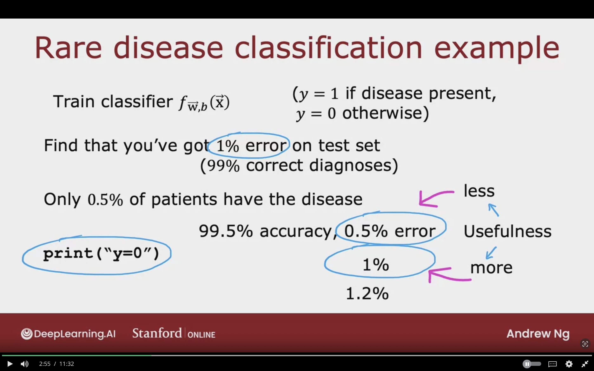

# Skeweed Datasets

When working on machine learning model where the ratio of positive and negative examples is very skewed and not 50/50.

## Error Metrics for Skewed Datasets

### Rare Desease Classification Example

Trainer classifier $f_{\vec{W},b}$

($y$ = 1 if disease is present,
$y$ = 0 otherwise)

Find that you've got 1% error on test set (99% correct diagnoses)

Only 0.5% of patients have the disease.

Even a simple `print("y=0")` will achieve a 99.9% Accuracy, 0.5$ error due to diease being extremly rare.

Can't tell if getting 1% error is good result or not as it's a very rare disease.

Accuracy is not always a good measure to know if a model is having a good performance.

The image below shows that having a low error % sometimes is not useful as the disease is rare and so the simple print code will be more accurate but it's not useful.

### Precision/Recall

$y = 1$ in presence of rare class we want to detect.

|              | Predicted Negative | Predicted Positive |
|--------------|--------------------|--------------------|
| Actual Negative | True Negative (TN) | False Positive (FP) |
| Actual Positive | False Negative (FN) | True Positive (TP) |

## Trading Off Precision and Recall

