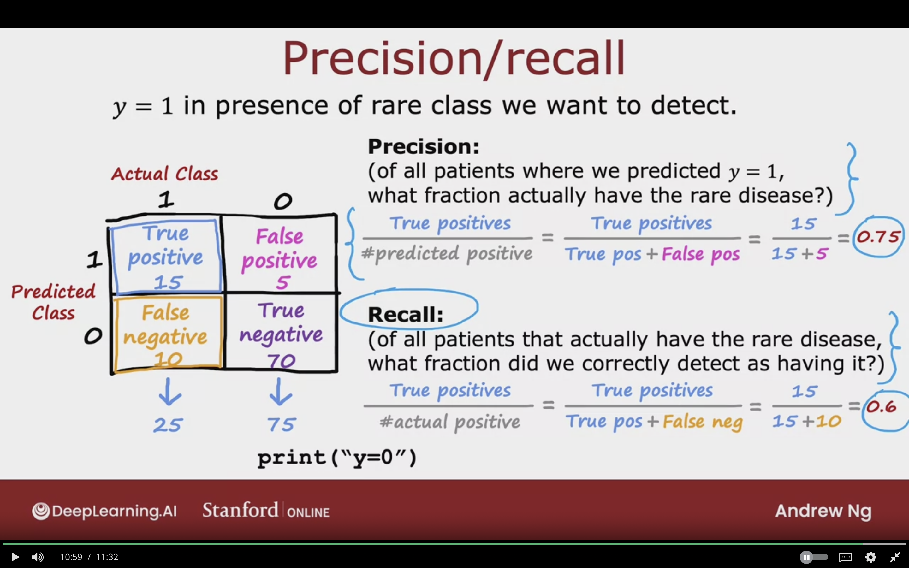
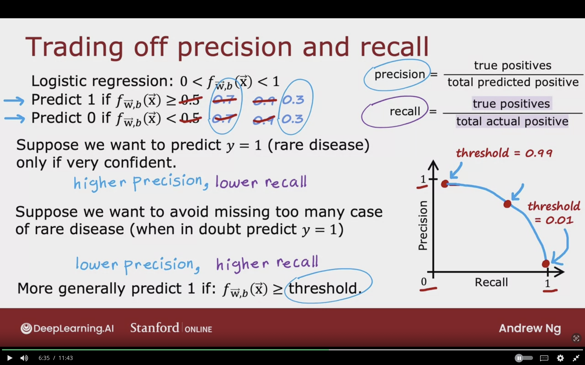
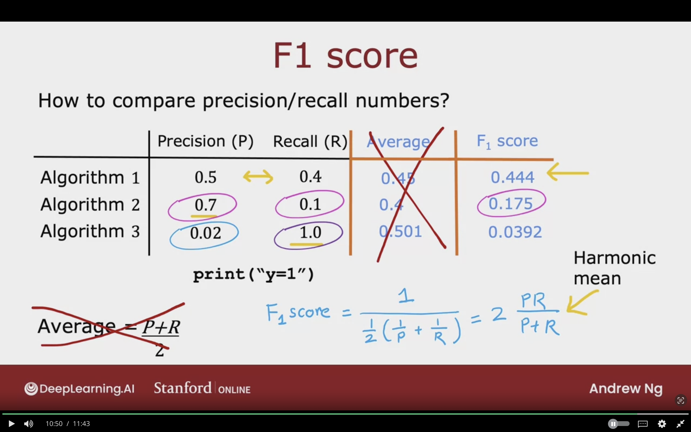

# Skeweed Datasets

When working on machine learning model where the ratio of positive and negative examples is very skewed and not 50/50.

## Error Metrics for Skewed Datasets

### Rare Desease Classification Example

Trainer classifier $f_{\vec{W},b}$

($y$ = 1 if disease is present,
$y$ = 0 otherwise)

Find that you've got 1% error on test set (99% correct diagnoses)

Only 0.5% of patients have the disease.

Even a simple `print("y=0")` will achieve a 99.9% Accuracy, 0.5$ error due to diease being extremly rare.

Can't tell if getting 1% error is good result or not as it's a very rare disease.

Accuracy is not always a good measure to know if a model is having a good performance.

The image below shows that having a low error % sometimes is not useful as the disease is rare and so the simple print code will be more accurate but it's not useful.

### Precision/Recall

$y = 1$ in presence of rare class we want to detect.

**Confusion Matrix:**

|              | Actual Class 1 | Actual Class 0 | |
|--------------|--------------------|----------------------|--|
| Predicted Class 1 | True Positive 15 | False Positive 5  | 25 |
| Predicted Class 0 | False Negative 10 | True Negative 70 | 80|
||25|75

First name (True/False) --> Prediction is correct or wrong
Second name (Positive/Negative) --> the actual class

**Precision:**  
(of all patients where we predicted $y = 1$, what fraction actually have the rare disease?)

$$
{\text{True positives} \over \text{\#Predicted positive}} 
= {\text{True positives} \over \text{True Pos + False Pos}} 
\\
= {15 \over {15 + 5}}
= {15 \over 20}
= 0.75
$$
Adding up the first row, of the predicted class is 1

**Recall:**  
(of all patients that actually have the rare disease, what fraction did we correctly detect as having it?)

$$
{\text{True postives} \over \text{\#actual positive}}
= {\text{True positive} \over \text{True pos + False neg}}
\\
= {15 \over {15 + 10}}
= {15 \over 25}
= 0.6
$$

## Trading Off Precision and Recall

High Precision, if diagnose of patient with rare disease, then the patient does have it, and it's accurate diagnosis.

High recall, if patient with rare disease, then proabably the algorithm will correctly identify that disease.

### Trading Off Precision and Recall

**Logistic regression:** $0 < f_{\vec{W},b} < 1$

Predict 1 if $f_{\vec{W}, b} \ge \cancel{0.5} \;\; \cancel{0.7} \;\; 0.9$  
Predict 0 if $f_{\vec{W}, b} < \cancel{0.5} \;\; \cancel{0.7} \;\; 0.9$

$$
\text{precision} =
{\text{true positives} \over \text{total predicited positive}}
$$

$$
\text{recall} =
{\text{true positives} \over \text{total actual positive}}
$$

#### 1- Suppose we want to predict $y = 1$ (rare disease) only if very confident.**

Threshold will be 0.9

**Raising the threshold will result in:**

- Higher Precision
- Lower Recall

It might be raised due to the check up being very expensive.

#### 2- Suppose we want to avoid missing too many cases of rare disease (when in doubt predict $y = 1$)

Thresehold will be 0.3

**Lowering the threshold will result in:**

- Lower Precision
- Higher Recall

When treatment is not invasive or expensive, and leaving it is far more dangerous.

More generally predict 1 if:  
$f_{\vec{W},b} \ge threshold$

The image below showcases that we can select a threshold in which a higher precision will be a result, but with a lower recall an vice versa.

### F1 Score

To automoatically trade off precision and recall.

How to compare precision/recall numbers?

|             | Precision (P) | Recall (R) | ~~Average~~ | $F_{1}$ Score |
|-------------|--------------|------------|---------|---------|
| Algorithm 1 |     0.5      |    0.4     |  0.45   | 0.44 |
| Algorithm 2 |     0.7      |    0.1     |   0.4   | 0.175 |
| Algorithm 3 |     0.02     |    1.0     |  0.501  | 0.0392 |

Average = ${{P + R} \over 2}$

The average is not very good measure

If algorithm has low precision & low recall, then it's probably not a good choice.

**F1 Score:**  
way of computing average of sorts that pays attention to which ever is lower

$$
F_{1} Score =
{1 \over {{1 \over 2} ({1 \over P} + {1 \over R})}}
= 2 {PR \over P + R}
$$

The equation is also called **Harmonic Mean**  

Way of taking the average that emphasis the smaller values more

## Topics to Study

- Precision/Recall
- Harmonic Mean