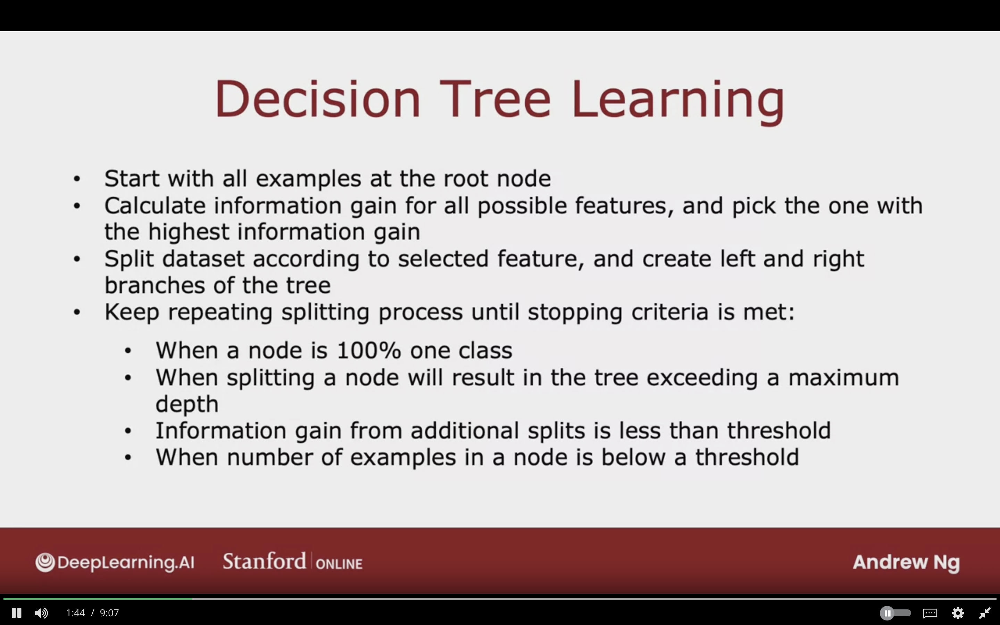

# Decision Trees Learning

## Measuring Purity

- If the examples all cats single class, then it's all pure.

- If the examples not all cats single class, then it's all pure.

### Entropy As a Measure of Impurity

$p_{1} =$ fraction of examples that car cats

#### Example:

**2 cats and 4 dogs:**  
$p_{1} = 0  \;\;\;\;\;\;\;\;\; H(P_{1}) = 0$

**2 cats and 4 dogs:**  
$p_{1} = 2/6  \;\;\;\;\; H(P_{1}) = 0.92$

**3 cats and 3 dogs:**  
$p_{1} = 3/6  \;\;\;\;\; H(P_{1}) = 1$

**5 cats and 1 dogs:**  
$p_{1} = 5/6  \;\;\;\;\; H(P_{1}) = 0.65$

**6 cats and 0 dogs:**  
$p_{1} = 6/6  \;\;\;\;\; H(P_{1}) = 0$

**Entropy Function (H):**
$H(p_{1})$

- As we go 3/6 to 6/6, the impurity decreases from 1 to 0.

- As we go from 3/6 to 6/6, the purity increases from 0 to 1.

$p_{1} =$ fraction of examples that car cats

$p_{0} = 1- p_{1}$

**Entropy Function**

$$
H(p_{1}) = - p_{1} log_{2} (p_{1}) - p_{0} log_{2} (p_{0}) \\
\qquad\qquad\qquad 
=  - p_{1} log_{2}(p_{1}) - (1- p_{1}) log_{2} (1- p_{1}) 
$$

We take the $log_{2}$ just to make the peak 1, and it will make interpreting the numbers easier.

Note: "$0log(0)$ = 0"

By convention instead of taking $log(0)$ as infinity it will be 0.

**Gini Criteria**
Is another form for computing the  loss for decision tree.

The entropy function looks similar to logistic loss!

The below image is the formula for computing the entropy in decision tree.

## Choosing Split: Information Gain

To decide which feature to split on a node. It will based on a choice of feature that will reduce entropy, or reduce impurity, or maximizes purity.

**Information Gain:**  
The reduction of entropy 

### Choosing a Split

$p_{1}$ will refer to the example being in class cat.

The weighted average:
$$
\left(
{   
    {\text{\# of examples in branch 1}
    \over \text{total examples}
    }
H(p_{1} \text{branch 1})}
+
    {\text{\# of examples in branch 2}
    \over \text{total examples}
}
H(p_{1} \text{branch 2})
\right)
$$

#### Ear Shape Feature

At the root node: 
$p_{1} = 5/10 = 0.5$

The entropy at the root node: 
$H(0.5) = 1$

1. Pointy
   - $p_{1} = 4/5 = 0.8$
   - $H(0.8) = 0.72$

2. Floppy
   - $p_{1} = 1/5 = 0.2$
   - $H(0.2) = 0.72$

The Information Gain:
$$
H(0.5) -
\left(
{{5 \over 10} H(0.8)} + {{5 \over 10} H(0.2)}
\right) \\
= 0.28
$$

Will be selected as the root node, as it's the larget value.

#### Face Shape Feature

At the root node: 
$p_{1} = 5/10 = 0.5$

The entropy at the root node: 
$H(0.5) = 1$

1. Round
   - $p_{1} = 4/7 = 0.57$
   - $H(0.57) = 0.99$

2. Not Round
   - $p_{1} = 1/3 = 0.33$
   - $H(0.33) = 0.92$

The Information Gain:
$$
H(0.5) -
\left(
{{7 \over 10} H(0.57)} + {{3 \over 10} H(0.33)}
\right) \\
= 0.03
$$

#### Whiskers Feature

At the root node: 
$p_{1} = 5/10 = 0.5$

The entropy at the root node: 
$H(0.5) = 1$

1. Present
   - $p_{1} = 3/4 = 0.75$
   - $H(0.75) = 0.81$

2. Absent
   - $p_{1} = 2/6 = 0.33$
   - $H(0.33) = 0.92$

The Information Gain:
$$
H(0.5) -
\left(
{{4 \over 10} H(0.75)} + {{6 \over 10} H(0.33)}
\right) \\
= 0.13
$$

Because how important it's to have low entropy on right or left branch will depend on the number examples on the right or left branch.

**The Information Gain:**  
It measures the reduction in entropy you get in tree resulting from making a split.

Because the entropy was originally one at the root node and by making the split the entropy value gets lower and the difference is called "reduction in entropy"

The reduction in entropy is one of the stopping critieria, and if the the reduction is very small, then stop. Because it may lead to overfitting problem.

### Information Gain

$p_{1}^{root} = 5/10 = 0.5$

**For Left Sub-Branch**

1. The number of examples of class cat in the left sub-branch over total left branch examples:  
    - $p_{1}^{left} = 4/5$

2. The fraction of examples of all the examples of the root node that went to the left sub-branch:  
   - $w^{left} = 5/10$

**For Right Sub-Branch**

1. The number of examples of class cat in the right sub-branch over total right branch examples:  
    - $p_{1}^{right} = 1/5$

2. The fraction of examples of all the examples of the root node that went to the left sub-branch:  
    - $w^{right} = 5/10$

**Information Gain:**

$$
= H(p_{1}^{\text{root}})-
\left(
w^{\text{left}} H (p_{1}^{\text{left}})
+ w^{\text{right}} H (p_{1}^{\text{right}})

\right)
$$

Can calculate the information gain split on a node, and pick the one with the highest infromation gain, and it will result in increasing the purity of the subset data in the left sub-branches and right sub-branches.

## Putting It Together

The information gain allows us to choose which feature to split on one node.

### Decision Tree Learning Process

- Start with all examples at the root node

- Calculate information gain for all posssible features, and pick the one with the highest information gain

- Split the dataset according to selected feature, and create left and right branches of tree, and send the training examples to either left and right branch

- Keep repeating splitting process until stopping criteria is met:

  - When a node is 100% one class
  - When splitting a node will result in the tree exceeding a maximum that I have set
  - Information gain from additional splits is less than threshold
  - When number of examples in a node is below a threshold

### Recursive Splitting

We first start with all the examples at root node, and based on the information gain on the 3 features, we decide that ear shape as root node.

The dataset is then split into 2 subset with each having 5 examples.

We then focus on the left sub-branch, and the right will be ignored for now.

We look at the node and see if it meets the splitting critieria, but theres is a mix of examples.

So we pick a feature to split on, we then go to the features and compute the infromation gain of each feature as if it's the root node.

Face shape feature has the highest information gain, so it's been choosen.

We then check for the lowest left branch, and check if it meets the criteria, and decide if we should stop splitting. We found that the criteria has been meet as all the example are now cats, so it will be a leaf node for making prediction for cat.

For the right sub-branch we do the same, and the stop splitting criteria has been met also as all the examples are dogs. So it will be a leaf node for making prediction for not cat.

We no turn our attention to the right sub-tree that contains 5 examples, we first check if the stop splitting criteria is meet, and it's not. So we decide to keep on splitting. We then compute the information gain on all the features, and we found that the Whiskers feature gives the highest.

We then check these branches if they have meeting the stop splitting criteria, and we found that it does so we stop.

We end up with left leaf node that predicts cat, and right leaf node that predict not cat.

The final decision tree should look like this now

**We found that :**
- By building left subtree, we build decision tree of 5 examples

- By building right subtree, we build decision tree of 5 examples

(The process is called Recursion)

**Recursion:**
writing code thatthat calls itself.

We build the decision tree, by building smaller decision tree and putting them all togther.

**On which basis to chose depth?**

- The larger the depth, the larger decision tree is
but with risk with overfitting

- Cross validation can be used for picking the best depth, but open source libraries have better ways to choose the best depth

- If the information gain from additional split is less than a threshold

- When the number of examples in a node is below is certain threshold

## Using One-Hot Encodeding of Categorical Features

To cover features where the number of possible value is more than 2.

### Features With Three Possible Values

Ear shape feature can take on 3 posssible values

The below we are creating 3 possible branches for ear shape feature.

### One Hot Encoding

Rather than using Ear Feature with 3 possible values, we create three additional features which are pointy ears, floppy ears, and oval ears.

One of these additional features will be 1, that's why it's called "One Hot Feature"

0 will represnt that the feature is absent
1 will represent it that the feature is present

**One Hot Encoding:**  
If a categorical feature can take on $k$ values, create $k$ binary features (0 or 1 valued).

As a result the same algorithm can now be used without any modification.

### One Hot Encoding and Neural Networks

One Hot encoding can help encodie categorical features using 1 and 0 so that it can be fed as inputs into neural neural network, which expects numbers as inputs.

The others feature can be encode into number which make it then possible to feed the inputs to a neural network.

## Continuous Valued Features

## Regression Trees

## Topic to Study

- Decision Trees
- Recusrive Algorithms