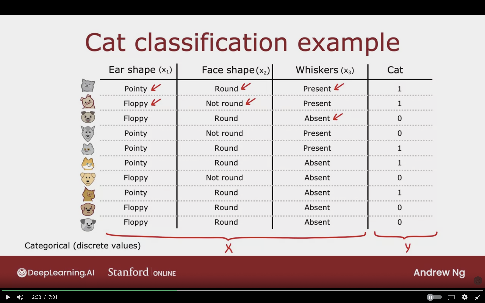
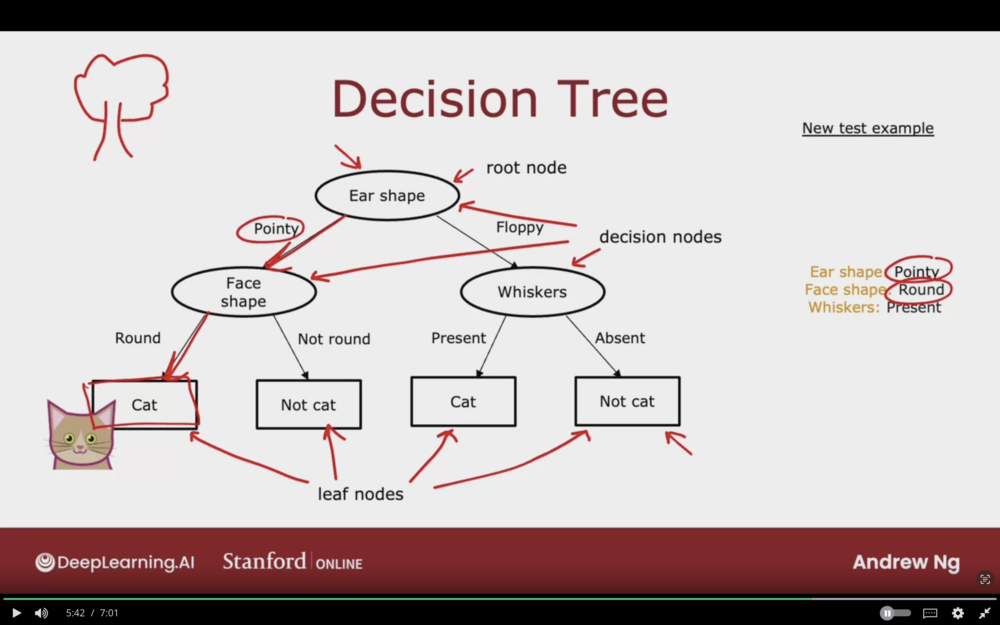
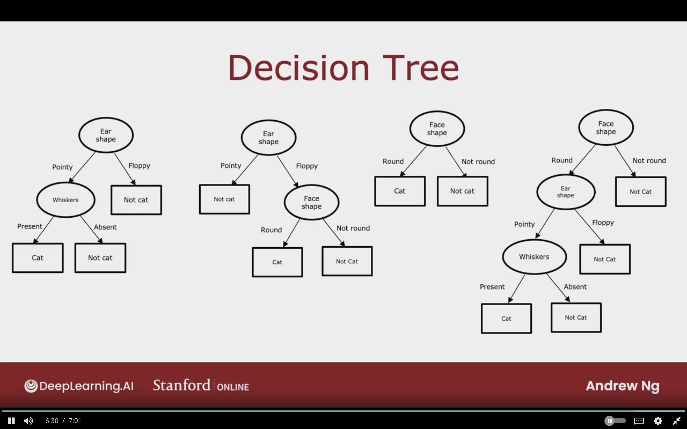
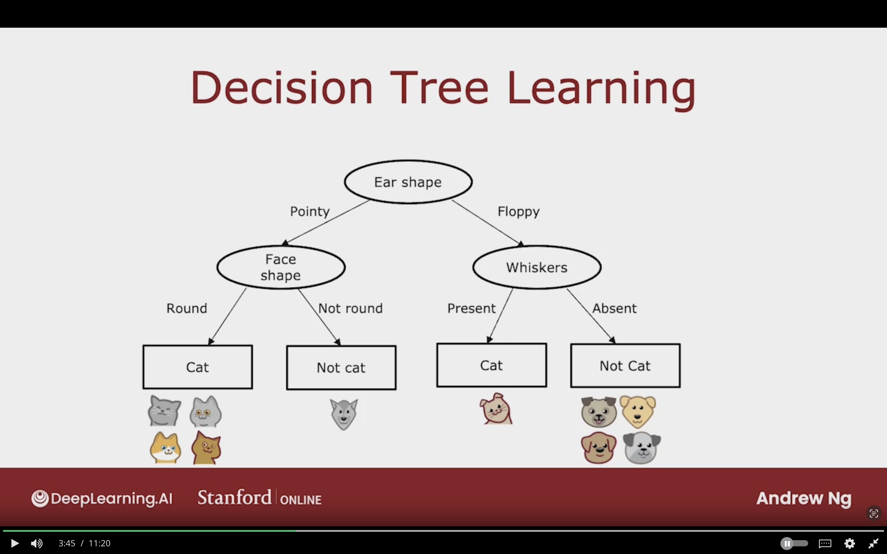
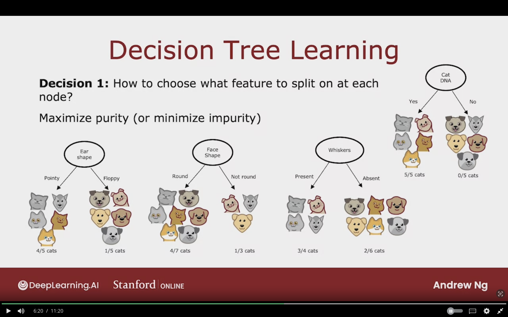

# Decision Trees

## Decision Tree Model

### Cat Classification Problem

I'm running a aat adoptation center, and given an image the classifier will tell wether the animal is cat or not.

**Input features $X$ takes on categorical values (discrete values).**

1. Ear shape $x_{1}$
2. Face shape $x_{2}$
3. Whiskers $x_{3}$

Binary Classification $y$ (0/1)

Cat? (0/1)

### Decision Trees

Model after training decision tree learning algorithm on the dataset.

**Root Node:** 
Top most node in decisionn tree 

**Decision Nodes:** 
Each oval in decision trees.  
They look at particular feature, and based on the value it decide to either go left or right

**Leaf Nodes:** 
They make a prediction.

### Other Examples of Decision Trees

The learning algorithm will create multiple decision trees, and chooses one that does well on training set and generalizes to new data which is the cross validation set.

## Learning Process

### Decision Tree Learning

**The following steps which was used to create a decision tree:**

1. Decide which feature to be the Root Node.

2. Focusing on the left branch of the decision to decide which node/feature to use next.

3. Create a leaf node that makes predicion.

4. Repeat the same process on the right branch, and pick a feature to split the dataset

5. Once the node is on certain class, then it will be leaf node which it will classify accordingly.

The image below showcases the process of creating decision tree. The following steps were done for the cat classification problem were followed:

1. Pick ear shape feature as the root node, then split the dataset accoring to the possible type of ear shapes.
2. Focus on the left branch, which is the pointy ear shape and split the dataset again according to face shape into 2 branches (Round and Not Round)
3. If the dataset was classified correctly then it will be Leaf Node where the predicition will occur.
4. Focus on the right branch which is the Floppy ear shape type.
5. Split the dataset again based on if whiskers present or absent.
6. If the dataset was split correctly, then it will be decision node in which it will be prediction result.

### Decision Tree Learning

**Decision 1:**
How to choose what feature to split on at each node?  
- Maximize Purity (Or minimize impurity)  
- Get to subset where as close a possible to all cats or all dogs.

Has to choose between the feature which of these result in the greatest purity of the labels of left and right branches.

**Decision 2:** 
When do you stop spliting?

- When a node is 100% one class (all cats or all dogs)
- When spliting a node will result in the tree exceeding a maximum depth which it's defined a parameter that can be decided.
  - Depth is defined as the number of hops that it takes from root node to particular node.
- The decision tree will never exceed the defined maximum depth.
- Maximum depth used to make sure that the tree is not very big, and it can avoid the risk of overfitting.
- When improvements in purity score are below a threshold. Or decreases in impurity, but gains are very small.
- When number of examples in  a node is below a threshold.

