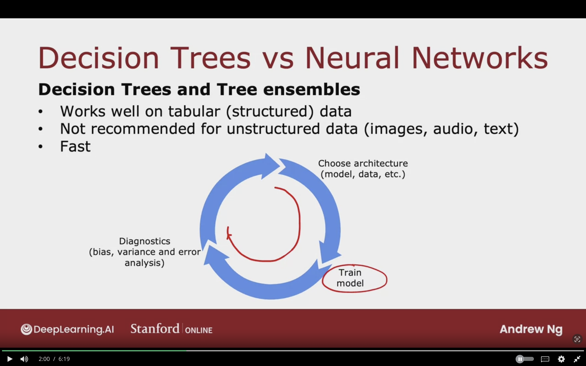

# Tree Ensembles


## Using Multiple Decision Trees


**Weakness of single decision tree:**  
highly sensitive to small changes in data

**Solution:**
To build a lot of decision trees which is called **<u>Tree Ensembles</u>**


### Trees are Highly Sensitive to Small Changes in Data

Changing a single example in the dataset

The highest information gain feature to split on will become the Whiskers feature.

The subsets of data will become totally different, and as a result the subtrees on left and right will be totally different.

So, the algorithm is so not very robust.

When using decsision tree you can get a better result by training multiple decision trees in order increase the performance.


### Tree Ensemble

**Tree Ensemble:**  
A collection of trees

Each one is a a plausibe way of classifying a cat

Run the 3 decision trees on the new example, and they all make the vote of the final prediction.

The final prediction is the most vote class of all the decision trees.


## Sampling with Replacement

With replacement is important beacause if I don't do replacement then I will get the same 4 tokens.


The way sampling with replacement applies when building ensemble trees

Construct multiple random training set that are different than the original dataset.

**It goes as follows:**

- We keep on taking a random example from the original dataset
- After taking the example, the example is returned
- We keep on doing that until the the complete subset is 10, and it may contain duplicate examples


**Sampling with Replacement:**
Lets us construct new training set that similar but slightly different that the original dataset.


## Random Forest Algorithm

Creating tree ensemble using the sampling with replacement.

### Generating a Tree Sample

Given training set of size $m$


**For $b = 1$ to $B$:**

- Use Sampling with replacement to create a new training set of size $m$

- Train decision tree to the new dataset


$B$ recommended to be 64 or 100, the number of trees to build.

Setting $B$ never hurts performance, but after having a large number of B it will not have an effect. For example $B$ as 1000


**Bagged Decision Trees:**
The algorithm called bagged because it's like taking examples from a bag, and the $B$ stands for "bag"!


**Problem with Sampling with Replacement Procedure:**

- Sometimes it's always using the same splits the root node, and vert similar splits near the root node.


### Randomizing the Feature Choice

Randmoize th feature choice at each node that can cause the set of trees to become more different than each other.

- At each node, when choosing a feature to split, If $n$ feature are available.  

- Pick a random subset of $k < n$ features and allow the algorithm to only choose from the subset of features.

- Pick $k$ features as the allowed features, then out of those $k$ features choose the one with the highest infromation gain as the feature to split on


**Typical choice for $k$:**  
is $k = \sqrt{n}$  
Used for larger features problem

**Random Forrest Algorithm**  
Works better than single decision tree.

The sampling with replacements cause algorithm to explore a lot of small changes to data already

and it's averaging over all changes to data from sampling with replacement process.

Any little change to training dataset will less likely to have big impact of the overall output of the overall random forrest algorithm.


## XGBoost

Most common implementation of tree ensembles or decision trees

### Boosted Trees Intitution

Given training set of size $m$

For $b=1$ to $B$:

- Use sampling with replacement to create a new training set of size $m$

    - But instead of picking from all examples with equal (1/m) probability, make it more likely to pick misclassified examples from previously trained trees do poorly on.

- Train a decision tree on the new dataset

**Deliberate Practice:**  
Focusing on particular piece in music which is difficult or not easy to play,


The image below showcases boosted trees intititution. We first take from the original dataset, and check the example which the algorithm performed poorly only, then give them more probability in being picked as a subset, so the algorithm can focus on the examples which it had trouble in getting right.

Will look at ensemble of trees for trees $1, \dotso, b-1$ are not doing well on

When building tree $b$ will have higher probability of picking examples the previous examples did not do well on.


### XGBoost (eXtreme Gradient Boosting)

- Open source implementation of boosted trees

- Fast effcient implementation

- Good choice of default splitting criteria for when to stop splitting

- Built in regularization to prevent overfitting

- Highly competitive algorithm for machine learning competitions (Kaggle)


**Rather doing sampling with replacement**

- XGBoost assign different weights to different training examples, so no need to generate a lot of random chosen examples
- As a result, it's more efficient than sampling with replacement


### Using XGBoost


#### Classification

```python
from xgboost import XGBoostClassifier

model = XGBoostClassifier()

model.fit(X_train, y_train)
y_pred = model.predict(X_test)
```

#### Regression

```python
from xgboost import XGBoostRegressor

model = XGBoostRegressor()

model.fit(X_train, y_train)
y_pred = model.predict(X_test)
```


## When to Use Decision Trees

As they're good algorithms for classification and neural networks are good too.

### Decision Trees vs Neural Networks


#### Decision Trees and Tree Ensembles

- Works well on tabular data (structured) data

- Not recommeneded for unstructured data (images, audio, text) 

- Fast to train, as you can goo throught the iteration much quicker compared to neural networks


- Small decision trees may be human interpretable, so we can now easily understand how the conclusion was concluded
 - But for tree ensembles it can be complicated

- Use XGBoost or Random Forrest instead of decision trees, but it's computationally more expensive


#### Neural Networks

- Works well on all types of data, including tabular (structured) and unstructured data

- May be slower than a decision tree

- Works with transfer learning, useful for application for smaller datasets

- When building a system of multiple models working togther, it might be easier to string together multiple neural networks
  - When neural networks are stringed togther then you can train them all togteher, but decision trees can be trained once at a time


## Topic to Study

- Decision Trees
- Information Gain
- Random Forrest
- Boosted Trees/XGBoost
- GridSearchCV