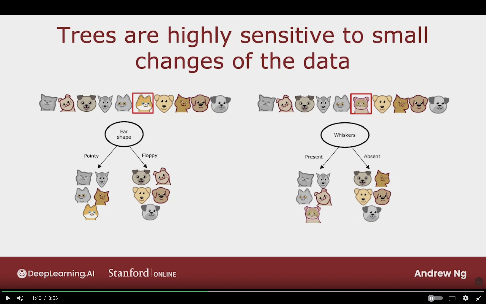

# Tree Ensembles

## Using Multiple Decision Trees

**Weakness of single decision tree:**  
highly sensitive to small changes in data

**Solution:**
To build a lot of decision trees which is called **<u>Tree Ensembles</u>**

### Trees are Highly Sensitive to Small Changes in Data

Changing a single example in the dataset

The highest information gain feature to split on will become the Whiskers feature.

The subsets of data will become totally different, and as a result the subtrees on left and right will be totally different.

So, the algorithm is so not very robust.

When using decsision tree you can get a better result by training multiple decision trees in order increase the performance.

### Tree Ensemble

**Tree Ensemble:**  
A collection of trees

Each one is a a plausibe way of classifying a cat

Run the 3 decision trees on the new example, and they all make the vote of the final prediction.

The final prediction is the most vote class of all the decision trees.

## Sampling with Replacement

With replacement is important beacause if I don't do replacement then I will get the same 4 tokens.

The way sampling with replacement applies when building ensemble trees

Construct multiple random training set that are different than the original dataset.

**It goes as follows:**

- We keep on taking a random example from the original dataset
- After taking the example, the example is returned
- We keep on doing that until the the complete subset is 10, and it may contain duplicate examples

**Sampling with Replacement:**
Lets us construct new training set that similar but slightly different that the original dataset.

## Random Forest Algorithm

## XGBoost

## When to Use Decision Trees

## Topic to Study

-