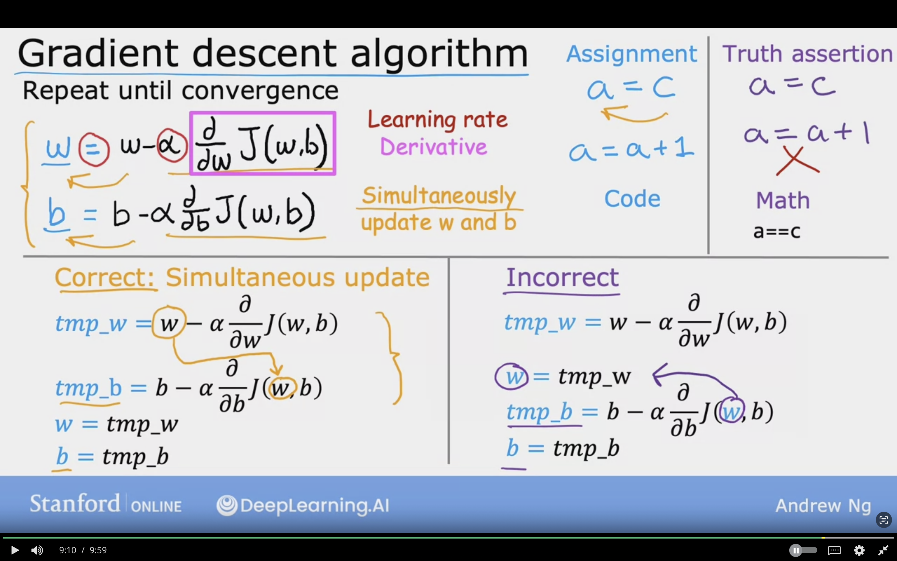

# Gradient Descent

Used for training advanced models especially in deep learning

Have some function $J(w,b)$
for linear regression or any function
$min_{w_{1},w_{2},w_{3},w_{n},b}$ for $J(w_{1},w_{2},w_{3},w_{n},b)$

Want $min_{w,b}$   $J(w,b)$

**Outline**

    Start with some $w,b$ set $(w=0, b=0)$
    Keep changing $w,b$ to reduce $J(w,b)$
    Until we settle at or near a minimum
    May have  > 1 Minimum (Many minimums)

    also J not always a parabola

 
 

In Gradient Descent based on the starting point, and taking a small step around to look where it's descencing in order to find the stepest descent.

Based on starting it can lead to different minimum, and this minimum can be called as **Local Minima**. It can lead to downhill of the Cost function $J$.

## Local Minimia

The lowest point where $J$ is considered the minimum and it's depending on the starting point parameters

## Gradient Descent Algorithm

Repeat until convergence, reach the point at local minima, where parameters $w, b$ does not change much with additional steps

Formula for updating the weights
$$w =  w - \alpha {\partial \over \partial w}  J(w,b)$$

= : Assignment

$\alpha$: (alpha) Learning Rate. Controls how much a big step to take downhill. Big value means huge step, and small value means small step.

${\partial \over w}  J(w,b)$ : Parital dervitive step, determine the size of steps

Formula for updating the bias
$$b =  b - \alpha {\partial \over \partial b}  J(w,b)$$

**Simultaneously update $w$ and $b$ is required to update the parameters**

## Gradient Descent Intitution

Derivative point at this line is drawing a tangent line, and to draw the slope I can draw a triangle. The height $\div$ (width/base) = slope

$w =  w - [\alpha {\partial \over \partial w}  J(w,b)]$

$\alpha$ is the learning rate and it's always a positive number

### In case of positive

${\partial \over \partial w}  J(w,b) > 0$

$w =  w - \alpha$ * (positive number), - times + gives negative

so it moves to the left towards the minimum, due to negative slope

### In case of negative

${\partial \over \partial w}  J(w,b) < 0$

$w =  w - \alpha$ * (negative number), - times - gives positive

so it moves to the right towards the minimum, due to negative slope

 

The 2 examples of updating the weight according the slope on the point choosen, in case of (+) slope the term $\alpha {\partial \over \partial w}  J(w,b)$ becomes negative, so it shifts to left <-- negative x-axis to reach minimum.

In case of (-) slope the term $\alpha {\partial \over \partial w}  J(w,b)$ becomes positive, so it shifts towards the right ro reach minimum.

## Learning Rate

$$w =  w - \alpha {\partial \over \partial w}  J(w,b)$$

1. If $\alpha$ is too small...

    For example 0.000001

    Gradient Descent will take a lot of steps to reach the minimum, and will be very slow.

2. If $\alpha$ is too large

    For example, 1000.0

    Gradient Descent may overshoot, and never reaches the minimum.
    Fail to converge, diverge.

Once the cost function have reached the local minima, the slope at that point will be 0.
Thus, the partial derivative will be evaluted to 0.

$$w =  w - \alpha {\partial \over \partial w}  J(w,b)$$

$$ {\partial \over \partial w}  J(w,b) = 0$$

$$w =  w - \alpha * 0$$

$$w =  w $$

The updated $w$ will be equal to the previous $w$

Below is a screenshoot of reaching the local minima.

 

### Can reach local minimum with fixed Learning Rate

When reaching near local minima, gradient descent will automaticallly take smaller steps

As apporaching the local minima, the derivative will automatically be smaller, and update steps become smaller

$$w =  w - \alpha {\partial \over \partial w}  J(w,b)$$

$$\alpha {\partial \over \partial w}  J(w,b)$$
Large ---> Not as large ---> Smaller

Near Local minimum

- Derivative becomes smaller
- Updates steps becomes smaller

Can reach minimum without deceasing learning rate $\alpha$

Gradient descent used to minimze any cost function, and not only mean squared error

## Gradient Descent for Linear Regression

### Linear Regression Model

$$f_{w,b}(x) = wx + b$$

### Cost Function Model

$$J(w,b) = \frac{1}{2m} \sum\limits_{i = 0}^{m-1} (f_{w,b}(x^{(i)}) - y^{(i)})^2 $$

### Gradient Descent Algorithm Steps

Repeat until convergence {

For weight $w$
$$w =  w - \alpha {\partial \over \partial w}  J(w,b)$$

Formula can be used to compute the gradient descent for $w$
$${\partial \over \partial w}J(w,b) = \frac{1}{m} \sum\limits_{i = 1}^{m} (f_{w,b}(x^{(i)}) - y^{(i)})x^{i} $$

For bias $b$
$$b =  b - \alpha {\partial \over \partial b}  J(w,b)$$

Formula can be used to compute the gradient descent $b$
$${\partial \over \partial b}J(w,b) = \frac{1}{m} \sum\limits_{i = 1}^{m} (f_{w,b}(x^{(i)}) - y^{(i)}) $$

(The formulas are derived from calculas)

}

#### Partial Derivative Steps

(Type the proof)

### Gradient Descent Algorithm Steps Subtituted

Repeat until convergence {

For weight $w$
$$w =  w - \alpha [\frac{1}{m} \sum\limits_{i = 1}^{m} (f_{w,b}(x^{(i)}) - y^{(i)})x^{i}]$$

For bias $b$
$$b =  b - \alpha [\frac{1}{m} \sum\limits_{i = 1}^{m} (f_{w,b}(x^{(i)}) - y^{(i)})]$$

update $w, b$ simultaneously

}

w[1] =${\partial \over \partial w} J(w,b)$

b[2] =${\partial \over \partial b} J(w,b)$

$f_{w,b}x^{(i)} = wx^{(i)} + b$

Screenshot of the algorithm

 

In case of more than one local minimum, the starting point will determine which local minimum will be reached

 

In Squared Error Cost with linear regression
the cost function will never have multiple local minimum, and it will have one single minimum

Due to cost function  being a convex function, and which it has bowl shape. It will always converge to global minimum.
Example shown below

## Running Gradient Descent

As the algorithm continues to run, the cost will decrease until it reaches the minimum and the line will fit the data

It is refered to as Batch Gradient Descent

### "Batch" Gradient Descent

"Batch": Each step of gradient descent it will use all the training examples. Instead of subset of the data.

It will look at the entire batch or all examples. it will be 47, so $m=47$
$$\sum\limits_{i = 1}^{m} (f_{w,b}(x^{(i)}) - y^{(i)})x^{i}$$

There are other gradient descent which looks into subsets

