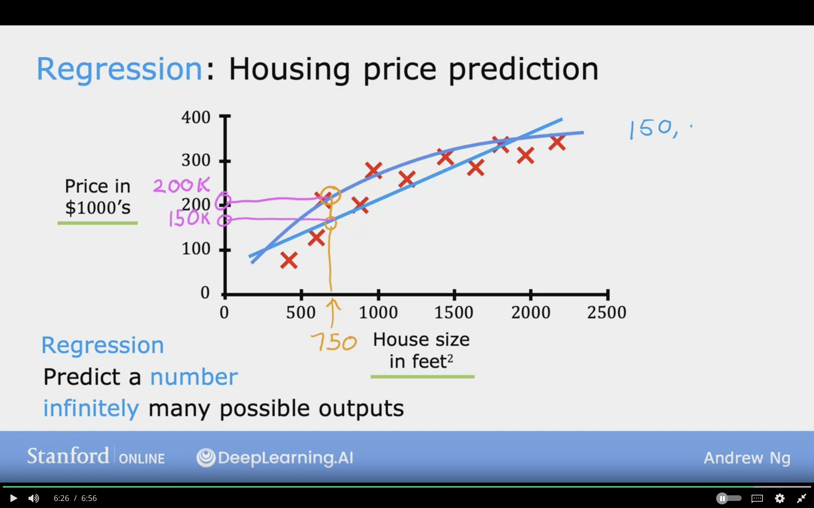
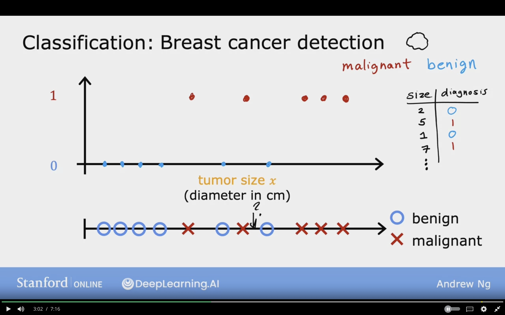
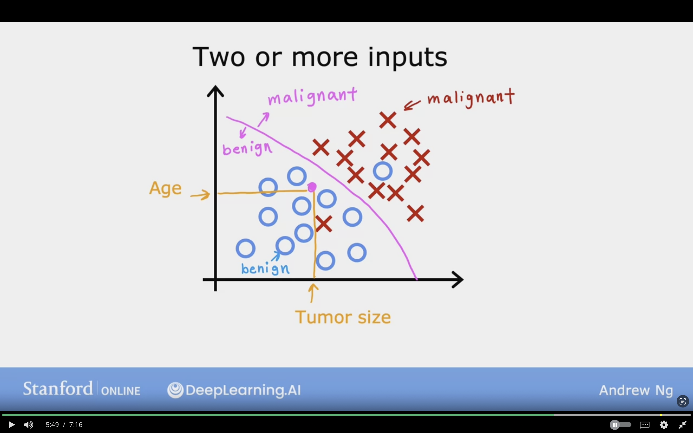
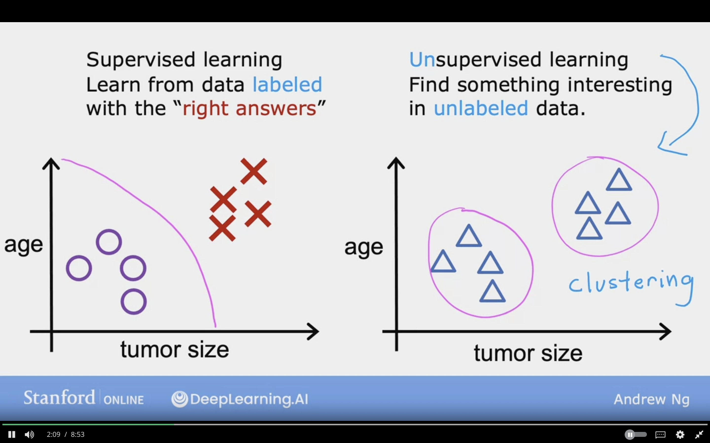
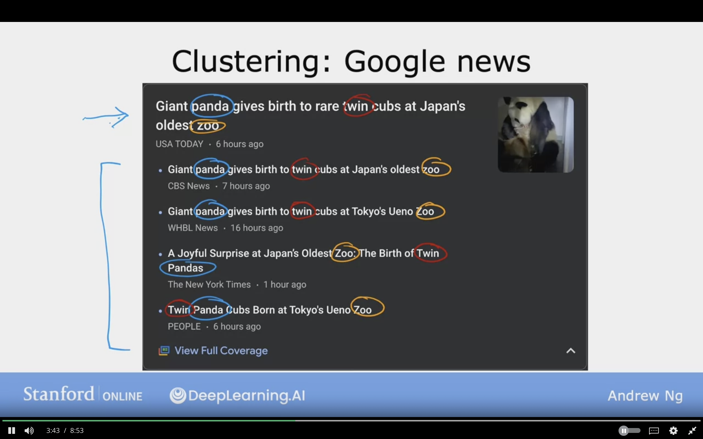
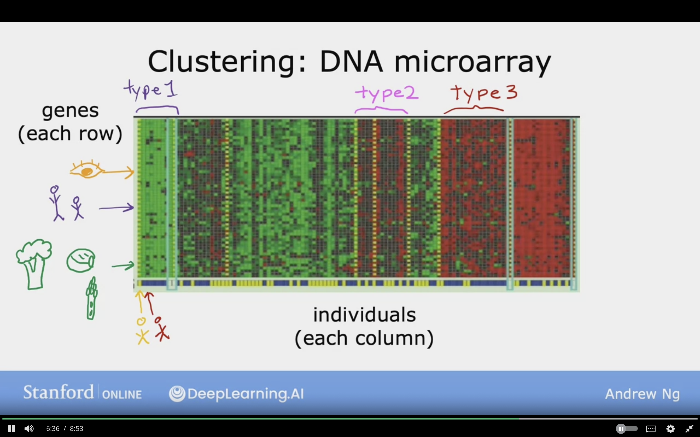
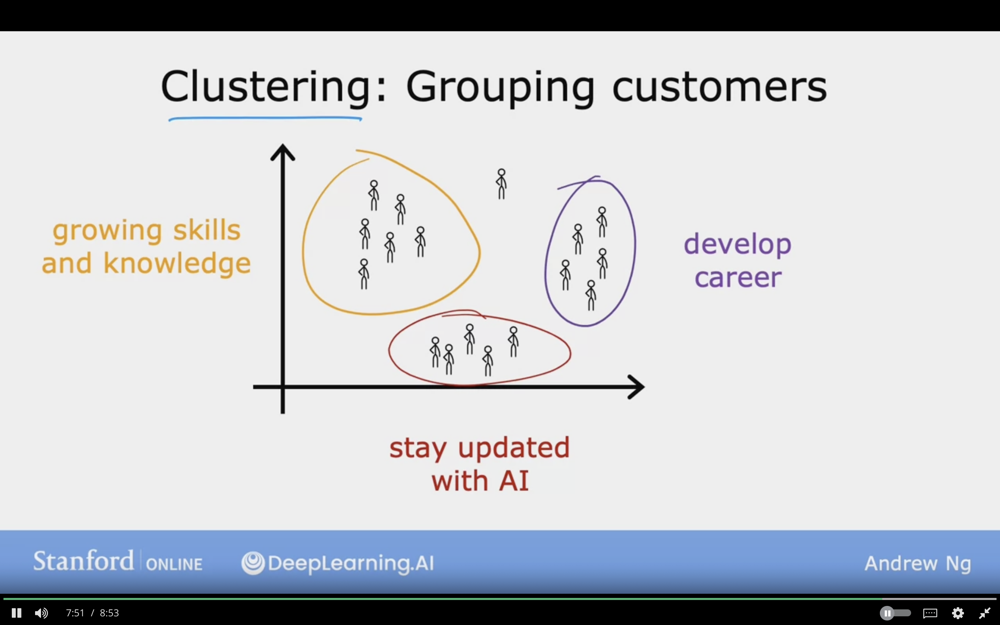

# What is Machine Learning?

Field of study that gives the computers the ability to learn without being explicitly programmed

## Machine Learning Algorithms

1. Supervised Learning - used most often in real time applications (Course 1 + 2)
2. Unsupervised Learning (Course 3)

   - Recommender Systems
   - Reinforcement Learning

## 1. Supervised Learning

- input (X) --> output (Y)
- Learns from given right answers

|   input (x)   |   output    |   Application |
|------------|-----------|---------------|
|   email | spam? (0/1) | spam filtering                |
|   audio | text transcripts | speech recogination      |
|   English | Spanish | machine translation             |
| ad, user, info |  click? (0/1) | Online Advertising   |
| image, radar info | position of other cars | self-driving cars|
| image of phone | defect? (0/1)  | visual inspection

### a. Regression

Predict a number infinitely many possible outputs

#### Housing Price Prediction

Example which uses Linear Regression

### b. Classification

- Predict categories and not always a number, as it can be label
- Class and Category are the same
- small number of possible outputs and finite
- Can have tow or more inputs

#### Breast Cancer Detection

Detect if tumor is maligant or benign
Can have different types than the above like maligant type 1 or maligant 2

The learning algorithm can find boundary line that seperates the 2 categories

## 2. Unsupervised Learning

- Data comes with inputs x, but not output labels y
- Algorithm has to find structure in data
- Find something interesting in data
- Tell machine to find clustering

### a. Clustering

- Group similar data points together
- Places unlabeled data into clusters

#### Google News

- Groups data based on specific feature which is for examples panda, zoo, twin

#### DNA Microarray

#### Grouping Customers

Market Segmentation

### b. Anamoly Detection

Find unusal data points

### c. Dimensionaltiy Reduction

Compress data using fewer numbers
