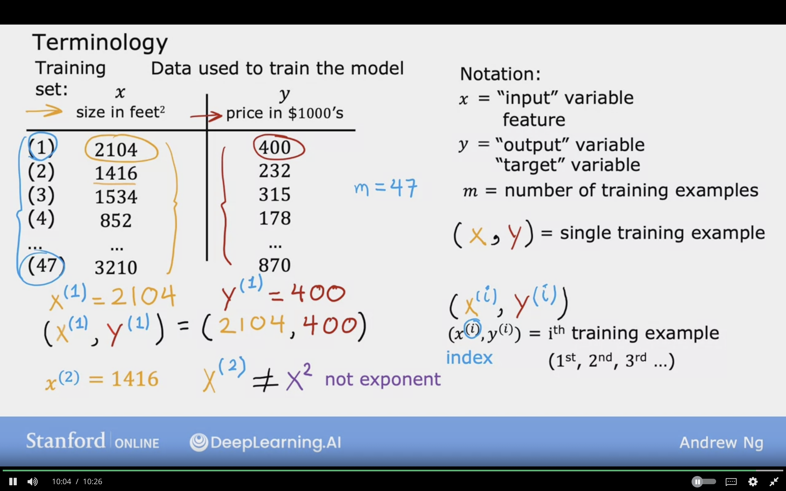
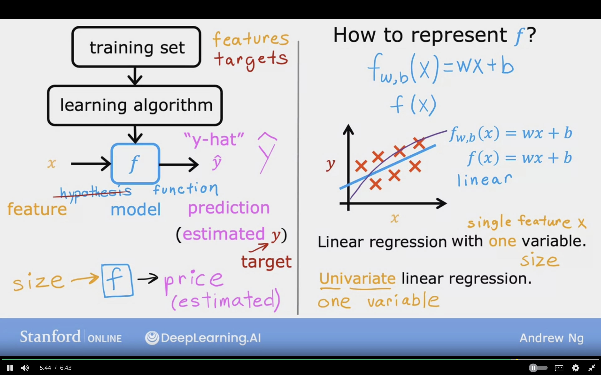
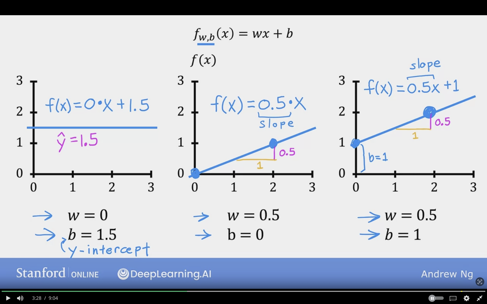
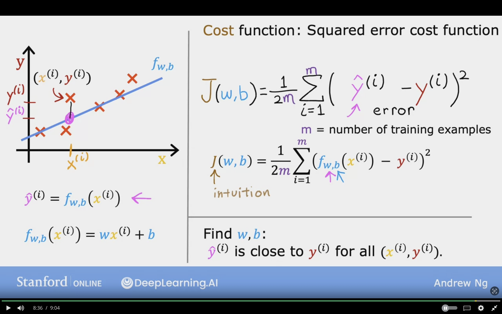

# Regression Model

Regression model, because it predicts a number
It is a type of of supervised learning

In data table the data is represented as a table.
where:
    - size in feet  -> x
    - price in $1000's -> y

## Classification Model

Predicts categories based on small number of ctageories

## Linear Regression with One Variable

Linear Regression can be used to fit straight line into data

### Terminology

**1. Training Set**: Data used to train the model consists of features and targets

### Notation

$x$ = "input" variable/ feature

$y$ = "output" variable/ "target" variable

$m$ = number of training examples

$(x, y)$ = single training example

$(x^{i}, y^{i})$ = $i^th$ training example ($1^{st}$, $2^{nd}$, $3^{rd}$...)

$i$ = index of training example

$ŷ$ = estimated prediction

**Note**:

* $i$ is not exponent, but index in the training example

* $x^{1}$ refers to example 1 input which is 2104
and $y^{1}$ refers to example 1 output which is 400

## Roadmap

1. Training Set (features + targets)
2. Learning Algorithms
3. $f$  function/hypothesis

$x$ (input, feature )---> $f$ (function/ model) ---> $ŷ$ (y- hat) prediction (estimated $y$ target)

### Example

Size $x$ ---> $f$ --->  House Price (estimated) $ŷ$

## How to represent $f$ ?

$f_{w,b}(x) = wx + b$

Same thing
 
$f(x) = wx + b$

**Linear Regression with one variable/ single feature _x_ -->size**

**Univariate Linear Regression:** Uni means One Variable

y is the true value for that training example, referred to as the output variable, or “target”.

## Cost Function

Will tell us how well the model is doing in order to do better

Model:
$$f_{w,b}(x) = wx + b$$

$w,b$ : parameters are variable can be adjusted during the model training

$w,b$ : are also called coeffcients or weights

$w$ : slope y-x = 0.5- 1 = 0.5
$b$ : is also called  y-intercept

Examples of different  $w , b$

## Cost Function Formula

**Cost Function:** Squared Error Cost Function

Formula for cost function
$$J(w,b) = \frac{1}{2m} \sum\limits_{i = 0}^{m-1} (f_{w,b}(x^{(i)}) - y^{(i)})^2 $$

Formula for finding prediction of example by using the model
$$ŷ^{(i)} = f_{w,b}(x^{(i)})$$

Formula for the model 
$$f_{w,b}(x^{(i)}) = wx^{(i)} + b$$

**Find $w,b$:**

$ŷ^{(i)}$ is close to $y^{(i)}$ for all $(x^{(i)}, x^{(i)})$
