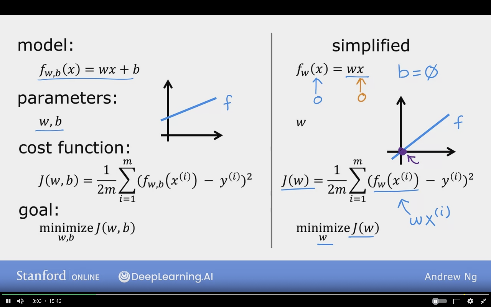
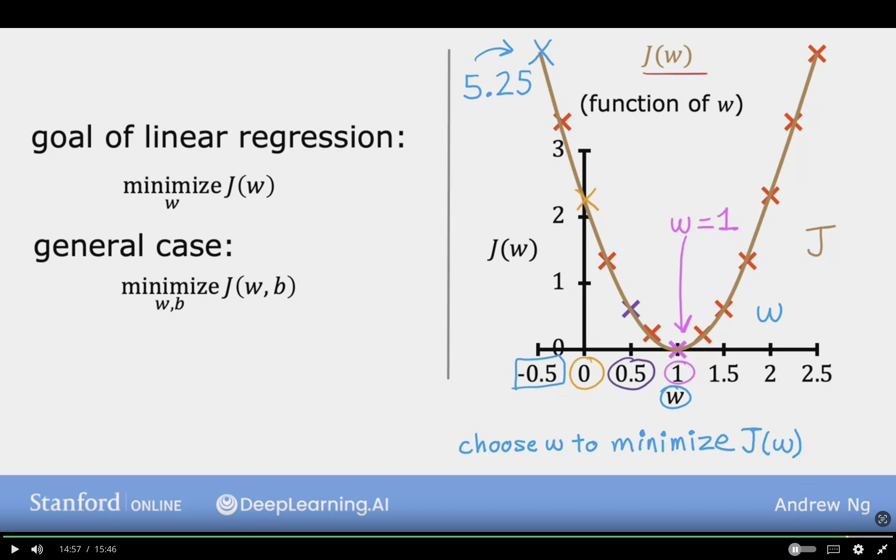
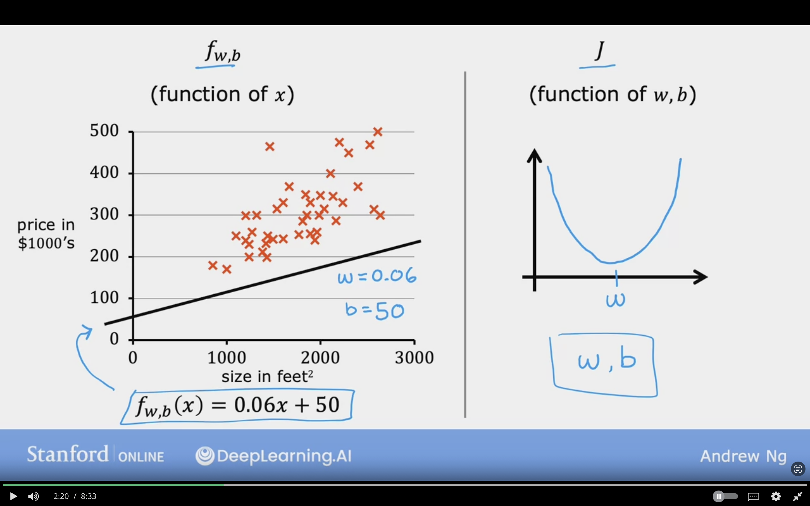
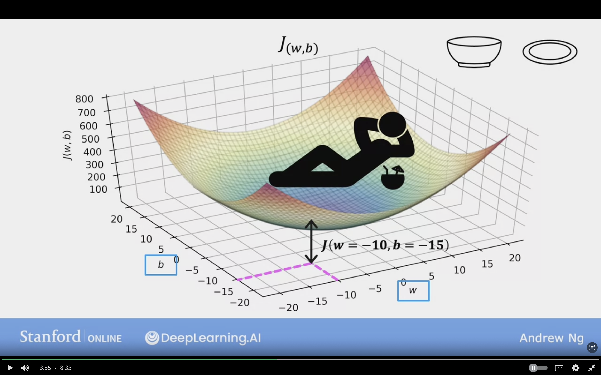
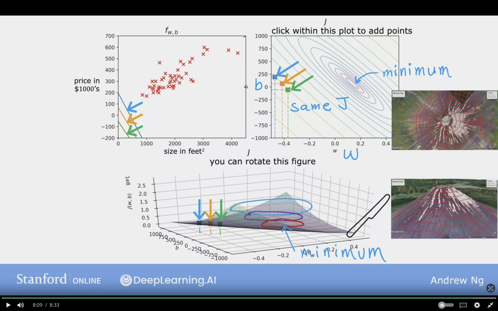
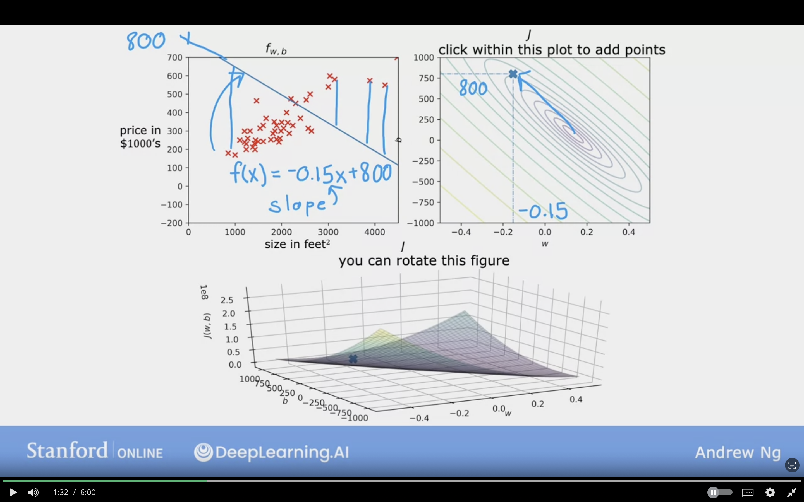
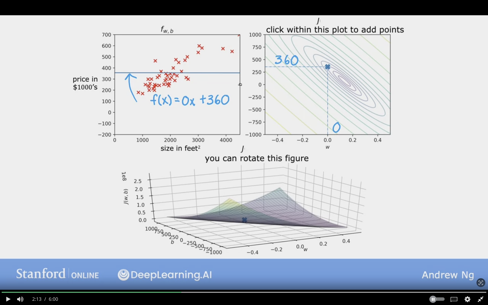
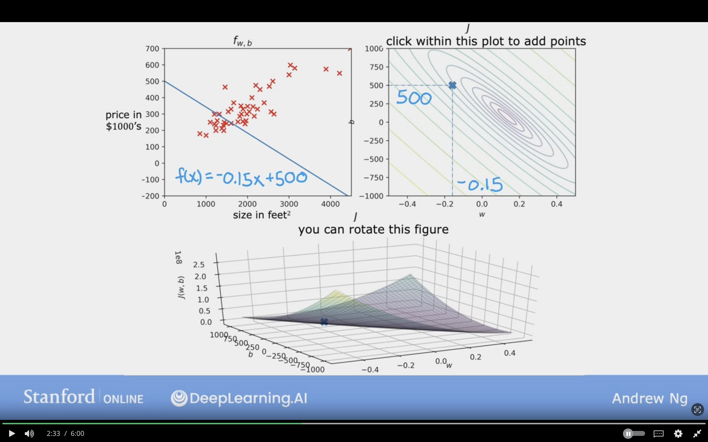
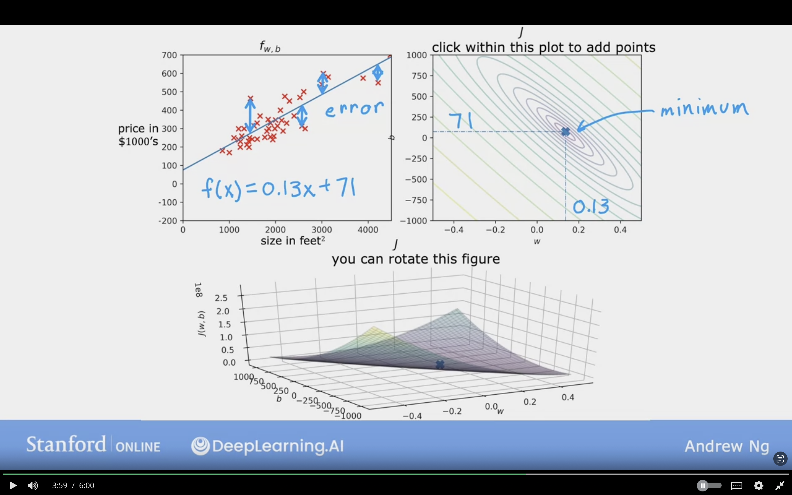

# Regression Model

Regression model, because it predicts a number
It is a type of of supervised learning

In data table the data is represented as a table.
where:
    - size in feet  -> x
    - price in $1000's -> y

## Classification Model

Predicts categories based on small number of ctageories

## Linear Regression with One Variable

Linear Regression can be used to fit straight line into data

### Terminology

**1. Training Set**: Data used to train the model consists of features and targets

### Notation

$x$ = "input" variable/ feature

$y$ = "output" variable/ "target" variable

$m$ = number of training examples

$(x, y)$ = single training example

$(x^{i}, y^{i})$ = $i^th$ training example ($1^{st}$, $2^{nd}$, $3^{rd}$...)

$i$ = index of training example

$\hat{y}$ = estimated prediction

**Note**:

* $i$ is not exponent, but index in the training example

* $x^{1}$ refers to example 1 input which is 2104
and $y^{1}$ refers to example 1 output which is 400

## Roadmap

1. Training Set (features + targets)
2. Learning Algorithms
3. $f$  function/hypothesis

$x$ (input, feature )---> $f$ (function/ model) ---> $\hat{y}$ (y- hat) prediction (estimated $y$ target)

### Example

Size $x$ ---> $f$ --->  House Price (estimated) $\hat{y}$

## How to represent $f$ ?

$f_{w,b}(x) = wx + b$

Same thing
 
$f(x) = wx + b$

**Linear Regression with one variable/ single feature _x_ -->size**

**Univariate Linear Regression:** Uni means One Variable

y is the true value for that training example, referred to as the output variable, or “target”.

## Cost Function

Will tell us how well the model is doing in order to do better

Model:
$$f_{w,b}(x) = wx + b$$

$w,b$ : parameters are variable can be adjusted during the model training

$w,b$ : are also called coeffcients or weights

$w$ : slope y-x = 0.5- 1 = 0.5
$b$ : is also called  y-intercept

Examples of different  $w , b$

## Cost Function Formula

**Cost Function:** Squared Error Cost Function

Formula for cost function
It compares the predicted y values ($\hat{y}$) and the actual y values ($y$)
$$J(w,b) = \frac{1}{2m} \sum\limits_{i = 0}^{m-1} (f_{w,b}(x^{(i)}) - y^{(i)})^2 $$

$m$ = numbers of examples

$x$ = "input" variable/ feature

$y$ = "output" variable/ "target" variable

$w$ = weight

$b$ = bias

Formula for finding prediction of example by using the model
$$\hat{y}^{(i)} = f_{w,b}(x^{(i)})$$

Formula for the Model
$$f_{w,b}(x^{(i)}) = wx^{(i)} + b$$

**Find $w,b$:**

$\hat{y}^{(i)}$ is close to $y^{(i)}$ for all $(x^{(i)}, x^{(i)})$

### Cost Function Intitution

Cost function will find the values for $w$ and $b$ that makes $J(w,b)$ as small as possible

**Goal:**
Minimize $_{w,b}$ $J(w,b)$

**Simplified:**
$f_{w} = wx$ , $b=\empty$

(Removing the bias)

$$J(w) = \frac{1}{2m} \sum\limits_{i = 0}^{m-1} (f_{w}(x^{(i)}) - y^{(i)})^2 $$

$$f_{w}(x^{(i)}) = w x^{(i) }$$

Minimize $_{w}$ $J(w)$

Cost Function subtitution (for fixed $w$, function of $x$) with $w=1$ and $f_{w}(x)$ , $f(x)$ represents making the prediction

.png)

Each value of parametered $J$ corresponds to different straight line fit $f(x)$ on $f_{w}(x)$ graph

For given training set the choice for W corresponds for single point in the $f_w(x)$ graph

.png)

$J(W)$ represents the mean squared error in the model, so the point where it is the least is the goal $W$

The goal of linear regression is to minimze $w$ in Cost function $J(W)$ and in general minimze $w,b$ J(w,b)$

**When does the model fit the data relatively well, compared to other choices for parameter w?**

When the cost is relatively small, closer to zero, it means the model fits the data better compared to other choices for w and b.

 
 

## Visualizing the Cost Function

Contour Plot can be used for visualize

Contour plot are a great way to visualize the 3D cost function $J$ ploted in 3D

The below image shows how B & W are selected to represent the minimum point in 3D surface Chart

Topographical map used to display how high mountains are, and had horizontal slicing of the mountain

### Images of Topographical Map

Minimum will be in the center of oval in contour plot

### Exampless of Cost Function Visualization with diffrenet W & B values

**Example 1:**
$f(x) = -0.15x+800$ where $w=-0.15, b=800$

**Example 2:**
$f(x) = 0x+800$ where $w=0, b=360$

**Example 3:**
$f(x) = -0.15x+500$ where $w=-0.15, b=500$

**Example 4:**
$f(x) = 0.13x+71$ where $w=0.13, b=71$

#### Instead of finding the minimum cost function, and algorithm can be used to find the minimum which is called **Gradient Descent** and it is one of the most algorithms in machine learning
