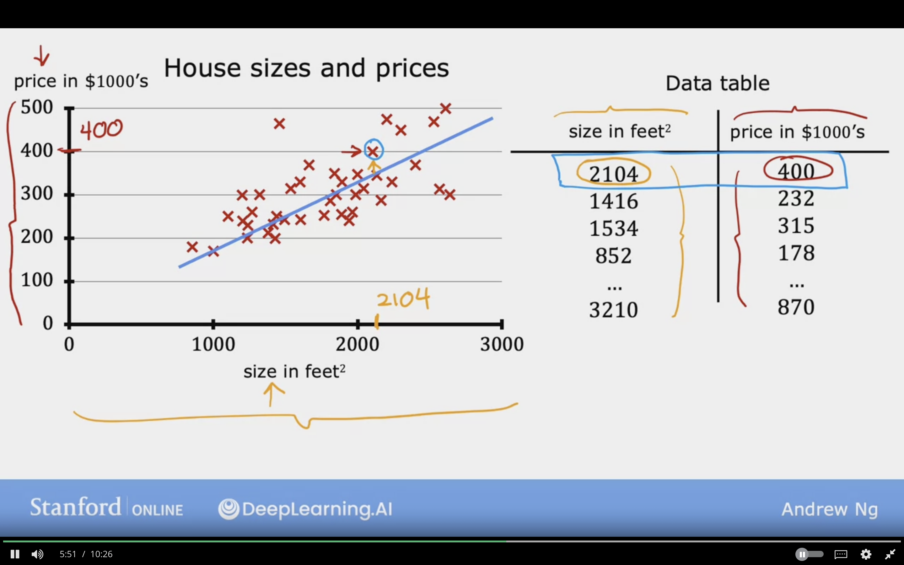

# Regression Model

Regression model, because it predicts a number
It is a type of of supervised learning

In data table the data is represented as a table.
where:
    - size in feet  -> x
    - price in $1000's -> y

## Classification Model

Predicts categories based on small number of ctageories

## Linear Regression with One Variable

Linear Regression can be used to fit straight line into data

### Terminology

**1. Training Set**: Data used to train the model consists of features and targets

### Notation

_x_ = "input" variable/ feature

_y_ = "output" variable/ "target" variable

_m_ = number of training examples

_(x, y)_ = single training example

_(x(i), y(i))_ = ith training example (1st, 2nd, 3rd...)

_i_ = index of training example

_ŷ_ = estimated prediction

**Note**:
* i is not exponent, but index in the training example

* x(1) refers to example 1 input which is 2104
and y(1) refers to example 1 output which is 400

## Roadmap

1. Training Set (features + targets)
2. Learning Algorithms
3. _f_  function/hypothesis

_x_ (input, feature )---> _f_ (function/ model) ---> _ŷ_ (y- hat) prediction (estimated _y_ target)

### Example

Size _x_ ---> _f_ --->  House Price (estimated) _ŷ_

## How to represent _f_ ?

_fw,b(x)_ = WX + b

Same thing
 
_f(x)_ = WX + b

**Linear Regression with one variable/ single feature _x_ -->size**

**Univariate Linear Regression:** Uni means One Variable

y is the true value for that training example, referred to as the output variable, or “target”.

