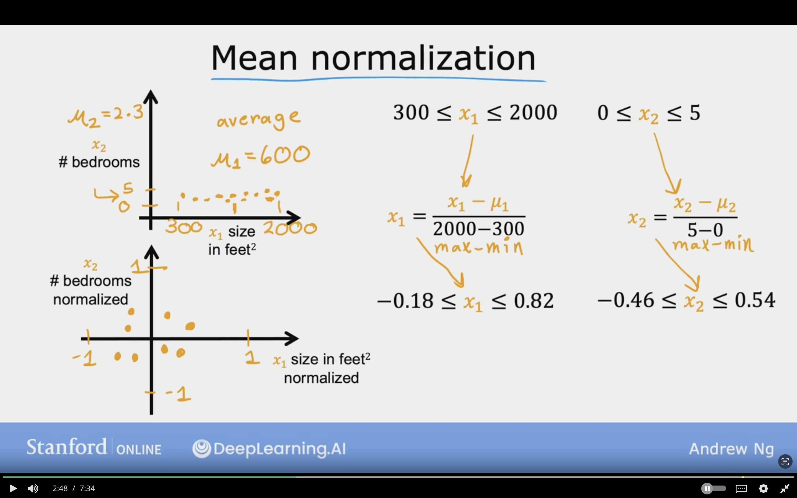

# Gradient Descent in Practice

## Feature Scaling

Used to enable Gradient Descent to run faster

### Feature and parameter values

**Example**

price = $w_{1} x_{1} + w_{2} x_{2} + b$

$x_{1}=$ size (feet$^{2}$) -> Range: (300-2,000) Large

$x_{2}=$ #Bedrooms -> Range: (300-2,000) Small

 

House : $x_{1} = 2000$, $x_{2} = 5$, price = $500K -> $y$ or target

Size of parameters $w_{1}, w_{2}$?

**Training Example 1:**

$w_{1} = 50$, $w_{2} = 0.1$, $b = 50$

price = $w_{1} x_{1} + w_{2} x_{2} + b$

price = $(50 * 2000) + (0.1 * 5) + 50$

- size = 50 * 2000 = $100,000K
- \# of rooms = (0.1 * 5) = $0.5K
- $b$ = $50K

price = $100,050.50K

Which is very far, so it is bad parameter choice

---

**Training Example 2:**

$w_{1}$ is small, and $w_{2}$ is large

$w_{1} = 0.1$, $w_{2} = 50$, $b = 50$

price = $w_{1} x_{1} + w_{2} x_{2} + b$

price = $(0.1 * 2000) + (50 * 5) + 50$

- size = 0.1 * 2000 = $200K
- \# of rooms = 50 * 5 = $250K
- $b$ = $50K

price = $500,000K

which is more reasonable

#### Conclusion

If the feature is of large value, the weight should be relativly small.
If the feature is of small value, the weight should be large.

---

### Feature Scaling Relationship

**Ploting the features on scatter plot, we can observe the following:**

- Size in feet $x_{1}$ in the x-axis will have large range (300-2000), so the size of feature should be large.
- \# bedrooms $x_{2}$ in the y-axis will have small range (0-5), so the size of feature should be small.

**Ploting the parameters on contour plot, we can observe the following:**

- Size in feet parameter $w_{1}$ in the x-axis will have narrow range (0-1) horizontally. so the size of parameter should be small.
- \# bedrooms parameter $w_{2}$ in the y-axis will have large range (10-100) vertically. From the ellipses which are formed. So the size of feature should be large.

 
 

If the dataset is used as it is, and used gradient descent.

- It will jump back and forth to reach the minimum due to contours being tall and skinny. Which will take much more time find the global minimum.

**To resolve the problem:**

Scale the feature/ Performing Transformation to the data/ rescale

- The range for both features will have comparable range of values.

- Gradient descent was ran on Cost function the contour will look more like circle, and gradeint descent will find the path to global minimum much easier.

The following image showcases rescaling of features

#### Feature Scaling is very important to speed up Gradient Descent

## Feature Scaling Works Examples

### Feature Scaling By Dividing by Max

Which divides the feature by the max value, and range will be between 0 and 1.

**Feature 1:**

$300 \le x_{1} \le 2000$, where 2000 is the max

$x_{1, scaled} = {x_{1}\over 2000}$

$0.15 \le x_{1,scaled} \le 1$

---

**Feature 2:**

$0 \le x_{2} \le 5$, where 5 is the max

$x_{2, scaled} = {x_{1}\over 5}$

$0 \le x_{2,scaled} \le 1$

The below image show cases how feature scaling by max value work.
It can distribute the number with range of 0 and 1

### Feature Scaling By Mean Normalization

Rescale the feature to be centered around 0, and range is within -1 and +1.

First find mean/average of a feature $\mu_{1}$

$\mu$: Mean

**Feature 1:**

$\mu_{1} = 600$

$300 \le x_{1} \le 2000$

$x_{1} = {{x_{1} - \mu_{1}} \over {max-min}}$

$x_{1} = {{x_{1} - 600} \over {2000-300}}$

$x_{1} = {{x_{1} - 600} \over {1700}}$

Substitute in the range

${{300 - 600} \over {1700}}\le x_{1} \le {{2000 - 600} \over {1700}}$

$-0.18 \le x_{1,scaled} \le 0.82$

---

**Feature 2:**

$\mu_{2} = 2.3$

$0 \le x_{2} \le 5$

$x_{2} = {{x_{2} - \mu_{1}} \over {max-min}}$

$x_{2} = {{x_{2} - 2.3} \over {5-0}}$

$x_{2} = {{x_{2} - 2.3} \over {5}}$

Substitute in the range

${{0 - 2.3} \over {5}}\le x_{2} \le {{5 - 2.3} \over {5}}$

$-0.46 \le x_{2,scaled} \le 0.54$

Below is an image which show features scalling with mean normalization  method

### Feature Scaling By Z-Score Normalization

We need to calculate Standard Deviation $\sigma$ fo each feature in order to compute Z-Score normalization.

Also, mean is needed to be calculated $\mu$

$\sigma$: Standard Deviation, Bell Curve, Gaussian Distribution, Normal Distribution

**Feature 1:**

$\mu_{1} = 600$

$\sigma_{1} = 450$

$300 \le x_{1} \le 2000$

$x_{1} = {{x_{1} - \mu_{1}} \over \sigma{1}}$

$x_{1} = {{x_{1} - 600} \over 450}$

Substitute in the range

${{300 - 600} \over 450}\le x_{1} \le {{2000 - 600} \over {450}}$

$-0.67 \le x_{1,scaled} \le 3.1$

---

**Feature 2:**

$\mu_{2} = 2.3$

$\sigma_{2} = 1.4$

$0 \le x_{2} \le 5$

$x_{2} = {{x_{2} - \mu_{2}} \over \sigma{2}}$

$x_{2} = {{x_{2} - 2.3} \over 1.4}$

Substitute in the range

${{0 - 2.3} \over 1.4}\le x_{2} \le {{5 - 2.3} \over {1.4}}$

$-1.64 \le x_{1,scaled} \le 1.93$

Below image showcase z-score normalization which takes into consideration the standard deviation $\sigma$ and mean $\mu$.
The range is within -3 and +3 unlike the mean which was in -1 and +1.

### Feature Scalling Aim

Aim for about the below ranges for each feature $x_{j}$

Accaptable Ranges:

- $-1 \le x_{j} \le 1$
- $-3 \le x_{j} \le 3$
- $-0.3 \le x_{j} \le 0.3$

Okay, no rescalling required:

- $0 \le x_{j} \le 3$
- $-2 \le x_{j} \le 0.5$

Too Large, and too small, both require scalling. Too large will cause gradient descent to run slow:

- $-100 \le x_{j} \le 100$, too large
- $-0.001 \le x_{j} \le 0.001$, too small
- $-98.6 \le x_{j} \le 105$, (temprature around 100) too large

Below image shows when it is required to feature scale

## Checking Gradient Descent for Convergence

How to tell if the gradient is converging, find parameters close to the global minimum.

**Reminder:**

$$w_{j} = w_{j} - \alpha {\partial \over \partial w_{j}}J(\vec{W}, b)$$

$$w_{j} = w_{j} - \alpha {\partial \over \partial b}J(\vec{W}, b)$$

### Make sure gardient descent is working correctly

**Objective:** $min_{\vec{W},b} J(\vec{W}, b)$

$J(\vec{W}, b)$ should decrease after every iterations

If $J$ ever increased at any point, this means the learning rate $\alpha$ was not choosen properly.

**Possible root cause:**

- The $\alpha$ is too large.
- Bug in the code.

The following plot can be used which has the number of iteration in x-axis and $J(\vec{W}, b)$ on the y-axis.

The curve is called **Learning Curve**

Difficult find when the gradient descent will converge as the number of iterations need varies depending on the model.

However, plotting the Learning Curve can help to know when to stop the model training.

Automatic Convergence Test

Let $\epsilon$ "epsilon" be $10^{-3}$ = 0.001.

If $J(\vec{W},b)$ decreases by $\le \epsilon$ in one iteration,
    declare **convergence**

- (Found parameters $\vec{W}, b$ to get close to global minimum)

 

**Notes:**

Learning Curve is easier to know when something is going wrong, like learning rate $\alpha$ is too large.

Difficult to choose a good $\epsilon$ epsilon value.

Below image shows learning curve and Automatic Convergence Test

---

## Choosing the Learning Rate $\alpha$

### Identify problem with gradient descent

The gradient descent can possibly have 2 problems which are:

- Bug in the code
- Learning rate is too large

From the Learning Curve we can notice or identify the possible reason for the problem

- Spiky Cost $J(\vec(W),b)$ which shows that on every few # of iterations goes up an down. Which is caused by large value for learning rate $\alpha$. For parameter $w_{1}$ the gradient can be seen goes far from the global minimum.
- Inverted Cost $J(\vec(W),b)$ means that the derivative term is positive which as a result shows the learning curve going up with each iteration
  
  example :
    1. $w_{1} = w_{1} + \alpha d_{1}$ (WRONG), curve goes up
    2. $w_{1} = w_{1} - \alpha d_{1}$ (Correct), curve goes down  

With a small enough $\alpha$, $J(\vec{w}, b)$ should decrease on every iteration.

### Solution to check if gradient descent not working

- Set learning rate $\alpha$ to a very small number.
- See if cost increases on every iteration.
- If there's an increase in cost $J(\vec{W},b)$ then there's bug in code!!

**Note:**

Small learning rate $\alpha$ is for debugging purposes only, and not very effcient for training algorithms, and will take much more time to converge.

### Values of $\alpha$ Learning Rate to choose

- 0.001 ==> (3X) 0.003
- 0.01 ==> (3X) 0.03
- 0.1 ==> (3X) 0.03
- 1

**Steps:**

- For each $\alpha$ run the gradient descent for handful of iterations and plot as chart "$J(\vec{W},b)$ vs. # Iterations"
- After trying different $\alpha$ choose one that seem to decrease learning rate rapidly an consistently.
- Slowly increase the $\alpha$ by 3X.
- Try range of value for $\alpha$ is too small, and $\alpha$ too big.
- Pick the largest possible $\alpha$, which is slightly smaller value that largest reasonable value  $\alpha_{min} \le \dotso \le \alpha_{best} \le \alpha_{max}$

**Quesion:**
You run gradient descent for 15 iterations with $\alpha$=0.3 and compute J(w)  after each iteration. You find that the value of J(w) increases over time.  How do you think you should adjust the learning rate $\alpha$?

**Answer:**
Try a smaller value of $\alpha$ (say $\alpha$=0.1).
Since the cost function is increasing, we know that gradient descent is diverging, so we need a lower learning rate $\alpha$.

## Feature Engineering

Using intitution or knowledge of the problem to design new features, usually done by tranforming or combining features in order to make it easier for the learning model to make active predictions.  

**Important:**

Choice of feature have a huge impact on model performance, it is critical to make it run well.

Instead of taking the frontage and depth as separate features, the 2 can be combined into single feature called $x_{3}$

New feature:
$x_{3} = x_{1} x_{2}$

The new model will be
$f_{\vec{W}, b} = w_{1} x_{2} + w_{2} x_{2} + b$

## Polynomial Regression

This will allow to fit curves non-linear functions to data. Instead of linear line like Linear Regression.

**Size:** x

**price:** y

Will create a parabola, which will not fit the data:

$f_{\vec{W}, b} = w_{1} x_{2} + w_{2} {x_{2}}^{2}+ b$

Will create curve to that fit close to dara and will go up due to $x^{3}$
$f_{\vec{W}, b} = w_{1} x_{2} + w_{2} {x_{2}}^{2} + {x_{3}}^{3} + b$

The problem is that the features should be scaled in order to avoid having a very large number, which will cause problems for the gradient descent.

 

We can also use the following model which is another set of features to choose to fit the dataset:

size + $\sqrt{size}$

$f_{\vec{W}, b} = w_{1} x_{2} + w_{2} \sqrt{x}+ b$

## Topics to Learn Further

- Standard Deviation $\sigma$, Normal Distribution
- Partial Derivatives
- Sci-Kit Library
- Know how to implement linear regression myself
- Study the lab material in details, especially the functions
