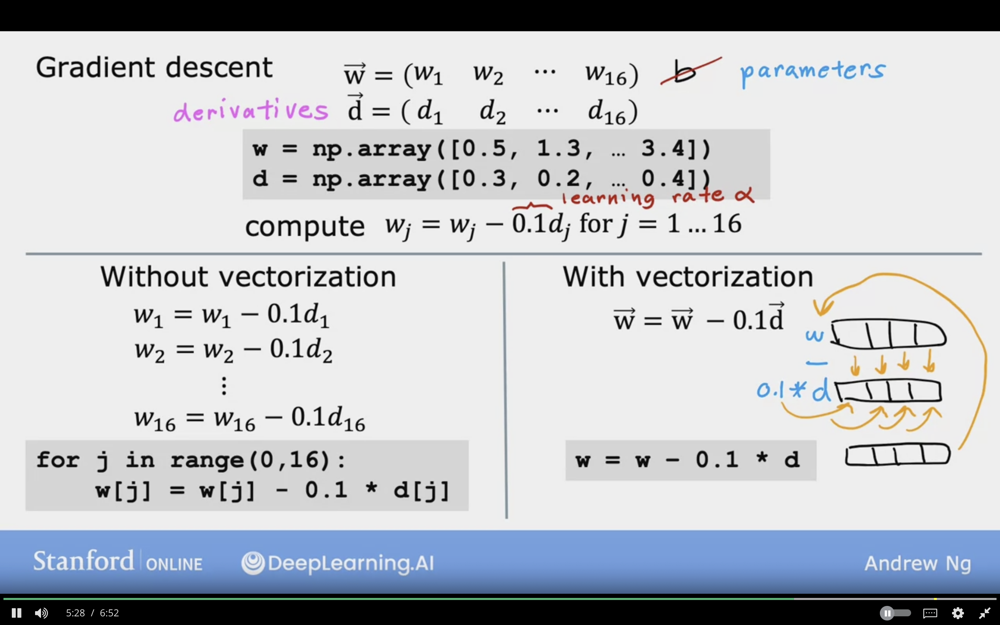

# Multiple Linear Regression

Thie module will discusss Multiple features (variables)

<br/>

Previously, In One feature/ Univariate, Size in feet (x) and price (y)

The model will look like
$$f_{w,b}(x) = wx + b$$


<br/>

In Multiple Features (variables)

size in feet, number of bedroom, nimber of floors, age of home, price in $1000's

Features will be denoted by
$x_{1}, x_{2}, x_{3}, x_{4}$

$X_{j} = j^{th}$ Feature

$n =$ number of features

$\vec{X}^{(i)} =$ features of $i^{th}$ training example, which is a list or vector of features in one row of dataset. It is also called row vector. Example of $i =3$ which is row 2

$\vec{X}^{(2)} =$ [1416 3 2 40], the $\vec{X}$ represents a vector

$x_{j}^{(i)} =$ value of feature $j$ in the $i^{th}$ training example. Example $x_{3}^{(2)}$ will be row=2 and column=3 (or feature 3)

Screenshot of an example of multiple features dataset


<br/>
<br/>

For housing pricing it can be observed that each feature effects the pricing as the following.

- The size increases the pricing by 0.1 $1000.
- The number of beddrooms increases the pricing by 4 * $1000.
- The number of floors increases the pricing by 10 * $1000.
- The number of years decreases the pricing by -2 * $2000.
- The base price starts of 80 assuming the rest of features is 0.


Previously the model 1 feature it was like this

$$f_{w,b}(X) = wx + b$$

For $n$ features the model will look like this

$$f_{\vec{w},b}(\vec{X}) = w_{1} x_{1} + w_{2} x_{2} + \dotso + w_{n} x_{n} + b$$

Parameters of the model:

Represents a vector of weights, and it is a row vector
$$\vec{w} = [w_{1} \space w_{2} \space w_{3} \space \dotso \space w_{n}]$$

$b$ is a number

Represents a vector of features, and it is a row vector
$$\vec{X} = [x_{1} \space x_{2} \space x_{3} \space \dotso \space x_{n}]$$

Rewriting the model, to represent the vector and it should be the below
<br/>
Where $\cdot$ represents a dot product from Linear Algebra

**Multiple Linear Regression:** Linear regession with multiple input variables

$$f_{\vec{w},b}(\vec{X}) = \vec{W} \cdot \vec{X}  + b = w_{1} x_{1} + w_{2} x_{2} + \dotso + w_{n} x_{n} + b$$

(It is NOT called multvariate regression and it something else)

**Vectorization** can be used which make it simple to implement this and other learning algorithms.

## Vectorization

- Will make code shorter
- It will make code run more effciently
- Take advantage of modern numerical linear algerbra libraries, and use GPU to speed up execute code

### Parameters and Features

$\vec{W} = [w_{1} \space  w_{3} \space w_{3}]$,    n=3

$b$ is bias and it is a number

$\vec{X} = [x_{1} \space  x_{3} \space x_{3}]$,    n=3

Linear Algebra: count from 1

Using NumPy Library in python

in python it starts from 0, so w[0], w[1], w[2]

```python
w = np.array([1.0, 2.5, -3.3])
b = 4
x = np.array([10, 20, 30])
```

code starts from 0

#### Without vectorization, n = 100,000 (bad)

$$f_{\vec{w},b}(\vec{X}) = w_{1} x_{1} + w_{2} x_{2}  + w_{3} x_{3} + b$$

```python
f = w[0] * x[0] +
    w[1] * x[1] +
    w[2] * x[2] + b
```

#### Without vectorization, but with for loop

$$f_{\vec{w},b}(\vec{X}) = \vec{W} \cdot \vec{X}  + b = w_{1} x_{1} + w_{2} x_{2} + \dotso + w_{n} x_{n} + b$$

$$f_{\vec{w},b}(\vec{X}) = (\sum\limits_{i = 1}^{n} {w_{j}} x_{j}) + b$$

$$\sum\limits_{i = 1}^{n} -> j =1 \dotso n$$
$j=1,2,4$

```range(0, n) -> j=0...n-1```

```python
f = 0
for j in range(0, n)
    f = f + w[j] * x[j]
f = f + b
```

#### vectorization, but with for loop

$$f_{\vec{w},b}(\vec{X}) = \vec{W} \cdot \vec{X}  + b$$

This implement $\cdot$ (dot product) in a vectorized implementation of product operation of $\vec{W}, \vec{X}$. It will run much faster, and the code will be much cleaner

**Reason:**
NumPy will be able to use parallel hardware to speedup execution.

```python
f = np.dot(w,x) + b
```

<br/>

The following screenshot shows example of running vectorization with the dot product in NumPy which runs faster than the other implementations.


### Without Vectorization vs Vectorization

#### Without Vectorization

```python
for j in range(0,16):
    f = f + w[j] * x[j]
```

$n = 15$

Will run at each time step at a time

$t_{0}$ -->  $f = f + w[0] * x[0]$

$t_{1}$ -->  $f = f + w[1] * x[2]$

$t_{2}$ -->  $f = f + w[2] * x[2]$

$\dotso$

$t_{15}$ -->  $f = f + w[15] * x[15]$

#### With Vectorization

```python
np.dot(w,x)
```

$n = 15$

Will run at each time step at a time

$t_{0}$ ------>  $[w[0] \space w[1] \dotso w[15]]$

In parallel   *   * ... *  (multiplication)

$t_{1}$ -->  $w[0]*x[0] + \space w[1] * x[1] + \dotso + w[15] * x[15]$

Effcient --> scale to large datasets

Without vs With Vectorization


### Gradient Descent Without vs With Vectorization

The weights:
$$\vec{w} = (w_{1} \space w_{2} \space \dotso \space w_{16})$$

The derivative terms:
$$\vec{d} = (d_{1} \space d_{2} \space \dotso \space d_{16})$$

```python
w = np.array([0.5, 1.3, ..., 3.4])
d = np.array([0.3, 0.2, ..., 0.4])
```

Compute $w_{j} = w_{j} - 0.1 d_{j}$ for $j = 1 \dotso 16$

#### Without Vectorization

$w_{1} = w_{1} - 0.1d_{1}$

$w_{2} = w_{2} - 0.1d_{2}$

$\dotso$

$w_{16} = w_{16} - 0.1d_{16}$

```python
for j in range(0,16):
    w[j] = w[j] - 0.1 * d[j]
```

#### With Vectorization

$$\vec{w} = \vec{w} - 0.1\vec{d}$$

first the $\vec{w}$ will get take and get subtracted by 0.1 * d, in single time

0.1 * $\vec{d}$ will get multiplied in single time to all the elements.

Then the result of subtraction will get stored in np array w

```python
w = w - 0.1 * d
```

The following image shows implementation of gradient descent with vectorization


<br/>

### Gradient Descent for Multiple Linear Regression

### Previous Notation

**Parameters:**

$$w_{1}, \dotso, w_{n}$$

$$b$$

**Model:**
$$f_{\vec{w},b}(\vec{X}) = w_{1} x_{1} + w_{2} x_{2} + \dotso + w_{n} x_{n} + b$$

**Cost Function:**
$$J(w_{1}, ...,w_{n}, b)$$

**Gradient Descent:**

repeat {

$$w_{j} =  w_{j} - \alpha {\partial \over \partial w_{j}} J(w_{1}, \dotso, w_{n}, b)$$

$$b =  b - \alpha {\partial \over \partial b} J(w_{1}, \dotso, w_{n}, b)$$
}

---

### Vector Notation

**Parameters:**
$$\vec{w} = [w_{1} \dotso w_{n}]$$

still a number
$$b$$

**Model:**
$$f_{\vec{w},b}(\vec{X}) = \vec{W} \cdot \vec{X}  + b$$

**Cost Function:** and it will return a number
$$J(\vec{W}, b)$$

**Gradient Descent:**

repeat {

$$w_{j} =  w_{j} - \alpha {\partial \over \partial w_{j}} J(\vec{W}, b)$$

$$b =  b - \alpha {\partial \over \partial b} J(\vec{W}, b)$$
}

---


<!-- Write the formulas here -->

### Gradient Descent One Feature

Repeat  {

For weight $w$
$$w =  w - \alpha [\frac{1}{m} \sum\limits_{i = 1}^{m} (f_{w,b}(x^{(i)}) - y^{(i)})x^{(i)}]$$

w[1] =${\partial \over \partial w} J(w,b)$

For bias $b$
$$b =  b - \alpha [\frac{1}{m} \sum\limits_{i = 1}^{m} (f_{w,b}(x^{(i)}) - y^{(i)})]$$

b[2] =${\partial \over \partial b} J(w,b)$

update $w, b$ simultaneously

}


---

### Gradient Descent Multiple Features

$n$ features ($n \ge 2$)

Repeat  {

For weight $w$

$$j = 1$$

$$w_{1} =  w_{1} - \alpha [\frac{1}{m} \sum\limits_{i = 1}^{m} (f_{\vec{W},b}(\vec{X}^{(i)}) - y^{(i)}) x_{1}^{(i)}]$$

w[1] =${\partial \over \partial w_{1}} J(\vec{W},b)$

$\dotso$

$$w_{n} =  w_{n} - \alpha [\frac{1}{m} \sum\limits_{i = 1}^{m} (f_{\vec{W},b}(\vec{X}^{(i)}) - y^{(i)}) x_{n}^{(i)}]$$

For bias $b$
$$b =  b - \alpha [\frac{1}{m} \sum\limits_{i = 1}^{m} (f_{\vec{W},b}(\vec{X}^{(i)}) - y^{(i)})]$$

b[2] =${\partial \over \partial b} J(\vec{W},b)$

<br/>

Simultaneously Update

$w_{j}$ (for $j = 1, \dotso , n$) and $b$

}

---

The following image showcases the difference when computing gradient descent for datasets with multiple features.

First difference in [1] that $W, X$ are now vectors

It can be noticed that parameters $w$ are having subscript w $w_{1}$ which means that for single feature weight

Also, the example feature $x$ is now a vector to indicate that it is multiple features, and not single feature


---

### Alternative to Gradient Descent

**Normal Equation:**

- Only for linear Regression
- Solve for $w, b$ without iterations

**Disadvantages:**

- Doesn't generalize to other learning algorithms like logistic regression, neural networks
- Slow when number of features is large (> 10,000)
- Almost not ML parctitioner should implement normal equation by themselves

**What you need to know:**

- Normal equation mehtod may be used in machine learning libraries that implement linear regression in order solve for $w, b$.
- Gradient descent is still the recommended method for finding parameters $w, b$.

