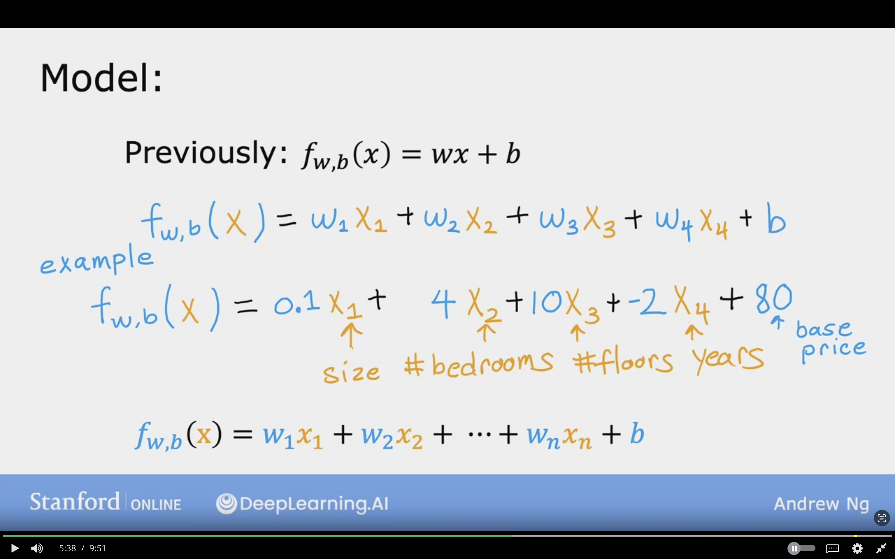

# Multiple Linear Regression

Thie module will discusss Multiple features (variables)

 

Previously, In One feature/ Univariate, Size in feet (x) and price (y)

The model will look like
$$f_{w,b}(x) = wx + b$$

 

In Multiple Features (variables)

size in feet, number of bedroom, nimber of floors, age of home, price in $1000's

Features will be denoted by
$x_{1}, x_{2}, x_{3}, x_{4}$

$X_{j} = j^{th}$ Feature

$n =$ number of features

$\vec{X}^{(i)} =$ features of $i^{th}$ training example, which is a list or vector of features in one row of dataset. It is also called row vector. Example of $i =3$ which is row 2

$\vec{X}^{(2)} =$ [1416 3 2 40], the $\vec{X}$ represents a vector

$x_{j}^{(i)} =$ value of feature $j$ in the $i^{th}$ training example. Example $x_{3}^{(2)}$ will be row=2 and column=3 (or feature 3)

Screenshot of an example of multiple features dataset

 
 

For housing pricing it can be observed that each feature effects the pricing as the following.

- The size increases the pricing by 0.1 $1000.
- The number of beddrooms increases the pricing by 4 * $1000.
- The number of floors increases the pricing by 10 * $1000.
- The number of years decreases the pricing by -2 * $2000.
- The base price starts of 80 assuming the rest of features is 0.

House-Model-Example.png
