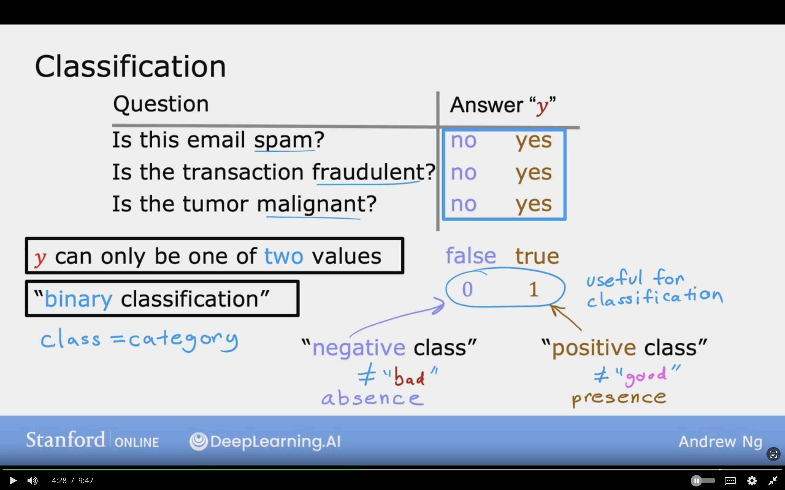
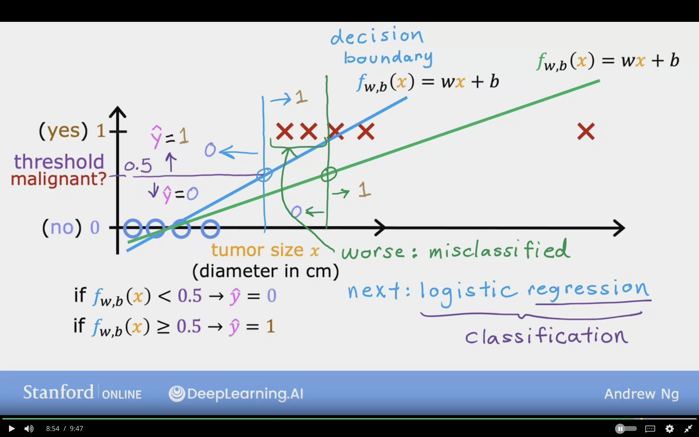
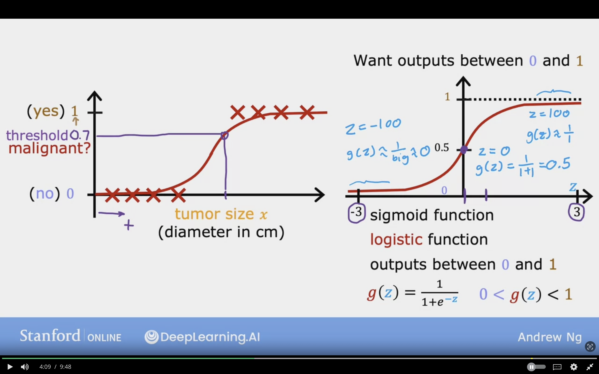
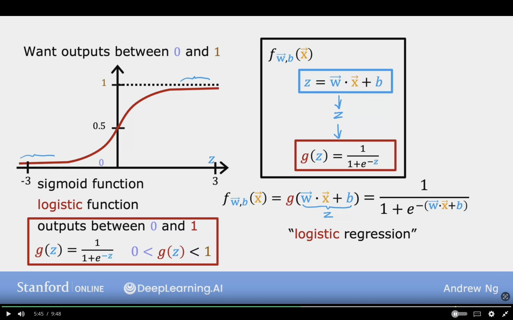
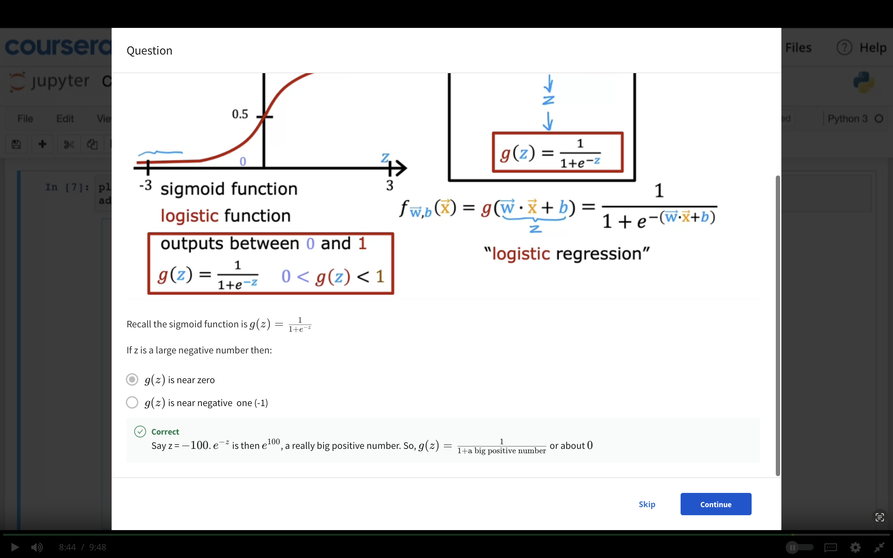
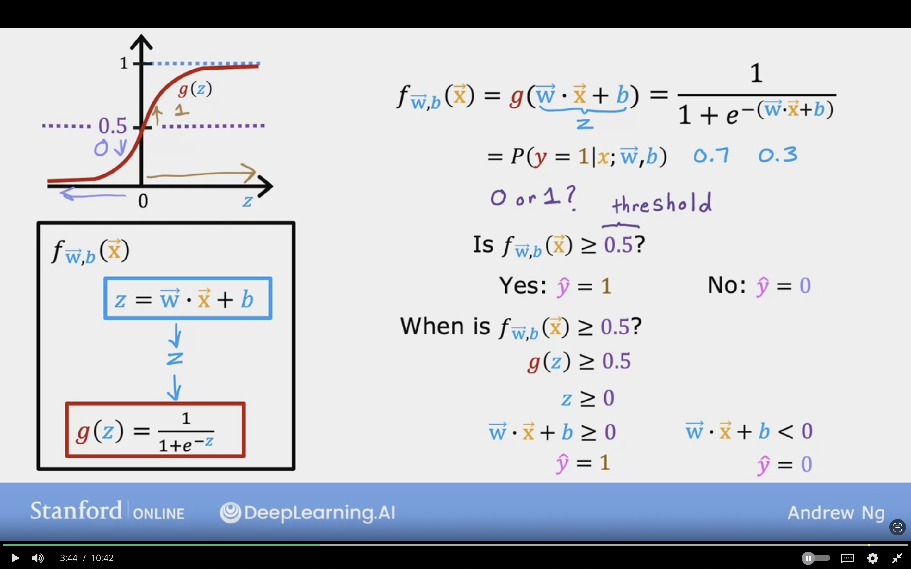
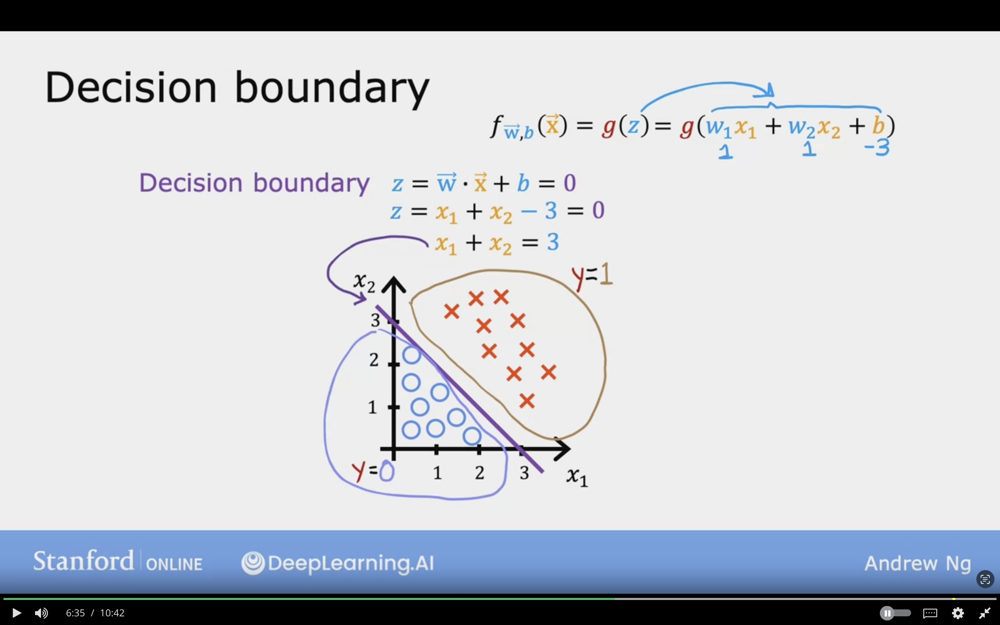
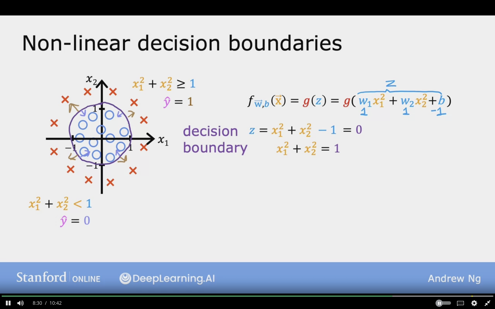
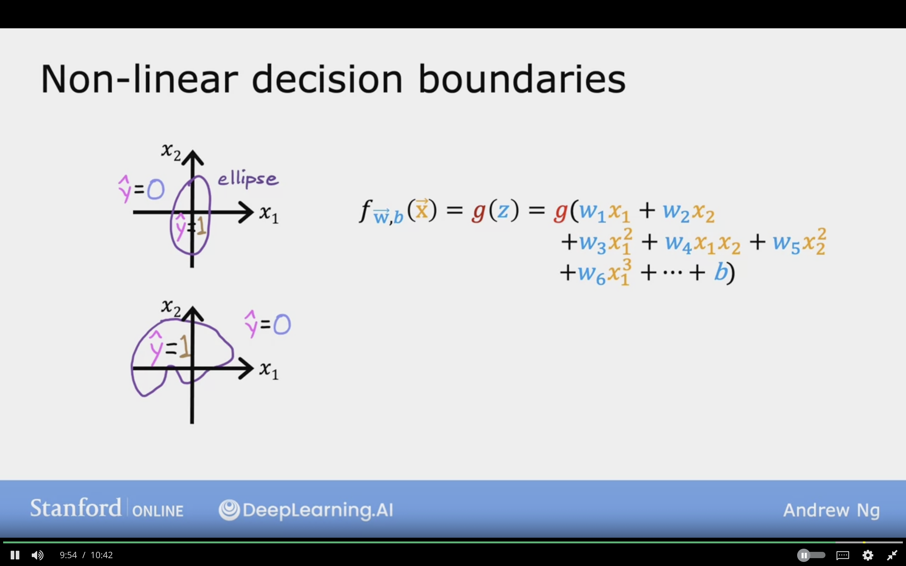

# Classification With Linear Regression

The model will produce a handful of possible output/numbers

## Motivation

**Examples of Classification Problems:**

Question | Answer "$y$"
- Is the email  spam or not? ---> yes/no
- Is the transaction fraudluent or not? ---> yes/no
- Is the tumor maligant? ---> yes/no

**Notes:**

- $y$ can only be one of ***two*** values
- "binary classification"
- class = category
- The class naming depends on the question asked, so Context is important
- The class does not mean that whether it's good or not

**Another naming conventions which are useful for classfication:**

- No  / 0 / false / negative class / absence
- Yes / 1 / true  / positive class / presence

 

In the plot line, the y axis will be the class malignant?, and for the x axis will be tumor size

- 0 will represent no
- 1 will represent yes.

Linear regression can be used for classification

**Thresshold**: can be used to represent a point which the classes are seperated

if $f_{w,b}(x) < 0.5 \rArr \hat{y} = 0$

if $f_{w,b}(x) \ge 0.5 \rArr \hat{y} = 1$

**Problems:**

- If a new example added which is very far then other correct classfication
- The thresehold will be incorrect, as it will shift the entire model
- The other examples for class 1 will be classfied as 0
- Adding extra example to the rightshouldn't change any of conculsions on how to classify malignant vs benign tumors
- Worse: missclassifed

**Decision boundary:** is the vertical line that seperates to classed, and it is shifted due to the far right example.

## Logistic Regression

One of the most common classifcation algorithm

Want output between 0 and 1.

**Sigmoid Function (Logistic Function)**  
- It takes on negative and positive values
- The label of horizontal axes is **Z**
- Outputs values between 0 and 1

The sigmoid function is the following
$$g(z) = { 1 \over {1 + e^{-z}}}$$

$$0 < g(z)< 1$$

where $e = 2.71$

If $z = 100 => g(z) \approx {1 \over 1} \approx 1$

If $z = -100 => g(z) \approx {1 \over big} \approx 0$

If $z = 0 => g(z) = {1 \over 1+1} = 0.5$

So that's why sigmoid function outputs values within 0 and 1

The following image showcases the Logistic Regression compared to the Linear Regression.

Where in the Linear Regression the curve is only in the positive x-axis

### Sigmoid Function Formula

$$f_{\vec{w},b}(\vec{X})$$

$$z = \vec{W} \cdot \vec{X} + b$$

$$g(z)$$

$$g(\vec{W} \cdot \vec{X} + b)$$

$$g(z) = {1 \over {1 + e^{-z}}}$$

The following image showcases the formula for the sigmoid function, and it can be seen that it follows the same steps as the linear regression, but it takes the result of the prediction and uses the $g(z)$ formula

### Interpretation of Logistic Regression Output

$$f_{\vec{w},b}(\vec{X}) = {1 \over {1 + e^{-(\vec{W} \cdot \vec{X} + b)}}}$$

It outputs the probability that class/label is 1, given certain label x.

**Example:**
- $x$ is "tumor size"
- $y$ is 0 (not malignant)
- or 1 (malignant)

$f_{\vec{w},b}(\vec{X}) = 0.7$

The model predicts that there is 70% chance that y is 1 (tumor is malignant)

$P(y = 0) + P(y = 1) = 1$

$P(y = 1) => P(1)$

$f_{\vec{w},b}(\vec{X}) = P(y = 1 | \vec{X};\vec{W},b)$

**Translation:** P of y=1 given the input features $\vec{x}$ and with parameters $\vec{w}, b$

**";"(semicolon):** denotes that $w,b$  are parameters that affect the computation of what is the probability of y being equal to 1 given the input feature $x$

Probability that $y$ is 1, given input $\vec{X}$, parameters $\vec{W},b$

This following questions emphasizes that negative values lead to $g(z)$ being a negative number

## Decision Boundary

### Sigmoid Function Formula

$$f_{\vec{W},b}(\vec{X}) = g(\vec{W} \cdot \vec{X} + b) = {1 \over {1 + e^{-(\vec{W} \cdot \vec{X} + b)}}}$$

Where
$$g(\vec{W} \cdot \vec{X} + b) = g(Z)$$

The probability of $y=1$ given the parameters of $\vec{W},b$ ==> 0.7 0.3
$$= P(y = 1|x;\vec{W},b)$$ 

**0 or 1?**  
I have to select a threshold which will be basis of choosing the class

Is $f_{\vec{W},b}(\vec{X}) \ge 0.5$ ? (0,5 is the threshold)  

- Yes: $\hat{y} = 1$

    - When is $f_{\vec{W},b}(\vec{X}) \ge 0.5$ ?  
        $g(Z) \ge 0.5$  
        $z \ge 0$  
        $\vec{W} \cdot \vec{X} + b \ge 0$  
        $\hat{y} = 1$

- No: $\hat{y} = 0$
    - $\vec{W} \cdot \vec{X} + b \le 0$  
        $\hat{y} = 0$

The below image shows the conclusions and step which are followed to set the boundaries

$$f_{\vec{W}, b} = g(Z) = g(w_{1} x_{1} + w_{2} x_{2} + b)$$

- $w_{1} = 1$
- $w_{2} = 1$
- $b = -3$

### Decision Boundary Example

**Decision Boundary** is the line where it neutral about the y=0 or y=1

$z = \vec{W} + \vec{X} + b = 0$  
$z = \vec{W} + \vec{X} - 3 = 0$, subtitute  
$z = \vec{W} + \vec{X} = 3$  
- this will be represent as a straight line that seperates the 2 classes
- it's called the Decision Boundary
- The boundary line is when
  - $w_{1} = 1$
  - $w_{2} = 1$
  - $b = -3$

The following image showcases the boundary line that seperates the 2 classes

### Non-Linear Decision Boundary

$f_{w,b}(\hat{X}) = g(Z) = g(w_{1} x_{1}^{2} + w_{2} x_{2}^{2} + b)$

- $w_{1} = 1$
- $w_{2} = 1$
- $b = -1$

Decision Boundary:

$z =  x_{1}^{2} +  x_{2}^{2}- 1 = 0$  
$z =  x_{1}^{2} +  x_{2}^{2} = 1$, equation of a circle

In case of  
1. $x_{1}^{2} +  x_{2}^{2} \ge 1$  
    $\hat{y} = 1$

2. $x_{1}^{2} +  x_{2}^{2} < 1$  
    $\hat{y} = 0$

The image below shows a non linear decision boundary which takes the shape of circle, and here the features have been engineered to be $x^{2}$

Logistic Regression can fit a lot of complex non linear data by using higher order of terms.

$$f_{\vec{W},b}(\vec{X}) = g(Z) = g(w_{1} x_{1} + w_{2} x_{2} + w_{3} x_{1}^{2} + w_{4} x_{2} + w_{5} x_{2}^{2})$$

This implementation of linear regression will predict:

- $\hat{y} = 1$  inside the shape
- $\hat{y} = 0$ outside the shape

If no higher order polynomial are used then the decision boundary will always be linear

**Topics to study:**
-