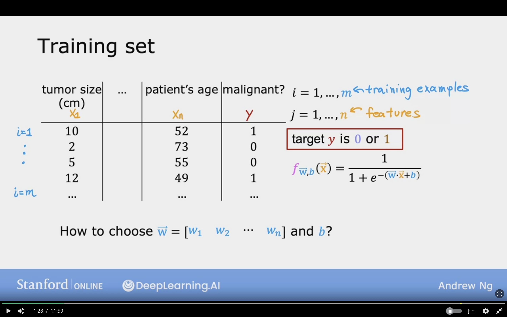
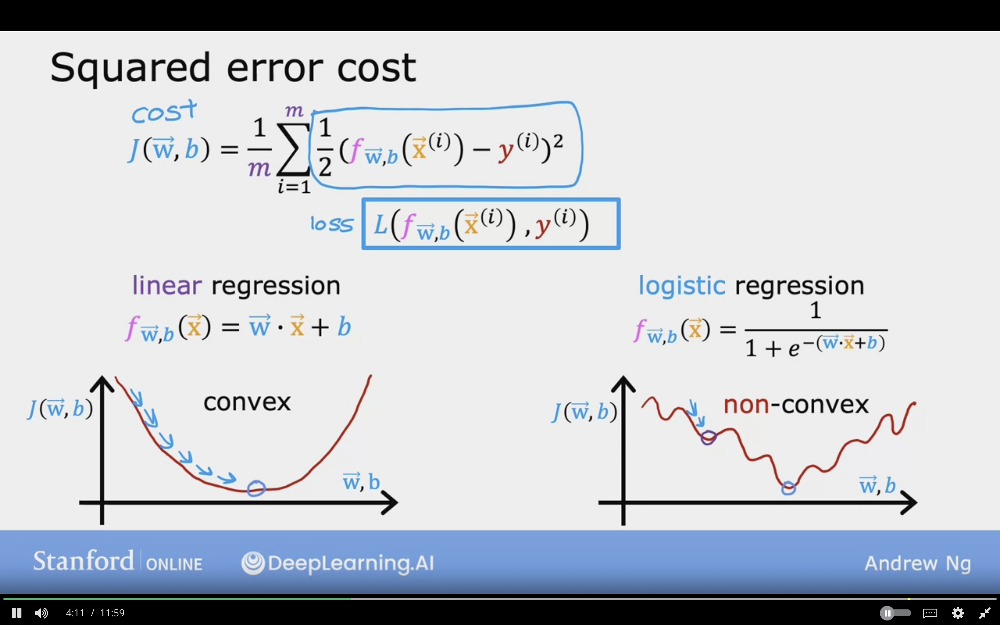
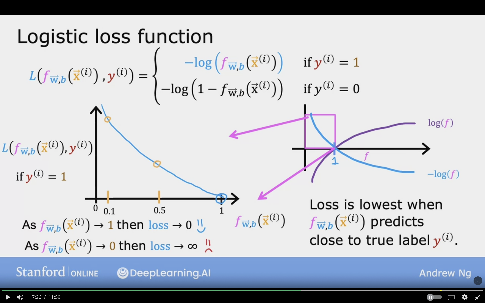
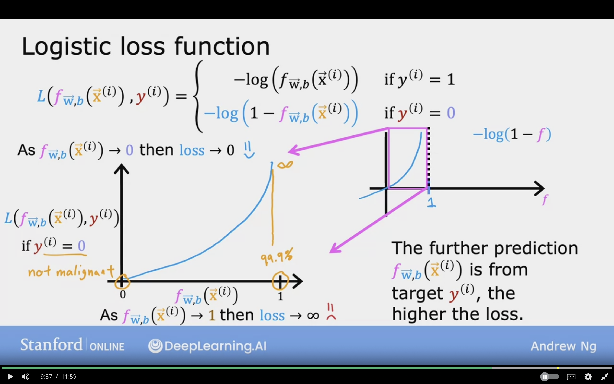
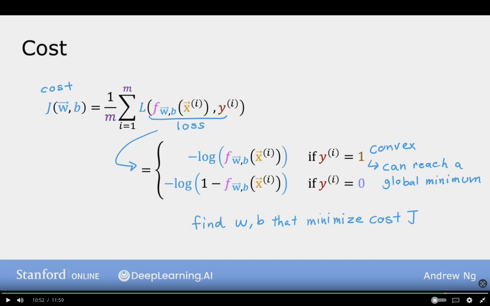
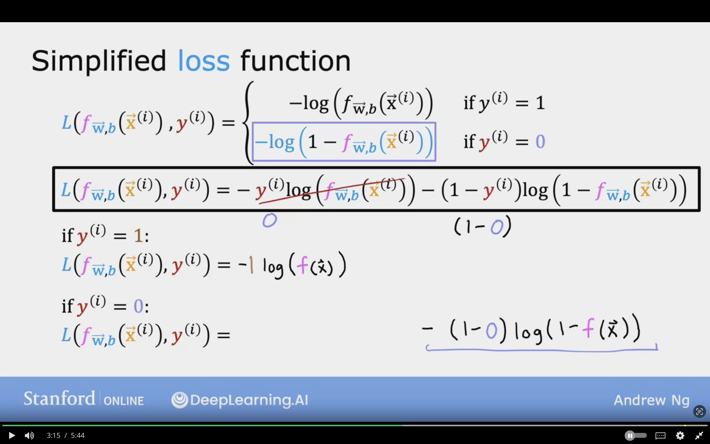
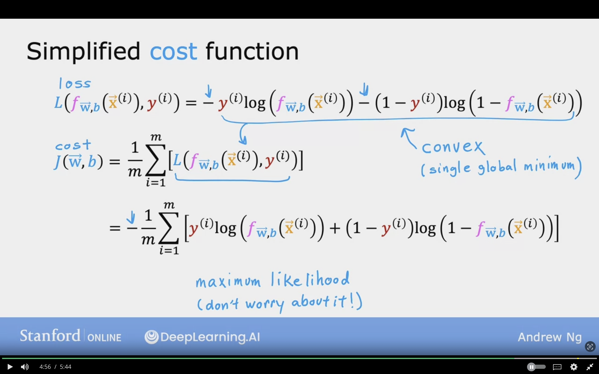

# Cost Function for Logistic Regression

Gives a way to meausre how set of parameters fit the data, and gives a way to choose better parameters

Mean Squared Error is not ideal for Logistic Regression

Th below image show cases s sample training for Logistic Regression.

The training set has $n$ number of fetaures, and $m$ number of examples:

- $i = 1 \dotso , m$ <-- Training Examples
- $j = 1 \dotso , n$ <-- Features

The Logistic Regression formula is 

$$f_{\vec{W}, b}(\vec{X}) = {1 \over {1 + e^{-(\vec{W} \cdot \vec{X} + b)}}}$$

## Squared Error Cost

The below cost function formula was used in the Linear Regression:

$$J(\vec{W}, b) = {1 \over m} \sum_{i=0}^{m}{1 \over 2}(f_{\vec{W}, b}(\vec{X}^{(i)}) - y^{i})^{2}$$

In this case, the term ${1 \over m}$ have been shifted to inside summation, for later lectures.

**For Linear Regression:**  
$f_{\vec{W}, b} (\vec{X}) = \vec{W} \cdot \vec{X} + b$

- It has convex shape cost function
- Gradient descent will take mall steps to reach global minimum

 

**For Logistic Regression:**  
$f_{\vec{W}, b}(\vec{X}) = {1 \over {1 + e^{-(\vec{W} \cdot \vec{X} + b)}}}$

- It has non convex shape cost function
- Gradient descent will go to a lot of local minimums
- So the cost function is not helpful
- Better cost function to be considered in order to reach the global minimum

 

**To build cost function for Logistic Regression:**  

The lost of single training example can be noted by

Loss => $L(f_{\vec{W},b} (\vec{X}^{(i)}), y^{(i)})$

## Logistic Loss Function

The loss function input $f(x)$ and true label $y$

* $loss(f_{\mathbf{w},b}(\mathbf{x}^{(i)}), y^{(i)})$ is the cost for a single data point, which is:

$$
  L(f_{\mathbf{w},b}(\mathbf{x}^{(i)}), y^{(i)}) = \begin{cases}
    - \log\left(f_{\mathbf{w},b}\left( \mathbf{x}^{(i)} \right) \right) & \text{if $y^{(i)}=1$}\\
    - \log \left( 1 - f_{\mathbf{w},b}\left( \mathbf{x}^{(i)} \right) \right) & \text{if $y^{(i)}=0$}
  \end{cases}
$$

So in the case of true value $y^{(i)} = 1$ there is a seperate loss function, and for $y^{(i)} = 0$ there is a seperate loss function.

**Loss function** measures how well you're doing on 1 training example, and the sum of loss we get the cost function.

**Cost function** is for the entire training set.

$f_{\vec{W}, b} (\vec{X}^{(i)})$ is the output of logistic regression, and it's always between 0 and 1.

### In case of $y^{(i)} = 1$

$$
L(f_{\mathbf{w},b}(\mathbf{x}^{(i)}), y^{(i)}) = 
    - \log\left(f_{\mathbf{w},b}\left( \mathbf{x}^{(i)} \right) \right) \text{, if } y^{(i)}=1
$$

 

- As $f_{\vec{W}, b} (\vec{X}^{(i)}) \rightarrow 1$ then loss $\rightarrow 0$, Because I'm close very close to the right answers

- As $f_{\vec{W}, b} (\vec{X}^{(i)}) \rightarrow 0$ then loss $\rightarrow \infin$, Because it's far from the right answers

Loss is the lowest when $f_{\vec{W}, b} (\vec{X}^{(i)})$ predicts close to the true label $y^{(i)}$, and vice versa.

### In case of $y^{(i)} = 0$

$$
L(f_{\mathbf{w},b}(\mathbf{x}^{(i)}), y^{(i)}) = 
    - \log\left(1-f_{\mathbf{w},b}\left( \mathbf{x}^{(i)} \right) \right) \text{, if } y^{(i)}=0
$$

 

- As $f_{\vec{W}, b} (\vec{X}^{(i)}) \rightarrow 0$ then loss $\rightarrow 0$, Because It's close very close to the right answers

- As $f_{\vec{W}, b} (\vec{X}^{(i)}) \rightarrow 1$ then loss $\rightarrow \infin$, Because it's far from the right answers

The further prediction $f_{\vec{W}, b} (\vec{X}^{(i)})$ is from target $y^{(i)}$, the higher the loss.

The below screenshot summarizes the Costu Function for Logistic Regression, and we have have seen that there are two loss function.

- One is used in the case of $y = 1$
- Other is used in the case of $y = 1$

The formula for cost fucntion $J(\vec{W}, b)$ is similar to cost in linear regression, but Loss in logistic regression does no not have the term ${1 \over 2}$ term inside the summation

**Question: Why is squared error cost function is not used in Logistic Regression?**

The non-linear nature of the model that results in a "wiggly", non-convex cost function with many potential local minimum.

***Explaination:*** If using the mean squared error for logistic regression, the cost function is "non-convex", so it's more difficult for gradient descent to find an optimal value for the parameters w and b.

## Simplified Lost Function

$$
  L(f_{\mathbf{\vec{W}},b}(\mathbf{\vec{X}}^{(i)}), y^{(i)}) = \begin{cases}
    - \log\left(f_{\mathbf{\vec{W}},b}\left( \mathbf{\vec{X}}^{(i)} \right) \right) & \text{if $y^{(i)}=1$}\\
    - \log \left( 1 - f_{\mathbf{\vec{W}},b}\left( \mathbf{\vec{X}}^{(i)} \right) \right) & \text{if $y^{(i)}=0$}
  \end{cases}
$$

$y$ is either 0 or 1, and it cannot be other values.

Simplier Form of the Lost Function, and it's completely equivalent

$$
  L(f_{\mathbf{w},b}(\mathbf{\vec{X}}^{(i)}), y^{(i)}) = 
    - y^{(i)}\log(f_{\mathbf{w},b}( \mathbf{\vec{X}}^{(i)}))
    - (1-y^{(i)})\log ( 1 - f_{\mathbf{w},b}( \mathbf{\vec{X}}^{(i)} ) )
$$

 

### Proof of substituting the $y^{(i)}$ values:

**if $y^{(i)} = 1:$**

$L(f_{\mathbf{w},b}(\mathbf{\vec{X}}^{(i)}), y^{(i)}) = -1 \log(f(\vec{X})) - (1-1) \dotso$, the rest will be canceled  
$= -\log(f(\vec{X}))$

**if $y^{(i)} = 0:$**

$L(f_{\mathbf{w},b}(\mathbf{\vec{X}}^{(i)}), y^{(i)}) = -0 (\dotso) - (1-0)\log (1 - f_{{w},b}( \mathbf{\vec{X}}^{(i)} ) )$  
$= -\log(1-f(\vec{X}))$

The below image showcases the simpified loss function, and how substituting the values is equivalent to the above formula.

## Simplified Cost Function

**Loss**  
It has the shape of Convex (Single Global Minimum)
$$
  L(f_{\mathbf{w},b}(\mathbf{\vec{X}}^{(i)}), y^{(i)}) = 
    - y^{(i)}\log(f_{\mathbf{w},b}( \mathbf{\vec{X}}^{(i)}))
    - (1-y^{(i)})\log ( 1 - f_{\mathbf{w},b}( \mathbf{\vec{X}}^{(i)} ) )
$$

**Cost**  
By substituting the loss function for logistic regression from above to below
$$
  J(\vec{W}, b) = 
  {1 \over m}
  \sum_{i=1}^{m}
  [L(f_{{w},b} ({\vec{X}}^{(i)}), y^{(i)})]
$$

**The Simplified Cost Function**  
The "-" will be taken outside
$$
    = 
  -{1 \over m}
  \sum_{i=1}^{m}
  [- y^{(i)}\log(f_{\mathbf{w},b}( \mathbf{\vec{X}}^{(i)}))
    - (1-y^{(i)})\log ( 1 - f_{\mathbf{w},b}( \mathbf{\vec{X}}^{(i)} ) )]
$$

The formula was derivied from Statistics, Maximum Likelihood Estimation, and it's used to efficiently find parameters for different models. 

The below image showcase the steps which lead to the simplified cost function, and it was taken from the loss function. The loss function is for single example, but the cost function is for the entire training examples/set.
