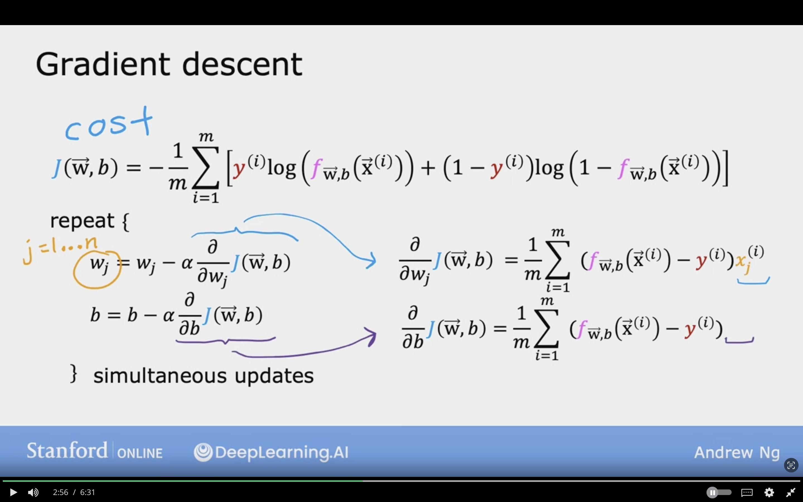
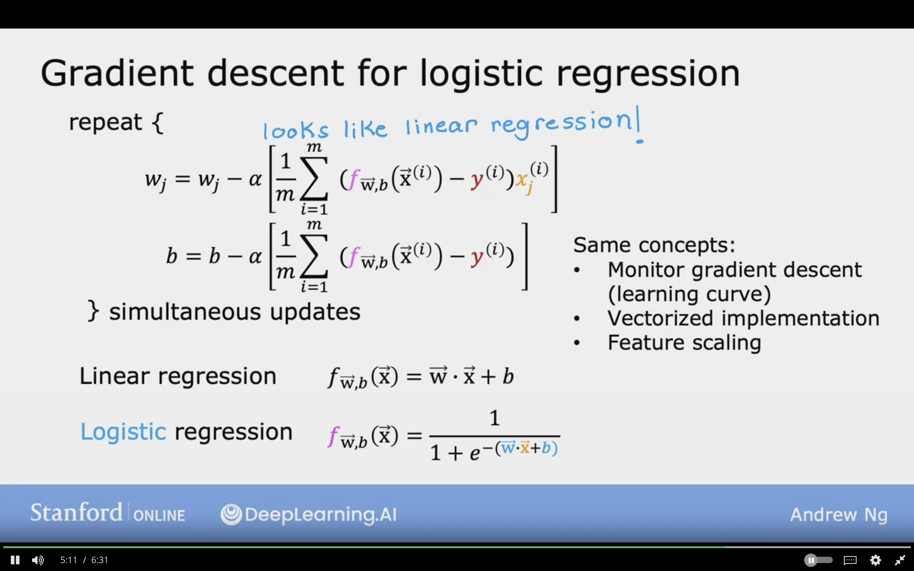

# Gradient For Logistic Regression

To fit parameters of Logistic Model we will try to find values of $\vec{W}$ and $b$ that minimizes cost function $J(\vec{W}, b)$ by applying gradient descent.

## Training Logistic Regression

Find $\vec{W}, b$

Given new $\vec{X}$, output
$f_{\vec{W}, b} ={1 \over {1 + e^{-(\vec{X} \cdot \vec{W} + b)}}}$

$P(y = 1 | \vec{X};\vec{W},b)$

Make prediction that the label $y$ is 1

## Gradient Descent 

$$
J(\vec{W}, b) = 
  -{1 \over m}
  \sum_{i=1}^{m}
  [- y^{(i)}\log(f_{\mathbf{w},b}( \mathbf{\vec{X}}^{(i)}))
    - (1-y^{(i)})\log ( 1 - f_{\mathbf{w},b}( \mathbf{\vec{X}}^{(i)} ) )]
$$

$j = 1 \dotso n$, where $n$ is the number of features

repeat {
$$
w_{j} = w_{j} - \alpha {
    {\partial}
    \over
    {\partial w_{j}}
    }J(\vec{W}, b)
    
    \leftarrow (1)
$$

$$
b = b - \alpha {
    {\partial}
    \over
    {\partial b}
    }J(\vec{W}, b)

    \leftarrow (2)
$$
} Simultaneous updates

(1)
$$
    {{\partial}
    \over
    {\partial w_{j}}
    }J(\vec{W}, b)
    = {1 \over m} \sum_{i=1}^{m} (f_{\vec{W}, b} (\vec{X}^{(i)}) - y^{(i)}) x_{j}^{(i)}
$$

(2)
$$
    {{\partial}
    \over
    {\partial b}
    }J(\vec{W}, b)
    = {1 \over m} \sum_{i=1}^{m} (f_{\vec{W}, b} (\vec{X}^{(i)}) - y^{(i)})
$$

The above formulas look identical to the formula in Linear Regression, but in Logitsic the $f_{\vec{W}, b} (\vec{X})$ is now different:

Linear Regression: 
$$
f_{\vec{W}, b} (\vec{X}) = \vec{W} \cdot \vec{X} + b
$$

Logistic Regression: 
$$
f_{\vec{W}, b} (\vec{X}) = {1 \over {1 + e^{- ({\vec{W} \cdot \vec{X} + b})}}}
$$

**Same Concepts:**

- Monitor Gradient Descent (Learning Curve)
- Vectorized Implementation, to speed up gradient descent
- Feature Scaling, so that the value have smaller range, and can be trained faster, and speed up gradient descent.

