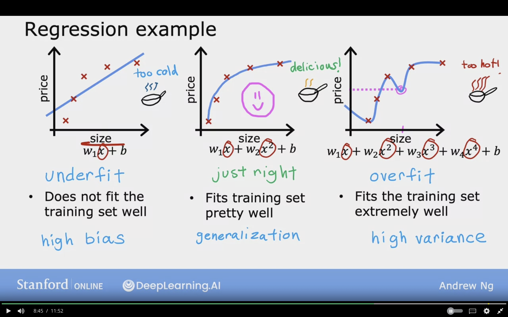
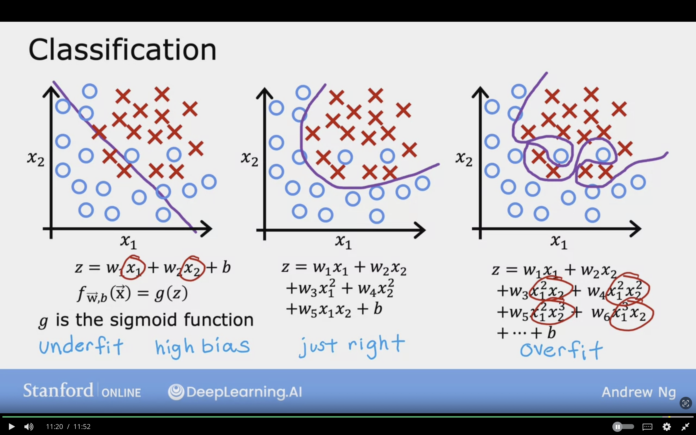
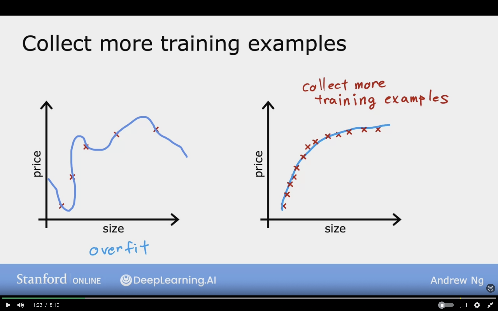
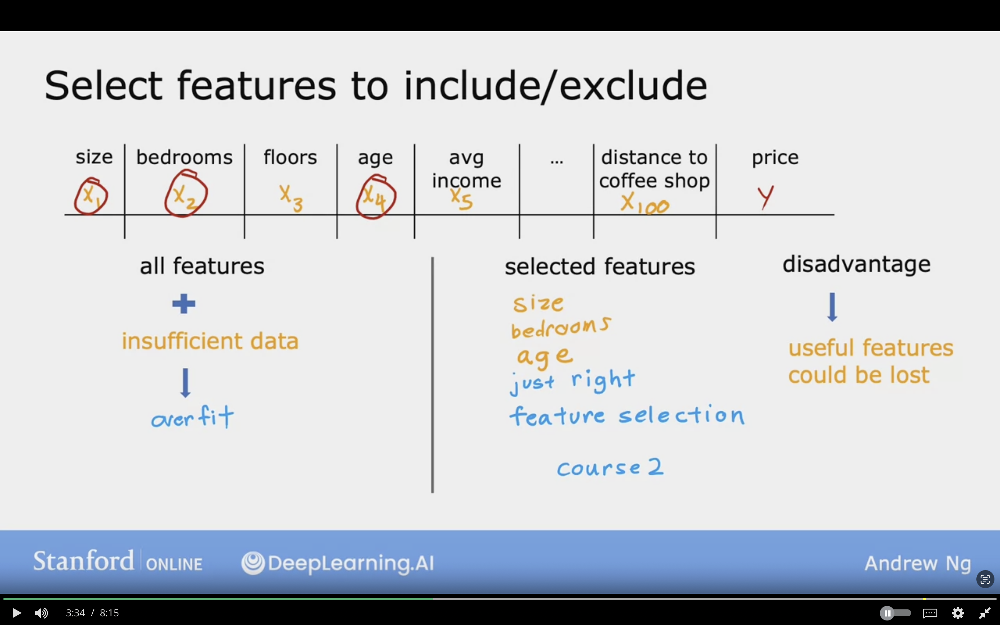
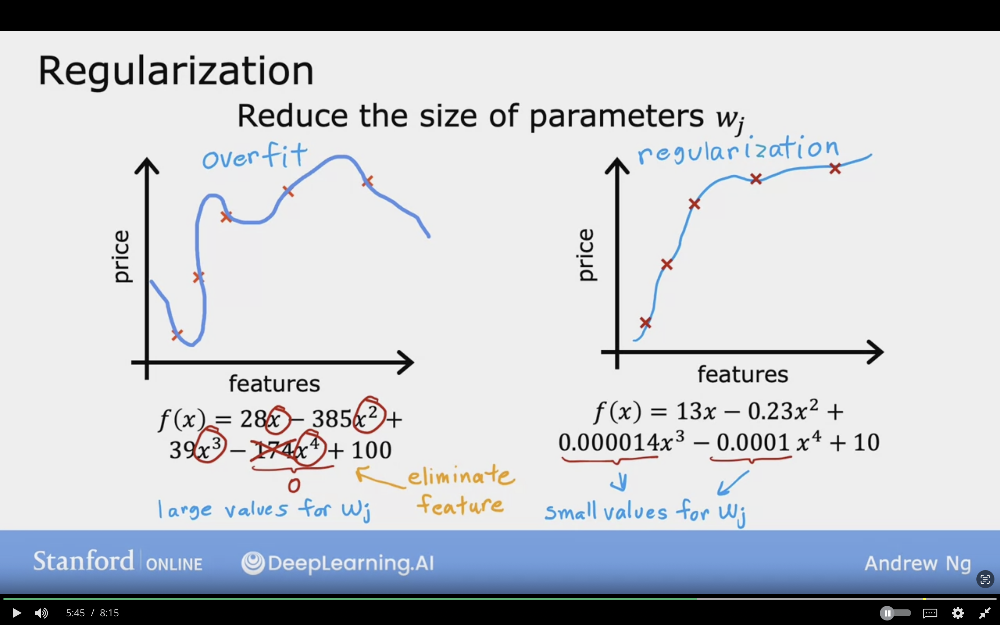
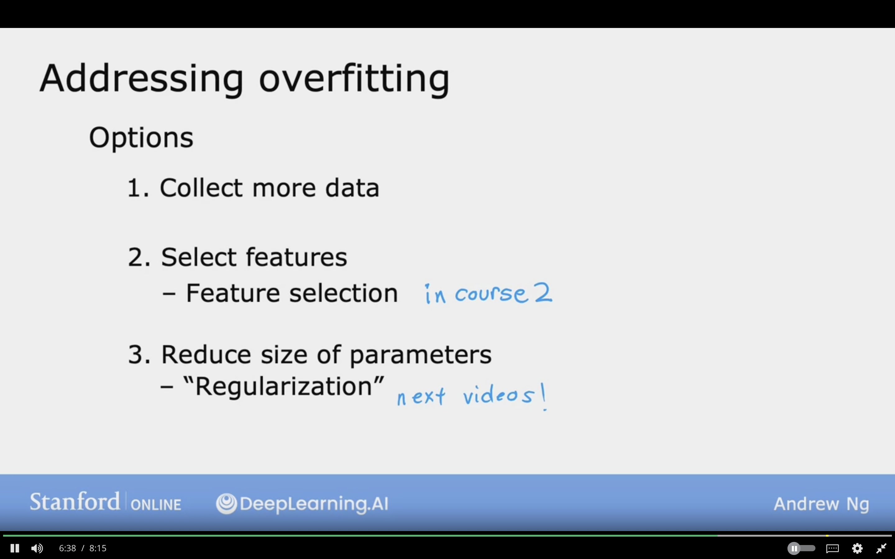
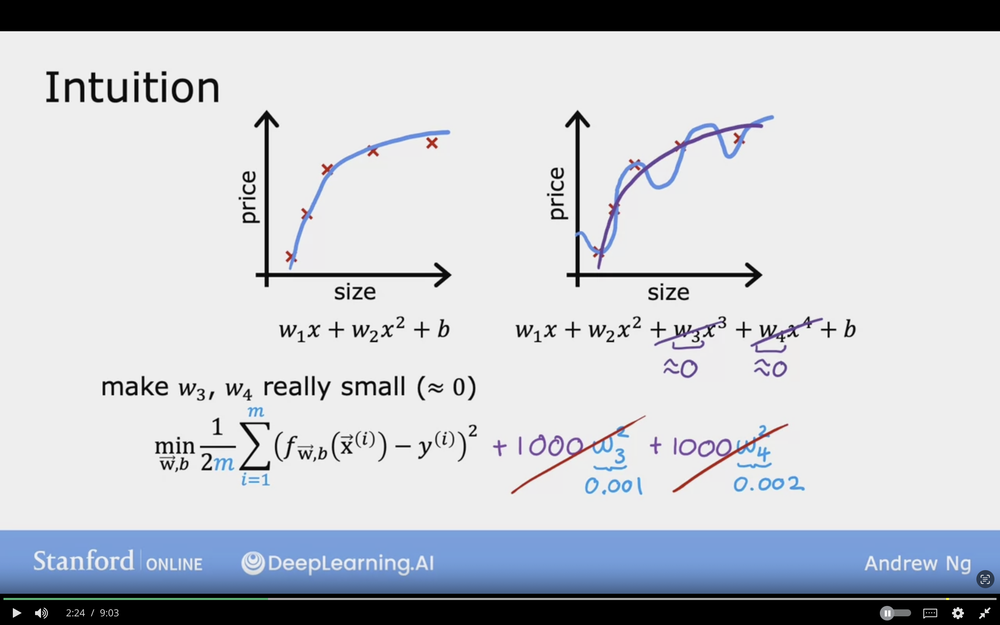
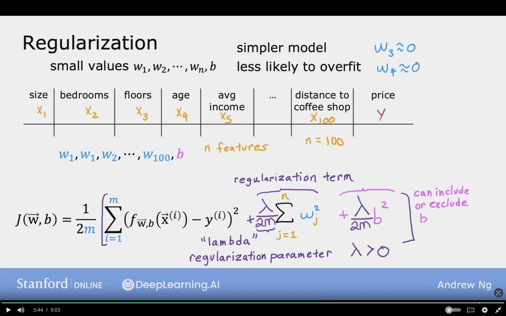
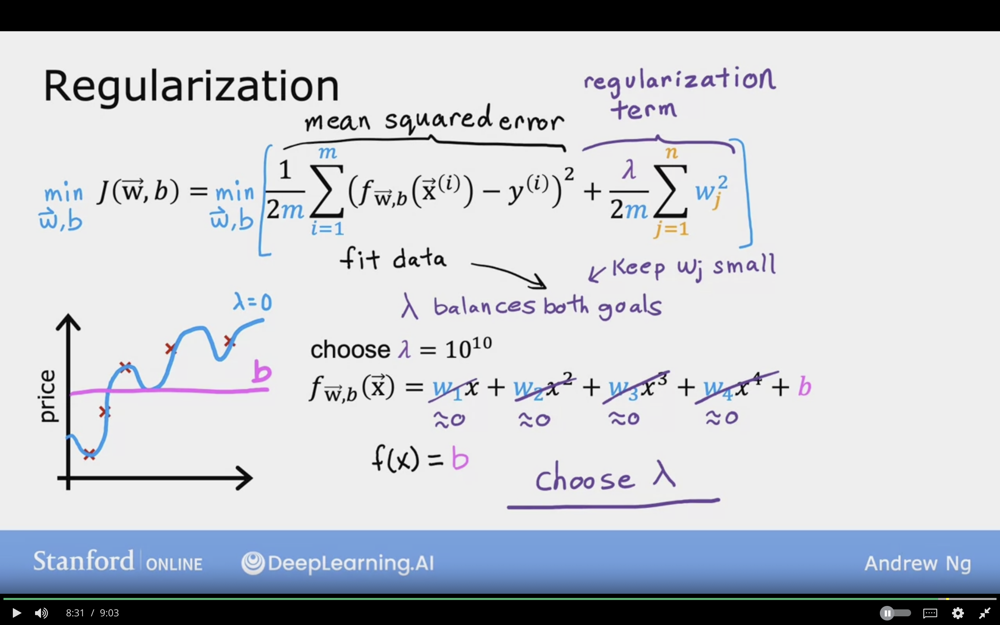

# The Problem of Overfitting

## Regression Example

In this section, we will see an example of different kind of fit of models to the training set on regression problem. Using the Housing prices example.

### Example 1: Underfit
**Algorithm has high Bias**  

$w_{1}x + b$

When the model does not fit the training set well.

- The learning algorithm has strong preconception/bias that the housing prices will be completely linear of the size.

### Example 2: Just Right
**Generalization, model preform well even on new dataset**  

$w_{1}x + w_{2}x^{2} + b$

When the model does fits the training set well.

### Example 3: Overfit
**Algorithm has high Variance**  

$w_{1}x + w_{2}x^{2} + w_{3}x^{3} + w_{4}x^{4} + b$

When the model does fit the training set ***extremely*** well

- Can Choose the parameters which results the cost being 0 on all training examples!!
- It cannot generalize to new examples which it have not seent before.
- Variance means the model tries so hard to hard to fit all the data.
- If training set little bit different, then the function that algorithm is trying yo fit will be different.

 

The below image show cases how different type of model may fit the model, and the example in the middle is the best one.

## Classification

In this section, we will see an example of different kind of fit of models to the training set on classification problem. Using the Tumor Size example.

### Example 1: Underfit/ High Bias

The decision boundary is a line
- It does not fit the data very well

$z = w_{1} x_{1} + w_{2} x_{2} + b$

$f_{\vec{w},b} = g(z)$

$g$ is the sigmoid function

### Example 2: Just right

The decision boundary is a curve
- It does fit the data well
- Has higher level polynomial, but not a lot!

$z = w_{1} x_{1} + w_{2} x_{2} + w_{3} x_{1}^{2} + w_{4} x_{2}^{2} + w_{5} x_{1} x_{2} + b$

$f_{\vec{w},b} = g(z)$

$g$ is the sigmoid function

### Example 3: Overfitting/High Variance

The decision boundary is a very curvey line!
- It does fit the data perfectly.
- Has high level polynomial
- Cannot generalize to new training example

$z = w_{1} x_{1} + w_{2} x_{2} + w_{3} x_{1}^{2} x_{2}  + w_{4} x_{1}^{2} x_{2}^{2} + w_{5} x_{1}^{2} x_{2}^{3} + w_{6} x_{1}^{3} x_{2} + \dotso + b$

$f_{\vec{w},b} = g(z)$

$g$ is the sigmoid function

 

Below image is ana example of classification problem with different models fit, and the example in the middle is the best model as it generalizes to new examples.

## Addressing Overfitting

Regularization to Reduce Overfitting

### Options to Overcome Overfitting

#### Option 1: Collect More Training Examples

With larger dataset, the learning model can fit function that it is less wiggly.

Can fit higher order polynomial or model with many features

If I have enough training examples, it would still be ok!

The below image showcases how increasing the number of training examples can resolve the overfitting problem

 

#### Option 2: Select Features to Include/Exclude

1. All features + insuffcient data => Overfitting

2. Selected Features (Size, bedrooms, age) => Just Right

**Feature Selection:**
Choosing the most appropriate set of features to use.

We will discuss algorithms that can identify the best features to use.

**Disadvantage:**
The algorithm may throw important set of information that I have about housing.  
Useful features could be lost

The image below showcases how feature selection can overcome the problem of overfitting.

 

#### Option 3: Regularization
**Reduce the size of parameters**

Encourages the learning algorithm to shrink the parameters value swithout demanding the parameters to be set 0.

Keeps all the features, but prevent the features from having overly large effect.

Smaller $w_{j}$ paramater $w_{1} \dotso w_{n}$

From:  
$f(x) = 28x - 385 x^{2} + 39 x^{3} - 174 x^{4} + 100$

To:  
$f(x) = 13x - 385 x^{2} + 0.0000014 x^{3} - 0.0001 x^{4} + 100$

The image below showcases how regulatization can overall improve the model overfitting issue, by shrinking the parameters $w_{j}$

### Addressing Overfitting Recap:

**Options:**

1. Collect More Data
2. Select Features
   - Feature Selection (Course 2)
3. Reduce Size of Parameters
   - Regularization (Next Videos)

## Cost Function with Regularization

### Intitution

Make $w_{3}$, $w_{4}$ really small $(\approx 0)$

$min_{\vec{W},b} {1 \over 2m} \sum_{i=1}^{m} (f_{\vec{W},b}(\vec{X}^{(i)}) - y^{(i)})^{2}$

And I want to modify the cost function to fit the data by adding 
$+ 1000 w_{3}^{2} + 1000 w_{4}^{2}$

$min_{\vec{W},b} {1 \over 2m} \sum_{i=1}^{m} (f_{\vec{W},b}(\vec{X}^{(i)}) - y^{(i)})^{2} + 1000 w_{3}^{2} + 1000 w_{4}^{2}$

The model will be penelized/regularized if $w_{3}$ and $w_{4}$ are large

Because if I want to minimze the function $w_{3}$ and $w_{4}$ has to be small!!

The only way is to make $w_{3}, w_{4}$ small:

- $w_{3} = 0.001$
- $w_{4} = 0.002$

The result $w_{3}, w_{4}$ are close to 0, which is mean the two terms are somewhat canceled.

The fit to data much close to quadratic, but with small effect from $x^{3}, x^{4}$

The below image showcases how the regularization is done, and how little it effects the model when it's minimized.

### Regualrization

**Having small $w_{1}, w_{2}, w_{3},\dotso,w_{n},b$**

**Results:**  
- Simpler model
- Less likely to overfit

In the previous example we have penelized  
$w_{3} \approx 0$  
$w_{4} \approx 0$

Below is an example of housing price dataset with 100 features.

We have a lot of features, but we do not know which feature to penelize, so we penelize all the features/ $w_{j}$ parameters

Results smoother, less wiggly, and not prone to overfitting.

$n$ features, where $n= 100$

$w_{1}, w_{2}, \dotso , w_{100}, b$

 

**To penelize all the parameters, we use the following formula:**

**Regularization Term is:** $+ {\lambda \over 2m} \sum_{j=1}^{n} w_{j}^{2}$"

$$
J(\vec{W},b) =
{1 \over 2m} \sum_{i=0}^{m} (f_{\vec{w},b}(\vec{x}^{(i)})
- y^{(i)})^{2} + {\lambda \over 2m} \sum_{j=1}^{n} w_{j}^{2}
$$

**$\lambda$:** Lambda, Regularization parameter  
$\lambda > 0$  
Similar to choosing learning rate $\alpha$, I now can choose lambda $\lambda$

$\lambda$ is divided by 2m, by scalling both terms the same way:
- makes choosing good values $\lambda$ easier
- Even if training set grows $n$ is the same value for $\lambda$ still works

$b$ is mostly not used in the regularization, but when used it looks like this:

$$
J(\vec{W},b) =
{1 \over 2m} \sum_{i=0}^{m} (f_{\vec{w},b}(\vec{x}^{(i)})
- y^{(i)})^{2} + {\lambda \over 2m} \sum_{j=1}^{n} w_{j}^{2}
+ {\lambda \over 2m}b^{2}
$$

The below image showcases the regularizations term for $w_{j}$ and $b$, they both introduce new value named $\lambda$

### Regualrization Continued

$$
min_{\vec{W},b}
J(\vec{W},b) =
min_{\vec{W},b}
({1 \over 2m} \sum_{i=0}^{m} (f_{\vec{w},b}(\vec{x}^{(i)})
- y^{(i)})^{2} + {\lambda \over 2m} \sum_{j=1}^{n} w_{j}^{2}
+ {\lambda \over 2m}b^{2})
$$

The cost function can be define as (1) + (2):  
- The (1) is the mean squared error, the goal to fit the data
- The (2) is the regularization term for $w_{j}$, the goal to keep $w_{j}$ small

$\lambda$ values specifies relative importance/tradeoff on how to balance the 2 goals:
- Mean Squared Error: Fit Data
- Keep $w_{j}$ small

 

**Example:** Choose $\lambda = 10^{10}$

$f_{\vec{W},b} (\vec{X}) = w_{1} x + w_{2} x^{2} + w_{3} x^{3} + w_{4} x^{4} + b$

$f_{\vec{W},b} (\vec{X}) = 0 + 0 + 0 + 0 + b$

$f_{\vec{W},b} (\vec{X}) = b$ => Underfit

and if $\lambda =0$ => it will Overfit!

In the following image we can observe thet there are now 2 terms in the cost function $J(\vec{W},b)$ which are the mean squared error, and regularization term. Choosing the right $\lambda$ is essential in order avoid the overfitting problem.

**Question:** For a model that includes the regularization parameter $\lambda$ (lambda), increasing $\lambda$ will tend to…

**Answer:**  
Decrease the size of parameters $w_{1}, w_{2}, \dotso, w_{n}$, 

**Explaination:**  
Increasing the regularization parameter 
$\lambda$ lambda reduces overfitting by reducing the size of the parameters. For some parameters that are near zero, this reduces the effect of the associated features.

## Topics to Learn